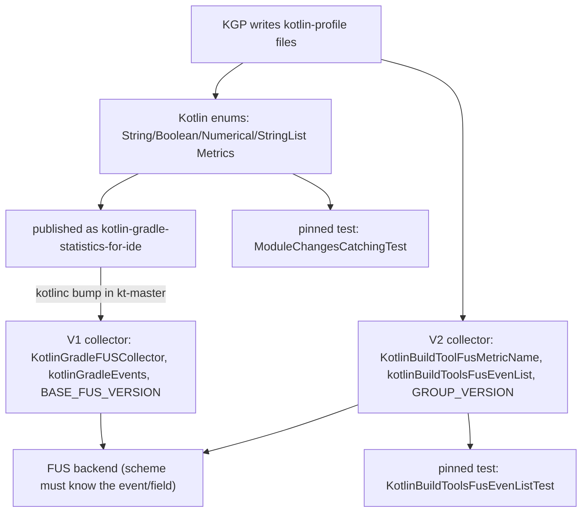

# Add a new Gradle FUS metric

A Gradle FUS metric travels a long path: the Kotlin Gradle plugin (KGP)
writes it into `kotlin-profile` files, the IntelliJ Kotlin plugin reads those
files and forwards the value to the FUS backend. Both ends declare the metric
independently, and both ends pin versions and file checksums in tests so that
a schema change cannot slip through unnoticed. This skill encodes the full
procedure.

Reference documentation: internal YouTrack article
[KT-A-484 "Collecting statistics from gradle FUS"](https://youtrack.jetbrains.com/articles/KT-A-484/Collecting-statistics-from-gradle-FUS).

## When to use

Trigger on phrasings such as:

- "add a FUS metric" / "add a new metric to FUS"
- "collect / report X in build statistics"
- "add a value to `BooleanMetrics` / `NumericalMetrics` / `StringMetrics` / `StringListMetrics`"
- "log X into the `kotlin-profile` files"
- "report X to `kotlin.gradle.performance` / `kotlin.gradle.performance_v2`"
- "`ModuleChangesCatchingTest` fails after I added a metric"

Users frequently mention only the enum, or only the reporting site. The
procedure always touches the whole chain, so use this skill even if the
request looks narrower.

## Privacy gate

**Do this before editing anything.** Per KT-A-484, a FUS metric must never
allow identifying a particular user — neither on its own, nor in combination
with the metrics already reported. Verify with the user that:

- the value carries no user, machine, company, or project identity (no
  absolute paths, host names, user names, project names, package names,
  repository URLs, e-mail addresses, license or account identifiers);
- the value is not a free-form string coming from user code or user
  configuration — such a value must be constrained by an anonymization
  policy (allowed list, regex, or version pattern) so that only a known
  vocabulary can ever leave the machine;
- the value cannot be joined with existing metrics to fingerprint a
  specific project or user (a rare combination of versions, module counts and
  paths is already a fingerprint).

If any of these is in doubt, **stop and ask the user**; propose a coarser
form of the metric instead (a boolean flag, a bucketed number, or an
allowed-list string). Never "just add it and see".

Also note that new metrics require metadata approval on the FUS backend
side; that is handled by the Analytics Platform team and is out of scope
here (see "Out of scope").

## Inputs

Collect all of these from the user before touching the code. If something is
missing, ask.

| Input | Notes |
|---|---|
| Metric name | `SCREAMING_SNAKE_CASE`, descriptive, e.g. `ENABLED_SWIFT_EXPORT`, `COMPILATIONS_COUNT`. It becomes the wire format: **an existing metric may never be renamed**, so pick carefully. Keep it byte-identical between the Kotlin enum and the IDE-side declaration. |
| Value kind | flag / number / single string / multiple strings — this selects the enum file (see the mapping table below). |
| Override policy | how several reports of the same metric within one build are merged (`OR`, `OVERRIDE`, `SUM`, `AVERAGE`, `CONCAT`, …). |
| Anonymization policy | `SAFE`, `RANDOM_10_PERCENT`, `AllowedListAnonymizer`, `RegexControlled`, `ComponentVersionAnonymizer`. |
| `perProject` | whether the value is meaningful per Gradle project rather than per build. Defaults to `false`. |
| Reporting time | configuration time (report through `Project`) or execution time (report through a `StatisticsValuesConsumer`). |
| Whether the IDE side is in scope | see the detection step; the `intellij-community` checkout may be absent. |

## Files involved

### Kotlin repo (this repository)

All paths are relative to the repository root.

| File | Role |
|---|---|
| `libraries/tools/kotlin-gradle-statistics/src/main/kotlin/org/jetbrains/kotlin/statistics/metrics/BooleanMetrics.kt` | `enum class BooleanMetrics(type, anonymization, perProject)` + `VERSION` |
| `libraries/tools/kotlin-gradle-statistics/src/main/kotlin/org/jetbrains/kotlin/statistics/metrics/NumericalMetrics.kt` | numeric metrics + `VERSION` |
| `libraries/tools/kotlin-gradle-statistics/src/main/kotlin/org/jetbrains/kotlin/statistics/metrics/StringMetrics.kt` | single-string metrics + `VERSION` |
| `libraries/tools/kotlin-gradle-statistics/src/main/kotlin/org/jetbrains/kotlin/statistics/metrics/StringListMetrics.kt` | multi-value metrics + `VERSION` |
| `libraries/tools/kotlin-gradle-statistics/src/main/kotlin/org/jetbrains/kotlin/statistics/metrics/MetricPolicies.kt` | the override / anonymization policy vocabulary (read-only reference) |
| `libraries/tools/kotlin-gradle-statistics/src/test/kotlin/org/jetbrains/kotlin/statistics/ModuleChangesCatchingTest.kt` | pins `(VERSION, md5)` per enum file, plus an md5 over the rest of the `metrics/` folder |
| `libraries/tools/kotlin-gradle-plugin/src/common/kotlin/org/jetbrains/kotlin/gradle/plugin/statistics/FusMetrics.kt` | `sealed interface FusMetrics` and the collector objects that actually report values |
| `libraries/tools/kotlin-gradle-plugin/src/common/kotlin/org/jetbrains/kotlin/gradle/utils/reportUtils.kt` | `Project.addConfigurationMetrics { … }` (read-only reference) |
| `libraries/tools/kotlin-gradle-plugin-integration-tests/src/test/kotlin/org/jetbrains/kotlin/gradle/FusStatisticsIT.kt` | integration coverage; hosts the file-private `assertFusReportContains`, `assertFusReportDoesNotContain`, `assertAllFusReportContains`, `assertFusReportContainsMetricWithValues`, `assertOutputDoesNotContainFusErrors` and the `fusStatisticsDirectory` accessor |
| `libraries/tools/kotlin-gradle-plugin-integration-tests/src/test/kotlin/org/jetbrains/kotlin/gradle/util/fusUtil.kt` | `filterKotlinFusFiles()` (`*.kotlin-profile`, `*.plugin-profile`) and `filterBackwardCompatibilityKotlinFusFiles()` (`*.profile`) used by those assertions (read-only reference) |
| `libraries/tools/kotlin-gradle-plugin-integration-tests/src/test/kotlin/org/jetbrains/kotlin/gradle/testbase/errorFileAssertions.kt` | `TestProject.assertNoErrorFilesCreated { … }` (read-only reference) |

### IntelliJ repo (`intellij-community`, optional — probe first)

Unless noted otherwise, paths are relative to `plugins/kotlin/gradle/gradle/`
inside the IntelliJ checkout.

| File | Role |
|---|---|
| `src/org/jetbrains/kotlin/idea/gradle/statistics/v2/flow/kotlinBuildToolsMetrics.kt` | `enum class KotlinBuildToolFusMetricName(val metric: KotlinBuildToolFusMetric<*>)` — the IDE-side mirror of the Kotlin enums |
| `src/org/jetbrains/kotlin/idea/gradle/statistics/v2/flow/KotlinBuildToolFusMetric.kt` | metric wrapper classes (read-only reference for picking the right wrapper) |
| `src/org/jetbrains/kotlin/idea/gradle/statistics/v2/flow/kotlinBuildToolEvents.kt` | `kotlinBuildToolsFusEvenList` — which metrics go into which FUS event |
| `src/org/jetbrains/kotlin/idea/gradle/statistics/v2/flow/KotlinBuildToolFusFlowCollector.kt` | `GROUP_VERSION`, group `kotlin.gradle.performance_v2` |
| `tests/test/org/jetbrains/kotlin/idea/gradle/statistics/v2/flow/KotlinBuildToolsFusEvenListTest.kt` | pins `GROUP_EXPECTED_VERSION_AND_HASH = Pair(GROUP_VERSION, md5-of-events-file)` |
| `src/org/jetbrains/kotlin/idea/gradle/statistics/KotlinGradleFUSCollector.kt` | the legacy V1 group `kotlin.gradle.performance`; holds `BASE_FUS_VERSION` (manual bump — see step 7b), the private `kotlinGradleEvents` list (the V1 counterpart of `kotlinBuildToolsFusEvenList`) and `enum class GradleStatisticsEventGroups` (the event names shared by both collectors) |
| `build/events/FUS.properties` (**IntelliJ root**, not under `plugins/kotlin/…`) | human-readable descriptions of every FUS group and event; a new `GradleStatisticsEventGroups` value needs a line here |

## Tooling

Per `.ai/guidelines.md`, use JetBrains IDE MCP tools for every read and write
on project files:

- read with `mcp__idea__read_file` / `mcp__idea__get_symbol_info`;
- search with `mcp__idea__search_text` (preferred for exact names) or
  `mcp__idea__search_regex`;
- locate files with `mcp__idea__find_files_by_glob` /
  `mcp__idea__find_files_by_name_keyword`;
- edit with `mcp__idea__replace_text_in_file` (or
  `mcp__idea__create_new_file`);
- after each edit, run `mcp__idea__get_file_problems` with
  `errorsOnly: false` and fix every problem attributable to the change.

The MCP server may be registered under a different name (`jetbrains`,
`my-idea`, `my-idea-dev`, …), in which case the tool ids carry that prefix
instead of `idea` (e.g. `mcp__jetbrains__read_file`); if several are
configured, ask the user which one to use. Tool names may also vary slightly
between IDE versions — if a call is rejected, fall back to the equivalent from
the tool mapping table in `.ai/guidelines.md` (`get_file_text_by_path`,
`search_in_files_by_text`, …).

Do not use `Read`, `Edit`, `Write`, `Grep`, or `Glob` on these files — they
bypass the IDE's view of open buffers and can desync.

Shell commands are still fine for running Gradle tasks and for `md5`.

## Step-by-step

Carry these out in order. After each step, briefly state what changed so the
user can follow along.

### 1. Declare the metric in the right enum

Pick the enum file by the kind of value. All four live in
`libraries/tools/kotlin-gradle-statistics/src/main/kotlin/org/jetbrains/kotlin/statistics/metrics/`.

| Value kind | Enum | Override policy (`type`) | Anonymization policy |
|---|---|---|---|
| flag, "feature X was used" | `BooleanMetrics` | `BooleanOverridePolicy`: `OR` (true wins — the usual choice for "was enabled anywhere in the build"), `OVERRIDE` (last report wins) | `BooleanAnonymizationPolicy`: `SAFE` (the only value) |
| count, duration, size | `NumericalMetrics` | `NumberOverridePolicy`: `OVERRIDE`, `SUM`, `AVERAGE` | `NumberAnonymizationPolicy`: `SAFE`, `RANDOM_10_PERCENT` (rounds the value — use it for anything resembling a size or a speed) |
| single string | `StringMetrics` | `StringOverridePolicy`: `OVERRIDE`, `OVERRIDE_VERSION_IF_NOT_SET` | `StringAnonymizationPolicy`: `AllowedListAnonymizer(listOf(…))`, `RegexControlled(regex, anonymizeInIde)`, `ComponentVersionAnonymizer()` |
| several values per build | `StringListMetrics` | `StringListOverridePolicy`: `CONCAT` (the only value) | `StringAnonymizationPolicy`, in practice `AllowedListAnonymizer(listOf(…))` |

Re-read the enum before editing — the policy vocabulary above comes from
`MetricPolicies.kt` and may have grown.

Add the constant to the **thematic section it belongs to** (the files are
grouped by comments such as `// User environment`, `// Build script`,
`//annotation processors`, `// Enabled features`), keeping the existing
formatting and the trailing comma. Add a short `//` comment above it if the
name is not self-explanatory.

Worked examples (imports for the policies are already present in each file):

```kotlin
// BooleanMetrics.kt
ENABLED_MY_FEATURE(OR, SAFE),

// NumericalMetrics.kt
MY_FEATURE_DURATION(SUM, RANDOM_10_PERCENT),

// StringMetrics.kt
MY_LIBRARY_VERSION(OVERRIDE_VERSION_IF_NOT_SET, ComponentVersionAnonymizer()),
MY_FEATURE_MODE(OVERRIDE, AllowedListAnonymizer(listOf("fast", "slow"))),

// StringListMetrics.kt
MY_FEATURE_TARGETS(CONCAT, AllowedListAnonymizer(listOf("jvm", "js", "native"))),
```

Pass `perProject = true` as the third argument only when the value is
per-Gradle-project rather than per-build.

**Never rename or remove an existing constant** — reported data is keyed by
the name; stale metrics are left in place.

### 2. Bump the enum `VERSION` and repair `ModuleChangesCatchingTest`

`ModuleChangesCatchingTest` guards the schema: it pins, for each of the four
enum files, the pair `(VERSION, md5-of-the-file)`, plus one md5 over the
remaining files of the `metrics/` folder. Any edit to an enum file therefore
requires two coordinated changes.

1. In the enum's `companion object`, increment `VERSION` by one:

   ```kotlin
   companion object {
       const val VERSION = 31 // was 30
   }
   ```

   Bump **only** the enum you actually edited.

2. In
   `libraries/tools/kotlin-gradle-statistics/src/test/kotlin/org/jetbrains/kotlin/statistics/ModuleChangesCatchingTest.kt`,
   update the single matching constant:

   ```kotlin
   private val BOOLEAN_METRICS_EXPECTED_VERSION_AND_HASH = Pair(31, "<new md5>")
   ```

   The four constants are `STRING_METRICS_EXPECTED_VERSION_AND_HASH`,
   `BOOLEAN_METRICS_EXPECTED_VERSION_AND_HASH`,
   `NUMERICAL_METRICS_EXPECTED_VERSION_AND_HASH`,
   `STRING_LIST_METRICS_EXPECTED_VERSION_AND_HASH`.

   **Do not hand-edit `SOURCE_FOLDER_EXPECTED_VERSION_AND_HASH`.** Its
   `first` component is computed as the sum of the four constants above, so
   bumping one of them fixes `testChecksTotalFilesChecksum` automatically.
   Its `second` component only changes if you edited some *other* file in the
   `metrics/` folder (e.g. `MetricPolicies.kt`, `MetricContainers.kt` or
   `StatisticsValues.kt`) — in that case update that hash as well, using the
   same recipe. That hash is a hash over the concatenated per-file MD5s of
   **all** files found by a recursive walk of the `metrics/` folder (the four
   enum files excluded), so files in nested folders such as `metrics/old/`
   count too.

Two ways to obtain the new md5 — either is fine:

- Run the test and copy the value from the failure message; the assertion
  prints `expected: (30, "622ddb…") but was: (31, "<new md5>")`:

  ```bash
  ./gradlew :kotlin-gradle-statistics:test --tests "*ModuleChangesCatchingTest*" -q
  ```

  (the failure message reads `Hash of …BooleanMetrics has been changed, please
  increase VERSION value…` followed by the expected/actual pairs)

- Compute it directly (the test hashes raw file bytes, so plain md5 matches):

  ```bash
  md5 -q libraries/tools/kotlin-gradle-statistics/src/main/kotlin/org/jetbrains/kotlin/statistics/metrics/BooleanMetrics.kt
  ```

Recompute the hash **after** the `VERSION` bump — the version line is part
of the file being hashed. If you touch the enum again later in the task, the
hash changes again; always redo this step last among the enum edits.

Side effect worth knowing: the legacy IDE-side group
`kotlin.gradle.performance` in `KotlinGradleFUSCollector.kt` derives its
version as `BASE_FUS_VERSION + StringMetrics.VERSION + BooleanMetrics.VERSION
+ NumericalMetrics.VERSION + StringListMetrics.VERSION`, so this bump raises
it automatically. That auto-bump covers **enum changes only** — if you also
change the V1 *events* (the `kotlinGradleEvents` list), `BASE_FUS_VERSION`
must be bumped by hand; see step 7b.

### 3. Report the metric from the Kotlin Gradle plugin

File:
`libraries/tools/kotlin-gradle-plugin/src/common/kotlin/org/jetbrains/kotlin/gradle/plugin/statistics/FusMetrics.kt`

The file is a set of `internal object`s implementing
`internal sealed interface FusMetrics`, each grouping the metrics of one
feature area and exposing a `collectMetrics(…)` function that the plugin
calls from the corresponding place. Re-read the file for the current set —
at the time of writing it holds `ExecutedTaskMetrics`,
`CompilerArgumentMetrics`, `NativeArgumentMetrics`,
`NativeCompilerOptionMetrics`, `KotlinTaskExecutionMetrics`,
`BuildFinishMetrics`, `CompileKotlinTaskMetrics`,
`CompileKotlinJsIrLinkMetrics`, `CompileKotlinWasmIrLinkMetrics`,
`KotlinMetadataConfigurationMetrics`, `KotlinProjectConfigurationMetrics`,
`UrlRepoConfigurationMetrics`, `KotlinJsBinaryTypeMetrics`,
`KotlinJsIrTargetMetrics`, `KotlinJsBrowserTestMetrics`,
`MultiplatformTargetMetrics`, `NativeLinkTaskMetrics`,
`KotlinStdlibConfigurationMetrics`, `KotlinCrossCompilationMetrics`,
`KotlinCompilerRefIndexMetrics`, `KotlinNativeCacheMetrics` and
`KotlinSourceSetMetrics`.

Add the reporting call to the object that owns the feature. Create a new
`internal object … : FusMetrics` only when no existing object fits, and then
call its `collectMetrics(…)` from the plugin code that knows the value.

**Configuration time** — report through the `Project`:

```kotlin
internal object MyFeatureMetrics : FusMetrics {
    internal fun collectMetrics(project: Project) {
        project.addConfigurationMetrics {
            it.put(BooleanMetrics.ENABLED_MY_FEATURE, true)
        }
    }
}
```

`Project.addConfigurationMetrics { … }` lives in
`org.jetbrains.kotlin.gradle.utils.reportUtils`; the lambda receives a
`MetricContainer` and is evaluated lazily inside a `Provider`, so the value
is configuration-cache friendly.

If the value depends on the user's DSL, defer the read until the DSL is
finalised, otherwise you will read a half-configured model:

```kotlin
project.launchInStage(KotlinPluginLifecycle.Stage.AfterFinaliseDsl) {
    val mode = project.myExtension.mode.get()
    project.addConfigurationMetrics {
        it.put(StringMetrics.MY_FEATURE_MODE, mode)
    }
}
```

(`AfterFinaliseCompilations` is the right stage when the value depends on
compilations or binaries — see `KotlinJsBinaryTypeMetrics` for a live
example.)

**Execution time** — report through a `StatisticsValuesConsumer`:

```kotlin
internal object MyTaskMetrics : FusMetrics {
    fun collectMetrics(durationMs: Long, metricsConsumer: StatisticsValuesConsumer) {
        metricsConsumer.report(NumericalMetrics.MY_FEATURE_DURATION, durationMs)
        metricsConsumer.report(BooleanMetrics.ENABLED_MY_FEATURE, true)
    }
}
```

Callers obtain the consumer from `BuildFusService.reportFusMetrics { … }`.
Never let metric collection break a build: wrap any non-trivial computation
in `runMetricMethodSafely(logger, "<methodName>") { … }` (see
`BuildFinishMetrics`), which swallows everything except
`MetricValueValidationFailed`.

Note that reporting a value that violates the metric's anonymization policy
(e.g. a string outside its allowed list) is *not* silently dropped — it
surfaces as a FUS error, which the integration test below checks for.

### 4. Cover the metric with an integration test

File:
`libraries/tools/kotlin-gradle-plugin-integration-tests/src/test/kotlin/org/jetbrains/kotlin/gradle/FusStatisticsIT.kt`

Add a `@GradleTest` (or extend an existing one that already builds a project
exercising your feature). The shape, mirroring
`testMetricCollectingForNative`:

```kotlin
@JvmGradlePluginTests
@DisplayName("Verify that the metric for my feature is collected")
@GradleTest
fun testMyFeatureMetric(gradleVersion: GradleVersion) {
    project("simpleProject", gradleVersion) {
        assertNoErrorFilesCreated {
            build("assemble", "-Pkotlin.session.logger.root.path=$projectPath") {
                assertOutputDoesNotContainFusErrors()
                fusStatisticsDirectory.assertFusReportContains("ENABLED_MY_FEATURE=true")
                fusStatisticsDirectory.assertFusReportContainsMetricWithValues(
                    "MY_FEATURE_TARGETS", listOf("jvm", "js")
                )
            }
        }
    }
}
```

Points that matter:

- `-Pkotlin.session.logger.root.path=$projectPath` is mandatory — it is what
  makes KGP write the profile files into the test project instead of the user
  home; `fusStatisticsDirectory` is `projectPath.resolve("kotlin-profile")`.
- `assertNoErrorFilesCreated { … }` fails the test if the statistics
  machinery produced an error file (e.g. a value rejected by its
  anonymization policy).
- `assertOutputDoesNotContainFusErrors()` catches the "finish-profile already
  exists" / "Unable to collect finish file" classes of problems.
- `assertFusReportContains("NAME=value")` checks both the current
  `*.kotlin-profile` / `*.plugin-profile` files and the
  backward-compatibility `*.profile` files.
- `assertFusReportContainsMetricWithValues(name, listOf(…))` is the helper to
  use for `StringListMetrics`: the current files join values with `,` while
  the legacy backward-compatibility files join them with `;`, and the helper
  asserts both. Pass the values in the order they are reported.
- `assertFusReportDoesNotContain(…)` is available for negative assertions —
  useful to prove the metric is absent when the feature is off.
- Choose the test tag annotation (`@JvmGradlePluginTests`,
  `@NativeGradlePluginTests`, `@MppGradlePluginTests`, …) matching the
  feature; see the module's `AGENTS.md` for the test infrastructure rules.
- Run the new test through
  `./gradlew :kotlin-gradle-plugin-integration-tests:kgpAllParallelTests --tests "*FusStatisticsIT.<testName>*"`
  (see "Verification").
- **Never disable configuration cache** (`buildOptions =
  defaultBuildOptions.copy(configurationCache = ConfigurationCacheValue.DISABLED)`)
  to make a new FUS test pass. If the build fails only with configuration
  cache enabled, treat that as a real bug to investigate (e.g. a lazily
  evaluated `Provider` that only gets resolved during configuration-cache
  serialization instead of during task execution, such as ensuring the
  compile task actually has sources/executes) rather than a reason to turn
  the cache off. Leave `defaultBuildOptions` untouched unless the feature
  under test is genuinely incompatible with configuration cache for reasons
  unrelated to your change (and say so explicitly with a `// TODO(KT-…)`
  comment referencing a tracking issue).

Metrics reported from an existing always-on code path can instead be appended
to the `expectedMetrics` array at the top of the class, which several tests
assert against.

### 5. Detect whether the IntelliJ sources are available

Everything above only makes KGP *write* the metric. Nothing reaches the FUS
backend until the IntelliJ Kotlin plugin also declares it. That code lives in
a **different repository** (`JetBrains/intellij-community`), which may or may
not be checked out next to this one.

**Why this should land early.** IDEA filters out every metric it does not
know and never forwards it to FUS, so until the IDE side ships, the KGP part
produces no data at all. On top of that the Kotlin plugin is built from the
`kt-*` branches and is usually 1–2 releases behind IDEA, so a late change
needs a cherry-pick into the current `kt-*` branch to reach users. Land the
IDE-side change as soon as the Kotlin-side one is merged.

Probe, in this order:

1. `intellij/community/plugins/kotlin/gradle/gradle/src/org/jetbrains/kotlin/idea/gradle/statistics/v2/flow/`
   relative to this repository root (a nested checkout — a frequent local
   layout, but never assume it). Check that the directory actually **exists
   and is non-empty** — an uninitialized git submodule or an empty
   placeholder folder must be treated the same as "not available", not as a
   resolved checkout.
2. If that default path is missing or empty, **ask the user for the path**
   to their `intellij-community` (or `ultimate`) checkout via `AskUserQuestion`
   instead of silently assuming the IDE side is out of scope. Only fall back
   to the "not available" branch below if the user confirms they don't have
   a checkout.

If a directory with real sources resolves (either the default path or the
one the user provided), continue with steps 6–8 in that repository. If it
does not, **stop after step 4** and hand the user this ready-to-paste
follow-up checklist, filled in with the actual metric name and wrapper:

```markdown
### IDEA follow-up for FUS metric <METRIC_NAME> (do this in intellij-community)

Inside `plugins/kotlin/gradle/gradle/`:

1. `src/org/jetbrains/kotlin/idea/gradle/statistics/v2/flow/kotlinBuildToolsMetrics.kt`
   — add to `enum class KotlinBuildToolFusMetricName`:
   `<METRIC_NAME>(<Wrapper>("<METRIC_NAME>")),`
2. `src/org/jetbrains/kotlin/idea/gradle/statistics/v2/flow/kotlinBuildToolEvents.kt`
   — optionally add `KotlinBuildToolFusMetricName.<METRIC_NAME>` to the
   relevant `FusFlowSendingStep` (the `All` step already includes it, since it
   uses `KotlinBuildToolFusMetricName.entries`).
3. `src/org/jetbrains/kotlin/idea/gradle/statistics/v2/flow/KotlinBuildToolFusFlowCollector.kt`
   — increment `GROUP_VERSION`.
4. `tests/test/org/jetbrains/kotlin/idea/gradle/statistics/v2/flow/KotlinBuildToolsFusEvenListTest.kt`
   — update `GROUP_EXPECTED_VERSION_AND_HASH` to the new
   `(GROUP_VERSION, md5-of-kotlinBuildToolEvents.kt)`.
5. Legacy `kotlin.gradle.performance` (V1) collector, in
   `src/org/jetbrains/kotlin/idea/gradle/statistics/KotlinGradleFUSCollector.kt`:
   the metric reaches the V1 `All` event on its own once `kotlinc` is bumped in
   IDEA, so nothing is needed there; **only** if the metric must go into a
   narrower V1 event, add it to the matching `KotlinGradleEvent(GROUP,
   GradleStatisticsEventGroups.<Event>, …)` entry in the private
   `kotlinGradleEvents` list and then increment `BASE_FUS_VERSION` in the same
   file.

If item 2 required a brand-new `GradleStatisticsEventGroups` value (declared in
`src/org/jetbrains/kotlin/idea/gradle/statistics/KotlinGradleFUSCollector.kt`),
also, at the **root of the checkout**:

6. `build/events/FUS.properties` — add a description line for the new event,
   e.g. `kotlin.gradle.performance_v2.<EventName>=<one-line description>`
   (see the existing `kotlin.gradle.performance_v2.*` block, for example
   `kotlin.gradle.performance_v2.JsTestBrowser=Metrics related to js browser tests`).

Then:

7. Run `KotlinBuildToolsFusEvenListTest` and the v2 flow tests.
8. Commit separately from the Kotlin-repo change.
```

### 6. Mirror the metric in `KotlinBuildToolFusMetricName`

**There are two collectors, and both matter.** The V2 collector
(`kotlin.gradle.performance_v2`) exists since IDEA 2025.2 and is fed by Kotlin
2.2.20+; the V1 collector (`kotlin.gradle.performance`) is still in use. Per
the compatibility agreement a reasonably recent Kotlin must be able to send
the full statistics to a reasonably recent IDEA, so **both pipelines have to
keep reporting** during the transition. Steps 6–8 cover V2; step 7b covers V1.



File: `plugins/kotlin/gradle/gradle/src/org/jetbrains/kotlin/idea/gradle/statistics/v2/flow/kotlinBuildToolsMetrics.kt`

Add an entry to `enum class KotlinBuildToolFusMetricName(val metric: KotlinBuildToolFusMetric<*>)`
in the matching thematic section. **The enum constant name and the string
passed to the wrapper must both be byte-identical to the Kotlin-side enum
constant** — the string is how the value is looked up in the profile files
(the file even carries the comment `metric name and enum should be the same`).

Pick the wrapper so that the aggregation and validation mirror the Kotlin-side
policies:

| Kotlin side | IDE-side wrapper |
|---|---|
| `BooleanMetrics(OR, SAFE)` | `KotlinBuildToolBooleanFusMetric("NAME")` |
| `BooleanMetrics(OVERRIDE, SAFE)` | `KotlinBuildToolBooleanOverrideFusMetric("NAME")` |
| `NumericalMetrics(OVERRIDE, SAFE)` | `KotlinBuildToolLongOverrideFusMetric("NAME")` |
| `NumericalMetrics(SUM, SAFE)` | `KotlinBuildToolLongSumFusMetric("NAME")`, or `anonymizeByRounding = true` to send a `RoundedLong` |
| `NumericalMetrics(SUM, RANDOM_10_PERCENT)` | `KotlinBuildToolLongSumAndRandomFusMetric("NAME")` |
| `NumericalMetrics(AVERAGE, …)` | `KotlinBuildToolLongAverageFusMetric("NAME")` |
| `StringMetrics(OVERRIDE, RegexControlled(regex, …))` | `OverrideRegexStringFusMetric("NAME", "<same regex>")` |
| `StringMetrics(…, ComponentVersionAnonymizer())` | `VersionStringFusMetric("NAME")`, or `IgnoreDefaultVersionStringFusMetric("NAME")` when a default version must not be reported |
| `StringMetrics`/`StringListMetrics` with `AllowedListAnonymizer` | `JoinedListValuesStringFusMetric("NAME")` (preferred — validated by a global FUS enum reference, so the vocabulary can be extended without a plugin release) or `ConcatenatedAllowedListValuesStringFusMetric("NAME", listOf(…))` (inline regex, must repeat the allowed list) |
| absolute-path-like value | `PathFusMetric("NAME")` |

Examples from the file:

```kotlin
ENABLED_MY_FEATURE(KotlinBuildToolBooleanFusMetric("ENABLED_MY_FEATURE")),
MY_FEATURE_DURATION(KotlinBuildToolLongSumFusMetric("MY_FEATURE_DURATION", anonymizeByRounding = true)),
MY_FEATURE_MODE(ConcatenatedAllowedListValuesStringFusMetric("MY_FEATURE_MODE", listOf("fast", "slow"))),
MY_LIBRARY_VERSION(VersionStringFusMetric("MY_LIBRARY_VERSION")),
```

If you choose `JoinedListValuesStringFusMetric`, its `enumRef` defaults to
`kbt_<name.lowercase()>`; that global enum must exist in the FUS metadata, so
either reuse an existing reference or fall back to the inline-regex wrapper
until the Analytics Platform team registers it.

The allowed values must match the Kotlin-side `AllowedListAnonymizer` list;
a value that the IDE cannot validate is dropped.

### 7. Optionally add the metric to an event

File: `plugins/kotlin/gradle/gradle/src/org/jetbrains/kotlin/idea/gradle/statistics/v2/flow/kotlinBuildToolEvents.kt`

`kotlinBuildToolsFusEvenList` is a list of `FusFlowSendingStep(eventName,
metricNames, addIDEPluginVersion)`. Its **first** step is

```kotlin
FusFlowSendingStep(
    GradleStatisticsEventGroups.All, KotlinBuildToolFusMetricName.entries, addIDEPluginVersion = true
)
```

so your new metric is reported by the `All` event automatically — no edit is
needed here for the value to reach FUS.

Add the metric to a narrower event only when analysts want it grouped
together with those metrics. The event names come from
`enum class GradleStatisticsEventGroups`, which lives one package up in
`plugins/kotlin/gradle/gradle/src/org/jetbrains/kotlin/idea/gradle/statistics/KotlinGradleFUSCollector.kt`
(values at the time of writing: `All`, `Environment`, `Kapt`,
`CompilerPlugins`, `MPP`, `JS`, `Libraries`, `GradleConfiguration`,
`ComponentVersions`, `KotlinFeatures`, `GradlePerformance`, `UseScenarios`,
`BuildReports`, `JsTestBrowser`). Per KT-A-484, keep an event small — **no
more than 10 fields** — otherwise the event cannot be used on the analytics
platform (and is hard to query and expensive to store); create a new
`GradleStatisticsEventGroups` value rather than overloading an existing event.
The same limit applies to the V1 event list in step 7b.

The two collectors have two independent event lists: this one
(`kotlinBuildToolsFusEvenList`) and the V1 `kotlinGradleEvents` from step 7b.
Decide for both at once — an analyst asking for a grouped event normally wants
it in whichever collector their data comes from.

If you add a new `GradleStatisticsEventGroups` value, go on to step 7a — the
event also needs a human-readable description.

### 7a. Describe every new event in `FUS.properties`

**Mandatory whenever step 7 added a value to `GradleStatisticsEventGroups`.**
An event without a description shows up nameless in the FUS metadata and in
the analysts' tooling, so the description is part of the event, not an
optional extra.

File: `build/events/FUS.properties` — note that it sits at the **root of the
IntelliJ checkout**, not under `plugins/kotlin/…`. In a monorepo checkout the
path is therefore `intellij/build/events/FUS.properties`; locate it with
`mcp__idea__find_files_by_glob` (`**/build/events/FUS.properties`) rather than
guessing, and use `mcp__idea__search_text` for `kotlin.gradle.performance_v2`
to jump to the right block.

The file is a flat `key=description` list. The keys for this collector are:

```properties
kotlin.gradle.performance_v2=Kotlin build performance statistics collected from Kotlin Gradle plugin and projects using the FUS Gradle plugin
kotlin.gradle.performance_v2.<EventName>=<one-line description>
```

Add one line per new event, using the enum value **verbatim** as the suffix
(the key must match `GradleStatisticsEventGroups.<value>.name` exactly, case
included). Keep it to a single line, plain English, describing what the event
groups — mirror the tone of the neighbours:

```properties
kotlin.gradle.performance_v2.JsTestBrowser=Metrics related to js browser tests
kotlin.gradle.performance_v2.UseScenarios=Metrics related to user interaction with Gradle
kotlin.gradle.performance_v2.MPP=Kotlin Multiplatform settings
```

Notes:

- Append the new line to the existing `kotlin.gradle.performance_v2.*` block.
  The block is roughly alphabetical but not strictly so (`JsTestBrowser`
  currently sits last), so do not reorder existing lines just to insert yours.
- The file also contains a legacy `kotlin.gradle.performance.*` block for the
  deprecated V1 group. Only add a `kotlin.gradle.performance.<EventName>` line
  if you actually made the V1 collector report the event; the two blocks are
  intentionally not in sync (`JsTestBrowser` exists only under `_v2`).
- Do not touch descriptions of existing events unless the wording is wrong;
  they are user-visible metadata.
- This file is not covered by the pinned-hash tests, which is exactly why it
  is forgotten — treat it as part of step 7 and never as a follow-up.
- In a `community`-only checkout the file may be absent (it lives in the
  outer/`ultimate` root, e.g. `intellij/build/events/FUS.properties`). If the
  glob finds nothing, ask the user where their descriptions file is instead of
  creating a new one, and if it truly is not available, hand the line over as
  part of the follow-up checklist from step 5.

### 7b. Legacy `kotlin.gradle.performance` (V1) collector

File: `plugins/kotlin/gradle/gradle/src/org/jetbrains/kotlin/idea/gradle/statistics/KotlinGradleFUSCollector.kt`

V1 does **not** have its own metric declarations: it reads
`StringMetrics` / `BooleanMetrics` / `NumericalMetrics` / `StringListMetrics`
directly from the published `kotlin-gradle-statistics-for-ide` library (see
`prepare/ide-plugin-dependencies/kotlin-gradle-statistics-for-ide/build.gradle.kts`
in the Kotlin repo, which publishes `:kotlin-gradle-statistics` for the IDE).
Consequences:

- your new enum constant joins the V1 `All` event **automatically** — the
  `GradleStatisticsEventGroups.All` entry is built from
  `StringMetrics.entries + BooleanMetrics.entries + …`, so there is nothing to
  declare;
- but only **after `kotlinc` is bumped in IDEA** (`#kotlin-intellij-kt-master`).
  Until that bump the IDE compiles against the previous
  `kotlin-gradle-statistics-for-ide` and simply does not know the constant.
  Mention this lag to the user — it is the usual reason "the metric is in
  master but I see nothing in V1".

To put the metric into a **narrower** V1 event, add it to the matching entry of
the private `kotlinGradleEvents` list in the same file:

```kotlin
KotlinGradleEvent(
    GROUP, GradleStatisticsEventGroups.KotlinFeatures,
    …,
    BooleanMetrics.ENABLED_MY_FEATURE,
),
```

Keep the ≤ 10 fields per event rule here as well.

**Only if you edited `kotlinGradleEvents`**, bump the base version manually at
the top of the same file:

```kotlin
private const val BASE_FUS_VERSION = 20 // was 19
```

The enum `VERSION` bumps from step 2 are already added to `BASE_FUS_VERSION`
by the group definition, so they cover *enum* changes; they do **not** cover
*event* changes. If you only added the metric (V1 `All` event only), leave
`BASE_FUS_VERSION` alone.

If a narrower V1 event is a brand-new `GradleStatisticsEventGroups` value, it
also needs a `kotlin.gradle.performance.<EventName>=…` line in
`build/events/FUS.properties` (step 7a).

### 8. Bump `GROUP_VERSION` and update the pinned test

This step is **mandatory whenever step 6 added an enum value**, even if you
skipped step 7: the `All` event's scheme is derived from
`KotlinBuildToolFusMetricName.entries`, so a new constant always changes the
reported scheme.

1. `plugins/kotlin/gradle/gradle/src/org/jetbrains/kotlin/idea/gradle/statistics/v2/flow/KotlinBuildToolFusFlowCollector.kt`
   — increment the version of the `kotlin.gradle.performance_v2` group:

   ```kotlin
   private const val GROUP_VERSION: Int = 18 // was 17
   ```

2. `plugins/kotlin/gradle/gradle/tests/test/org/jetbrains/kotlin/idea/gradle/statistics/v2/flow/KotlinBuildToolsFusEvenListTest.kt`
   — update the pinned pair:

   ```kotlin
   private val GROUP_EXPECTED_VERSION_AND_HASH = Pair(18, "<md5 of kotlinBuildToolEvents.kt>")
   ```

   The hash is taken over `kotlinBuildToolEvents.kt` only. If you did **not**
   edit that file in step 7, the md5 is unchanged — copy the existing string
   and change only the version number. If you did edit it, recompute:

   ```bash
   md5 -q plugins/kotlin/gradle/gradle/src/org/jetbrains/kotlin/idea/gradle/statistics/v2/flow/kotlinBuildToolEvents.kt
   ```

   or read the new value from the `checkGroupVersionVersion` failure message.

`KotlinBuildToolsFusEvenListTest` also asserts that event names are unique
(`checkUniqueEventName`), so a new `GradleStatisticsEventGroups` value must be
used by at most one step. The pinned-pair assertion is `checkGroupVersionVersion`,
and it resolves the events file through `PathManager.getCommunityHomePath()`.

The two collectors version themselves differently — keep both rules in mind:

| | V2 `kotlin.gradle.performance_v2` | V1 `kotlin.gradle.performance` |
|---|---|---|
| Version constant | `GROUP_VERSION` in `KotlinBuildToolFusFlowCollector.kt` | `BASE_FUS_VERSION` in `KotlinGradleFUSCollector.kt` (plus the four enum `VERSION`s) |
| New metric | bump manually | nothing — the enum `VERSION` bump from step 2 is added automatically |
| New / changed event or field | bump manually | bump `BASE_FUS_VERSION` manually |
| Pinned test | `KotlinBuildToolsFusEvenListTest` | none |

In short: **V2 needs a manual bump for every change to the collector, its
events or its fields; V1 only for event changes.**

## Verification

Kotlin repo — run from the **repository root** (`ModuleChangesCatchingTest`
resolves its paths relative to the working directory):

```bash
./gradlew :kotlin-gradle-statistics:test --tests "*ModuleChangesCatchingTest*" -q
./gradlew :kotlin-gradle-plugin-integration-tests:kgpAllParallelTests --tests "org.jetbrains.kotlin.gradle.FusStatisticsIT.testMyFeatureMetric"
```

Always use the `kgpAllParallelTests` task to run the integration test: it covers
every test tag at once, so the test is picked up regardless of which
`@JvmGradlePluginTests` / `@MppGradlePluginTests` / … tag it carries, and always
narrow it down with `--tests`. Use the fully qualified test class name
(`org.jetbrains.kotlin.gradle.FusStatisticsIT.<testName>`) rather than a
wildcard like `*FusStatisticsIT.<testName>*` — the wildcard form can match
unrelated classes and slow down or break the filter. Do not use the plain
`test` task, and do not try to guess the per-tag task (`kgpJvmTests`,
`kgpMppTests`, …). See
`libraries/tools/kotlin-gradle-plugin-integration-tests/AGENTS.md` for the rest
of the test infrastructure rules.

IntelliJ repo (only if steps 6–8 were performed) — run
`KotlinBuildToolsFusEvenListTest` and `KotlinBuildToolFusMetricTest` from
`plugins/kotlin/gradle/gradle/tests/test/org/jetbrains/kotlin/idea/gradle/statistics/v2/flow/`,
using the IDE run configuration or that repository's test runner.

Also run `mcp__idea__get_file_problems` with `errorsOnly: false` on **every**
edited file and fix anything attributable to the change.

### Manual check in a running IDE

The unit tests only prove the declarations are consistent; they do not prove
the value actually leaves the IDE. This check cannot be automated — hand these
instructions to the user (or follow them yourself in a sandbox IDE):

1. Agree to *Send usage statistics* in **Settings**.
2. Add to `idea.vmoptions` (**Help | Edit Custom VM Options**):

   ```
   -Dfus.internal.test.mode=true
   -Didea.is.internal=true
   -Dkotlin.gradle.fus.test=true
   ```

   The last flag makes the IDE read the `kotlin-profile` files every 2 minutes
   instead of every 60.
3. Run a Gradle build that reports the metric, then open the **Statistics Event
   Log** tool window and press **Record State Collectors**; the new field must
   appear in the `kotlin.gradle.performance_v2` (and/or
   `kotlin.gradle.performance`) events.

If the field is reported but shown as validation-rejected, the FUS **backend
scheme** does not know it yet (see "Out of scope"). For local testing you can
add a local validation rule to your IDE's scheme — recipe in
[DO-A-683 "Testing Collectors"](https://youtrack.jetbrains.com/articles/DO-A-683/Testing-Collectors#31-via-statistics-events-tool-window).

Finally, re-read the checklist: enum value ✓, `VERSION` bump ✓, pinned pair in
`ModuleChangesCatchingTest` ✓, reporting call ✓, integration test ✓,
`KotlinBuildToolFusMetricName` value ✓, `GROUP_VERSION` ✓, pinned pair in
`KotlinBuildToolsFusEvenListTest` ✓, V1 narrower event in `kotlinGradleEvents`
(only if requested) ✓ with the matching manual `BASE_FUS_VERSION` bump ✓, the
manual Statistics Event Log check ✓, and — if a new
`GradleStatisticsEventGroups` value was introduced — its
`kotlin.gradle.performance_v2.<EventName>=…` description in
`build/events/FUS.properties` ✓.

## Commit conventions

Read `.ai/commit-guidelines.md` before authoring any commit.

The two repositories are independent VCS roots — even when the IntelliJ
checkout is nested inside this one. Produce **two separate commits**:

1. Kotlin repo — the enum value, the `VERSION` bump, the
   `ModuleChangesCatchingTest` fix, the reporting code and the integration
   test.
2. IntelliJ repo — the `KotlinBuildToolFusMetricName` value, the optional
   event changes (V2 `kotlinBuildToolsFusEvenList` and/or V1
   `kotlinGradleEvents` with its `BASE_FUS_VERSION` bump), the
   `FUS.properties` event description, the `GROUP_VERSION`
   bump and the test update. If `build/events/FUS.properties` belongs to yet
   another VCS root than `plugins/kotlin/…` in the user's layout, commit it
   separately as well.

Never mix files from the two repositories in one commit. Reference the
YouTrack issue if the task has one, following the commit guidelines' rules for
issue references.

## Out of scope

- **The `fus-statistics-gradle-plugin` / `GradleBuildFusStatisticsService`
  route** — the mechanism a *third-party* Gradle plugin uses to report its own
  metrics. Different files, different procedure.
- **FUS backend scheme / metadata approval** — whenever a new event or field
  is introduced, or the type of an existing field changes, the FUS backend
  scheme must be updated; until then the values are **filtered out and
  silently dropped**, so "the code is merged" does not yet mean "the data is
  there". Once the collector reaches master, a TeamCity job updates the
  corresponding issue in the *FUS Metadata* project
  ([FUS-7079](https://youtrack.jetbrains.com/issue/FUS-7079) for
  `kotlin.gradle.performance_v2`) and the Analytics Platform team reviews the
  collector change. No code change is needed here; for local testing before
  the scheme is updated, use the local validation rule from
  [DO-A-683](https://youtrack.jetbrains.com/articles/DO-A-683/Testing-Collectors#31-via-statistics-events-tool-window).
  Questions go to the `#analytics-platform` or `#ij-platform-collectors` Slack
  channels.
- **Renaming, removing or deprecating existing metrics**, and dashboard /
  query changes on the analytics side.
- Any file not listed in "Files involved".

## Notes on the numbers in this document

Every concrete version (`BooleanMetrics.VERSION = 30`, `GROUP_VERSION = 17`,
`BASE_FUS_VERSION = 19`) and every md5 in
this document is a **worked example captured at writing time**. Always re-read
the current value from the source before editing, and never trust a hash
quoted here.
