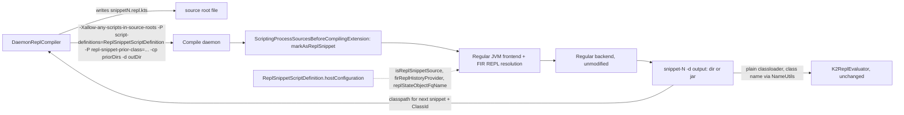

# Feedback & Investigation

### The two review complaints
1. *"You're still using a custom decoder for directory"* — `SnippetArtifactDirectoryCodec` (added last iteration) is a bespoke directory+header format. Even though the `.class` files inside are regular, a consumer still needs a private decoder (`readHeader`) to know which class to load and what the result field is called.
2. *"You're changing the script evaluation extension, that should not be involved in the compilation at all"* — `AbstractScriptEvaluationExtension.kt`'s `compileReplSnippet` function is a **compile-only** helper bolted onto the file that is supposed to own script *evaluation* (`ScriptEvaluationExtension.eval()`). It should not exist there, regardless of what it does internally.

### What the reviewer is actually pointing at
The compiler already has a fully **regular** way to turn a `.kts` file into a loadable class, with no bespoke plugin plumbing at all:
* `ScriptingProcessSourcesBeforeCompilingExtension.processSources` (`plugins/scripting/scripting-compiler/.../extensions/ScriptingProcessSourcesBeforeCompilingExtension.kt:245`) already returns `.kts` sources **untouched** into the regular frontend/backend whenever `-Xallow-any-scripts-in-source-roots` (`CommonConfigurationKeys.ALLOW_ANY_SCRIPTS_IN_SOURCE_ROOTS`) is set and the current `REPL_SNIPPET_COMPILATION_MODE` short-circuit is *not* engaged. That is: a plain `.kts` in the source list, with that one flag, already compiles end-to-end (frontend → backend → `-d`) into a normal script class, with zero custom code.
* `-P plugin:kotlin.scripting:script-definitions=<FQN>` + `script-definitions-classpath` (`ScriptingCommandLineProcessor.kt:23-30`) is the **existing, regular** mechanism for telling the scripting plugin about a non-default `ScriptDefinition` — exactly the "appropriate options" the issue refers to.

### Feasibility findings for REPL-snippet chaining on that regular path
* `KtScript.isReplSnippet`/`markAsReplSnippet()` (`compiler/psi/psi-api/.../KtScript.kt:43-90`) is the actual switch the FIR REPL machinery (`FirReplSnippetConfiguratorExtensionImpl`, `FirReplSnippetResolveExtensionImpl`) reacts to. Today it is **only** ever called by `K2ReplCompiler`'s own in-process orchestration (`K2ReplCompiler.kt:360`) — never by the regular CLI/JVM pipeline. This is the one genuinely missing piece of "base infrastructure": something must call `markAsReplSnippet()` before FIR resolution for a CLI/daemon-driven snippet. `ScriptingProcessSourcesBeforeCompilingExtension` already runs at exactly the right point (`ProcessSourcesBeforeCompilingExtension`, over `Collection<KtFile>`) to do this — it just needs to *mark-and-pass-through* instead of *intercept-and-shortcut*.
* `ScriptingHostConfiguration.repl.isReplSnippetSource` / `repl.firReplHistoryProvider` / `repl.replStateObjectFqName` are exactly the settings that turn a marked source into a *chained* snippet (prior-snippet symbols visible). `ScriptDefinition` (kotlin.script.experimental.definitions) already carries its own `hostConfiguration` — so a dedicated `ScriptDefinition`, loaded through the **existing** `script-definitions` option, is a fully regular way to supply them, matching the issue's own wording almost verbatim.
* `ArtifactBackedFirReplHistoryProvider` (`.../services/ArtifactBackedFirReplHistoryProvider.kt`) **already** resolves a prior snippet purely via `session.symbolProvider.getClassLikeSymbolByClassId(classId)` and reads its REPL-declarations sidecar straight from the located class's own `.kotlin_metadata` (embedded by `Fir2IrReplSnippetConfiguratorExtensionImpl.prepareSnippet` via the generic `ProtoBuf.CompilerPluginData` channel, keyed by `REPL_SIDECAR_PLUGIN_ID`). In other words: the "regular symbol extraction via metadata" mechanism the issue describes **already exists** — it is only fed a `ClassId` today via the custom `SnippetArtifact`/header blob. Feeding it the same `ClassId` through a plain, minimal plugin option instead removes the entire blob format.
* The wrapper class name for a given snippet source is **fully deterministic from its file name**, via the already-public `NameUtils.getScriptNameForFile`/`getSnippetTargetClassName` (`core/compiler.common/.../NameUtils.kt:39-56`) — confirmed by a leftover `Snippet_0_repl.class` artifact found at the repo root from an earlier test run of this exact naming convention. A caller who names the file it writes therefore already knows, with zero round-trip, the class it will get back.

### Verdict
The conversion the issue asks for is feasible and not overly complicated. It **removes** custom serialization (`SnippetArtifactDirectoryCodec` entirely, and the `AbstractScriptEvaluationExtension.kt` compile-only detour), and **adds** only one small, focused piece of new plumbing: a way for a CLI/daemon-driven snippet source to be marked + REPL-configured on the *regular* pipeline. The proposal below spells this out.

# Requirements

### Overview & Goals
Replace the bespoke `SnippetArtifact`/`SnippetArtifactDirectoryCodec` transport used by the on-daemon JSR-223 example (`:examples:scripting-jsr223-daemon`) with the compiler's **regular** compilation-artifact scheme: a `.kts` snippet is compiled through the unmodified regular JVM frontend/backend (enabled by `-Xallow-any-scripts-in-source-roots`) straight to a plain `-d` output (directory or jar); prior snippets are fed back purely via the regular classpath; the evaluation side loads compiled snippets with a plain classloader and recovers the small amount of extra bookkeeping it needs from the class's own embedded Kotlin metadata, via the same extraction mechanism the compiler's own REPL-history machinery already uses.

### Scope
**In scope**
* Revert `AbstractScriptEvaluationExtension.kt` to a pure evaluation-extension file — no compile-only `REPL_SNIPPET_COMPILATION_MODE` branch of any kind.
* Remove `SnippetArtifactDirectoryCodec` and the `-d`-vs-`repl-snippet-artifact-output` branching added for it; retire the `REPL_SNIPPET_ARTIFACT_OUTPUT`/`REPL_SNIPPET_PRIOR_ARTIFACTS` CLI surface used by the daemon example.
* Reduce `ScriptingProcessSourcesBeforeCompilingExtension` back to marking+passthrough: no interception, no calling `compileReplSnippet` itself.
* Add the minimal new infrastructure needed for a CLI/daemon-driven `.kts` source to compile as a *chained* REPL snippet on the regular pipeline (a `ScriptDefinition` supplying the REPL host-configuration, plus a metadata/classpath-driven `FirReplHistoryProvider`).
* Rework `DaemonReplCompiler` (`libraries/examples/scripting/jsr223-daemon`) to drive this regular pipeline: plain `-d` output, prior snippets passed as classpath entries plus their `ClassId`s, no bespoke decode step.
* Support both directory and jar-shaped compiled output uniformly on the evaluation side.

**Out of scope**
* The Build Tools API path (`CompileReplSnippetOperationImpl`, `SnippetArtifactCodec`, `SnippetArtifactHeader`): BTA's published `ReplSnippetCompilationResult.Success.artifact` is a plain, versioned `ByteArray` with no shared-filesystem assumption, a constraint this example does not have (investigated and confirmed in a prior iteration) — it keeps using the existing blob codec, unchanged.
* Any change to `K2ReplCompiler`'s in-process REPL behavior (used by the default in-process JSR-223 engine) beyond the narrow, additive infrastructure this proposal introduces.

### Functional Requirements
* A snippet compiled via `DaemonReplCompiler` must go through the compiler's regular frontend and backend — no `compileReplSnippet`/`K2ReplStatelessCompiler` call from a non-evaluation-safe entry point, and no involvement of `ScriptEvaluationExtension` at all.
* A later snippet must see the earlier snippets' declarations exactly as it does today (cross-snippet chaining preserved), driven only by (a) the earlier snippets' compiled classes being on the classpath and (b) their `ClassId`s being known to the frontend — no artifact blob/header file.
* The evaluation side must be able to load a compiled snippet from **either** a directory of `.class` files or a jar file, via a plain classloader, and must not depend on any bespoke decoder for that.
* All currently-passing behavior of `:examples:scripting-jsr223-daemon` (multiline/hostile-source snippets, runtime exceptions failing at eval not compile, compile errors failing at compile not eval, cross-snippet references) must keep passing unchanged.

# Technical Design

### Current Implementation
* `AbstractScriptEvaluationExtension.kt`'s `compileReplSnippet` (compile-only helper) and `ScriptingProcessSourcesBeforeCompilingExtension`'s `REPL_SNIPPET_COMPILATION_MODE` branch both drive `K2ReplStatelessCompiler` directly and write a `SnippetArtifact` (either `SnippetArtifactCodec`'s blob or `SnippetArtifactDirectoryCodec`'s directory+header) — the exact things flagged in review.
* `DaemonReplCompiler` (`libraries/examples/scripting/jsr223-daemon/.../DaemonReplCompiler.kt`) drives this via `repl-snippet-mode`/`repl-snippet-prior-artifact` plugin options, decodes `SnippetArtifactDirectoryCodec`'s header to learn the wrapper class name and result field, and wraps a `KJvmCompiledModuleFromClassPath` around the output directory.

### Key Decisions
1. **Compile path: regular frontend/backend, not a compile-only helper.** `ScriptingProcessSourcesBeforeCompilingExtension` goes back to being a pure `sources`-filter (its pre-existing `ALLOW_ANY_SCRIPTS_IN_SOURCE_ROOTS` passthrough). The only new behavior it gains is calling `KtScript.markAsReplSnippet()` on a recognized snippet source before returning it — the source then flows into the *unmodified* regular pipeline, so `-d` produces a real, regular script class. `AbstractScriptEvaluationExtension.kt` is reverted to have no knowledge of this feature whatsoever.
2. **REPL host-configuration is supplied by a dedicated `ScriptDefinition`, loaded through the existing `script-definitions`/`script-definitions-classpath` options** — not a bespoke plugin flag reinterpreted ad hoc. A new `ReplSnippetScriptDefinition` (shipped by the example, or as a small reusable class in `scripting-compiler`) sets `hostConfiguration { repl { isReplSnippetSource { _, _ -> true }; firReplHistoryProvider(...); replStateObjectFqName(...) } }`. This is the literal reading of the issue's "script compilation configuration is provided to the scripting plugin via appropriate options, if a non-default script definition is used", and it means any future same-machine caller gets chained-snippet compilation for free, without inventing a parallel option surface.
3. **Prior-snippet linkage travels through the regular classpath + a minimal `ClassId` list**, not an artifact blob. A new, small `FirReplHistoryProvider` (sibling of `ArtifactBackedFirReplHistoryProvider`, reusing its proven `session.symbolProvider.getClassLikeSymbolByClassId` + embedded-metadata-sidecar read) is constructed from an ordered list of prior `ClassId`s supplied via one new minimal plugin option (`repl-snippet-prior-class`); the prior snippets' compiled `.class` files reach the frontend purely via `-cp`. `repl-snippet-prior-artifact` and `repl-snippet-artifact-output` are removed from `DaemonReplCompiler`'s usage; `SnippetArtifactDirectoryCodec` is deleted outright (superseded, not kept as an alternative).
4. **The evaluation side never runs a bespoke decoder.** `DaemonReplCompiler.decodeCompiledSnippet` predicts each snippet's wrapper class name directly from the source file name it wrote, via the existing public `NameUtils.getScriptNameForFile`/`getSnippetTargetClassName` (`core/compiler.common`) — no header round-trip. The compiled output (directory or jar, both supported) is wrapped in a plain classloader (`KJvmCompiledModuleFromClassPath`, which already accepts either shape) to build the `KJvmCompiledScript` that `K2ReplEvaluator` runs unmodified, exactly as today.

### Proposed Changes
* **`plugins/scripting/scripting-compiler`**:
  * `AbstractScriptEvaluationExtension.kt` — remove `compileReplSnippet` and every `REPL_SNIPPET_COMPILATION_MODE`/artifact-output reference; restore to evaluation-only content.
  * `extensions/ScriptingProcessSourcesBeforeCompilingExtension.kt` — remove the interception branch; add a small `markAsReplSnippet()` call for sources recognized as snippet sources, then `return sources` (not `emptyList()`).
  * `impl/SnippetArtifact.kt` — delete `SnippetArtifactDirectoryCodec`; keep `SnippetArtifactCodec`/`SnippetArtifactHeader`/`SnippetArtifactSidecar` (still needed by BTA and by `ArtifactBackedFirReplHistoryProvider`'s embedded-metadata read).
  * New `services/ClasspathBackedFirReplHistoryProvider.kt` (name indicative): takes an ordered `List<ClassId>` instead of `List<SnippetArtifact>`; otherwise reuses `ArtifactBackedFirReplHistoryProvider`'s symbol-provider + embedded-sidecar logic verbatim (consider refactoring the shared logic into a common base rather than duplicating).
  * `ScriptingCommandLineProcessor.kt`/`ScriptingConfigurationKeys.kt` — drop `repl-snippet-artifact-output`/`repl-snippet-prior-artifact`(-directory variant); add `repl-snippet-prior-class` (`<ClassId>`, repeated).
* **`libraries/examples/scripting/jsr223-daemon`**:
  * New `ReplSnippetScriptDefinition.kt` — the `ScriptDefinition` from Key Decision 2, loaded via `-P plugin:kotlin.scripting:script-definitions=...` + `script-definitions-classpath`.
  * `DaemonReplCompiler.kt` — `buildSnippetCompilerArguments` rebuilt: `-Xallow-any-scripts-in-source-roots`, `script-definitions`/`script-definitions-classpath` (pointing at `ReplSnippetScriptDefinition`), `repl-snippet-prior-class` per prior, `-cp <priorOutputDir1>:<priorOutputDir2>...`, `-d <outputDir>` (unchanged); `decodeCompiledSnippet` rebuilt around `NameUtils`-predicted class names, no `SnippetArtifactDirectoryCodec` import.

### Data Models / Contracts
```
// New plugin option (ScriptingCommandLineProcessor)
-P plugin:kotlin.scripting:repl-snippet-prior-class=<classId>   // repeated, snippet order 1..N-1

// New FirReplHistoryProvider shape (services package)
class ClasspathBackedFirReplHistoryProvider(
    private val priorClassIds: List<ClassId>,
    private val sourceSessionProvider: () -> FirSession?,
) : FirReplHistoryProvider()   // resolves each ClassId via session.symbolProvider,
                                // reads its embedded SnippetArtifactSidecar from .kotlin_metadata
```

### Architecture Diagram


### Risks
* The `ScriptDefinition`-matching mechanism (how the frontend decides *which* `.kts` file uses `ReplSnippetScriptDefinition` vs. the default one) needs a concrete convention — most naturally the definition's own `fileExtension`/pattern (e.g. `.repl.kts`), consistent with how script definitions are normally matched; needs to be nailed down during implementation.
* `SnippetArtifactSidecar`'s embedded-metadata format is explicitly a prototype (`sidecarVersion`); reusing it from a second history-provider implementation increases the number of places that need updating on format changes — mitigate by refactoring the shared decode logic into one function both providers call.
* Verify whether `-Xuse-fir-lt=false` (needed by the current PSI-based source-collection path) is still required once `ScriptingProcessSourcesBeforeCompilingExtension` no longer short-circuits — it very likely still is, since that extension point only fires on the PSI path.

# Delivery Steps

### ✓ Step 1: Revert the compile-only detour from the evaluation extension and drop the bespoke directory codec
AbstractScriptEvaluationExtension.kt and ScriptingProcessSourcesBeforeCompilingExtension.kt no longer contain any REPL-snippet compile-only logic; SnippetArtifactDirectoryCodec is deleted.

- Remove `compileReplSnippet` and every `REPL_SNIPPET_COMPILATION_MODE`/artifact-output reference from `AbstractScriptEvaluationExtension.kt`, restoring it to pure evaluation-extension content.
- Restore `ScriptingProcessSourcesBeforeCompilingExtension.processSources` to its pre-existing `ALLOW_ANY_SCRIPTS_IN_SOURCE_ROOTS` passthrough logic, removing the interception branch that calls `compileReplSnippet` and returns `emptyList()`.
- Delete `SnippetArtifactDirectoryCodec` from `SnippetArtifact.kt`; keep `SnippetArtifactCodec`/`SnippetArtifactHeader`/`SnippetArtifactSidecar` untouched (still used by BTA and by `ArtifactBackedFirReplHistoryProvider`).
- Remove the now-unused `repl-snippet-artifact-output`/`repl-snippet-prior-artifact` (directory-aware) branching from `ScriptingCommandLineProcessor.kt`/`ScriptingConfigurationKeys.kt` that only existed to support the directory scheme; leave the blob-scheme options BTA needs in place if still referenced elsewhere.
- Remove/adjust the now-invalid `ScriptingCompilerPluginTest.testReplSnippetCompilationPipelineBranchRegularOutput` test (it exercised the deleted directory codec).
- User decision (session 2026-07-05): do not fix/rework BTA's `CompileReplSnippetOperationImpl` yet — instead comment out/stub the parts of it that only compiled because of the now-removed `compileReplSnippet`/`REPL_SNIPPET_COMPILATION_MODE`/`REPL_SNIPPET_ARTIFACT_OUTPUT`/`REPL_SNIPPET_PRIOR_ARTIFACTS` surface, just enough to keep the module compiling; BTA's actual rework is deferred to a future iteration.

### ✓ Step 2: Add the minimal frontend infrastructure for chained REPL-snippet compilation on the regular pipeline
A `.kts` source can be compiled as a chained REPL snippet purely through the regular JVM frontend/backend, driven by a dedicated ScriptDefinition and a classpath+ClassId-based history provider.

- Add `ReplSnippetScriptDefinition`: a `ScriptDefinition` whose `hostConfiguration` sets `repl.isReplSnippetSource`, `repl.firReplHistoryProvider`, and `repl.replStateObjectFqName`, discoverable via the existing `-P plugin:kotlin.scripting:script-definitions=<FQN>` + `script-definitions-classpath` options.
- Add `repl-snippet-prior-class` (`<ClassId>`, repeated, snippet order) to `ScriptingCommandLineProcessor.kt`/`ScriptingConfigurationKeys.kt`.
- Add a new `FirReplHistoryProvider` implementation that takes the ordered `List<ClassId>` from that option and resolves each one via `session.symbolProvider.getClassLikeSymbolByClassId`, reusing `ArtifactBackedFirReplHistoryProvider`'s existing embedded-`.kotlin_metadata` sidecar decode logic (refactor the shared bits into a common helper rather than duplicating).
- Wire `KtScript.markAsReplSnippet()` for sources recognized as snippet sources (via `ReplSnippetScriptDefinition`'s matching), inside `ScriptingProcessSourcesBeforeCompilingExtension`, before they are returned to the regular pipeline.
- Add a test in `ScriptingCompilerPluginTest`/`K2ReplStatelessCompilerTest` proving a `.kts` compiled through the plain CLI/K2JVMCompiler entry point (no `compileReplSnippet` call anywhere) produces a regular script class that both compiles standalone and, for a second snippet, resolves references to the first snippet's declarations via the new history provider.

### ✓ Step 3: Rework DaemonReplCompiler to drive the regular pipeline with plain classpath-based artifacts
DaemonReplCompiler compiles and links snippets purely through -d output, classpath entries, and predicted class names, with no bespoke decoder.

- Rebuild `buildSnippetCompilerArguments`: `-Xallow-any-scripts-in-source-roots`, `-P script-definitions=ReplSnippetScriptDefinition` + its classpath, `-P repl-snippet-prior-class=<ClassId>` per prior snippet, `-cp <priorOutputDir1>:<priorOutputDir2>...` for prior snippets' classes, `-d <outputDir>` (directory, unchanged).
- Rebuild `decodeCompiledSnippet`: predict the wrapper class name from the snippet's source-file name using `NameUtils.getScriptNameForFile`/`getSnippetTargetClassName` instead of reading any header; keep building `KJvmCompiledScript` via `KJvmCompiledModuleFromClassPath` over the output.
- Resolve the result-field name needed by `KJvmCompiledScript` either via the shared metadata-sidecar reader added in the previous stage, or via a threaded snippet-counter convention (`ScriptCompilationConfiguration.repl.currentLineId`) — pick whichever the previous stage's history-provider design makes cheaper, and document the choice.
- Remove all remaining `SnippetArtifactDirectoryCodec`/header imports and KDoc references from `DaemonReplCompiler.kt`, `KotlinJsr223DaemonScriptEngineImpl.kt`, and `KotlinJsr223DaemonScriptEngineFactory.kt`.

### ✓ Step 4: Verify uniform directory/jar loading and regression-proof the redesign
The example's classloading path works identically whether -d produced a directory or a jar, and the full existing test suite passes unchanged.

- Confirm/extend the classloader construction in `decodeCompiledSnippet` to accept both a directory output and a jar output transparently (both are valid `-d` targets and both work with `KJvmCompiledModuleFromClassPath`'s classpath-entry list).
- Re-run `KotlinJsr223DaemonScriptEngineTest` (multiline/hostile-source snippets, runtime-exception-vs-compile-error tests, cross-snippet-reference tests) and `DaemonReplCompilerTest` end to end against the reworked compiler, fixing any behavioral gaps surfaced by the redesign.
- Re-run `:kotlin-scripting-compiler:test` (including `ScriptingCompilerPluginTest`/`K2ReplStatelessCompilerTest`) to confirm the shared extension/history-provider changes introduce no regression for the in-process K2 REPL engine or BTA.
- Update `.ai` docs (new iteration addendum, `ITERATION_RESULTS.md`, `target/40-jsr223-target.md`) describing the investigation findings, the chosen design, and the migration away from the bespoke artifact codec.