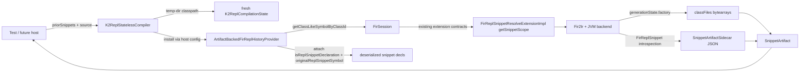

# Requirements

### Overview & Goals

Land the **first raw prototype** of stateless remote K2 REPL compilation as the proof-of-concept for migration-plan step 3 (workstream: *Stateless remote REPL compilation prototype*). Goal: compile snippet *N* without an in-memory `K2ReplCompilationState` from earlier snippets — instead, accept an ordered list of **`SnippetArtifact`** values (classfiles + paired JSON sidecar) and produce a new `SnippetArtifact` for snippet *N*.

This prototype is **internal** to `plugins/scripting/scripting-compiler`. No public API additions. No `FirReplSnippet*Extension` contract changes. No FIR serialization. No transport (BTA / IPC) yet. The prototype's only consumer is a new internal test in `plugins/scripting/scripting-compiler/tests`.

This closes the empirical part of **Q5a** (reconstruction feasibility) and lets **Q5b** (sidecar format) progress from "open" to "JSON locked for prototype, protobuf-in-metadata planned for promotion."

### Scope

#### In Scope

- New internal class `K2ReplStatelessCompiler` (sibling of `K2ReplCompiler`).
- New internal data types: `SnippetArtifact`, `SnippetArtifactSidecar`, JSON codec.
- New internal class `ArtifactBackedFirReplHistoryProvider : FirReplHistoryProvider`.
- Sidecar emission from the existing successful-compile path, capturing the minimal field set needed by `FirReplSnippetResolveExtensionImpl` and `Fir2IrReplSnippetConfiguratorExtensionImpl`.
- Runtime instrumentation (logging-based, gated by a system property) confirming `Fir2IrClassifierStorage.getFir2IrLazyClass` is invoked on deserialized prior-snippet classes and returns a usable `IrClass` parent.
- One end-to-end happy-path test in `plugins/scripting/scripting-compiler/tests` covering: a previously compiled `val x = 42` artifact + fresh source `x + 1` → second-snippet bytecode that resolves `x` against the deserialized snippet-1 wrapper class, runs, and returns `43`.
- Synthetic snippets remain first-class: the sidecar's `isSynthetic` flag is populated and round-tripped, and synthetic snippets are passed through `priorSnippets` just like user snippets.

#### Out of Scope

- Public API in `libraries/scripting/common` (`StatelessReplCompiler` interface). Deferred to a later step after the prototype validates the design.
- Build-Tools-API operation / IntelliJ in-process embedding (Q5d).
- Daemon-bridge migration (Q5e).
- Switching sidecar from JSON to protobuf-in-`.kotlin_metadata` (planned step 3 of the original proposal — only after the JSON prototype passes).
- Caller-side `FirSession` caching for performance (Q5c) — measured but not optimised here.
- Routing the existing stateful `K2ReplCompiler` through the stateless core (planned step 2 of the original proposal — only after this prototype passes).
- Changes to `FirReplSnippetConfiguratorExtensionImpl`, `FirReplSnippetResolveExtensionImpl`, `Fir2IrReplSnippetConfiguratorExtensionImpl` contracts. The prototype plugs into the existing `firReplHistoryProvider` host-config key.
- Changes to `FirReplSnippet` FIR-tree generator.

### User Stories

- As a future REPL host author (daemon / IDE / build tool), I want to compile snippet *N* given only the *byte-array artifacts* of snippets 1..N-1, so that I do not need to keep a live `FirSession` per REPL session.
- As a Kotlin compiler engineer, I want a single failing or passing test that exercises the entire reconstruction path, so that every Q5a sub-concern (lazy-class parent, attribute restoration, history-scope build, cross-snippet IR wiring) is forced to surface together rather than be debugged in isolation.
- As a Kotlin scripting maintainer, I want the prototype to keep synthetic-snippet semantics intact (Option D bindings, planned implicit cells), so the stateless path does not regress JSR-223 work that landed in step 1.

### Functional Requirements

- Given `priorSnippets: List<SnippetArtifact>` and a new `SourceCode`, `K2ReplStatelessCompiler.compile(...)` returns either a fresh `SnippetArtifact` or a failure diagnostic — no mutation of the input list, no cross-call hidden state in the compiler instance.
- A `SnippetArtifact` is fully self-describing: `classFiles: Map<String, ByteArray>` keyed by JVM internal name, plus `sidecar: ByteArray` (JSON-encoded `SnippetArtifactSidecar`).
- A reconstructed snippet symbol carries the same `isReplSnippetDeclaration` and `originalReplSnippetSymbol` markings as a freshly-resolved one, so the existing `FirReplSnippetResolveExtensionImpl.getSnippetScope` runs **unmodified**.
- The prototype works without re-running snippet 1's source code — only its classfiles + sidecar are required.
- Synthetic snippets are recorded in the sidecar (`isSynthetic = true`) and round-trip correctly; the caller must retain synthetic-snippet artifacts in `priorSnippets`.

### Non-Functional Requirements

- Test must complete in under 30s in the existing `:plugins:scripting:scripting-compiler:test` Gradle task on the same hardware that runs `CustomK2ReplTest`.
- No new dependencies. JSON codec uses Kotlin stdlib + an existing in-tree minimal JSON utility (or hand-rolled — fewer than ~100 LOC).
- No public-API surface changes (`@InternalScriptingApi` or `internal` visibility on every new type).
- Code follows the project guidelines in `/Users/ich-jb/Work/kotlin/ws/scripting/.ai/guidelines.md` (Kotlin engineering rules; no new K1 paths; no new public EPs; no daemon-REPL revival).

# Technical Design

### Current Implementation

#### Existing entry points

- `plugins/scripting/scripting-compiler/src/.../impl/K2ReplCompiler.kt`:
  - `class K2ReplCompiler(state: K2ReplCompilationState)` — stateful compiler; `state` accumulates `lastCompiledSnippet`, `moduleDataProvider`, `sharedLibrarySession`, etc., across calls.
  - `K2ReplCompiler.createCompilationState(...)` — builds the long-lived state, installing a `FirReplHistoryProviderImpl` (LinkedHashSet of `FirReplSnippetSymbol`) into `ScriptingHostConfiguration.repl.firReplHistoryProvider`.
  - `compileImpl(state, snippet, scriptCompilationConfiguration)` (file-private, lines 263–428) — the per-snippet pipeline: refinement → `getScriptKtFile` → FIR resolution via `createSourceSession` + `buildFirFromKtFiles` → checkers → `convertAnalyzedFirToIr` → `generateCodeFromIr` → `makeCompiledScript`.
  - `ReplModuleDataProvider.addNewLibraryModuleDataIfNeeded(libraryPaths)` already supports adding library classpath roots mid-session — this is the mechanism we reuse to inject prior-snippet classfiles as additional library roots.

#### Existing snippet-side EPs consumed

- `FirReplSnippetConfiguratorExtensionImpl` — reads only the **current** snippet's `ScriptCompilationConfiguration`, no history dependency. Untouched by this prototype.
- `FirReplSnippetResolveExtensionImpl.getSnippetScope` — consumes the `firReplHistoryProvider` to enumerate prior snippets and build a `FirReplHistoryScope` of `FirProperty`/`FirNamedFunction`/`FirRegularClass`/`FirTypeAlias` symbols filtered by `isReplSnippetDeclaration == true`. Untouched in code; we swap the host-config-bound provider for our reconstruction-based one.
- `FirReplSnippetResolveExtensionImpl.getSnippetDefaultImports` — calls `snippet.moduleData.session.firProvider.getFirReplSnippetContainerFile(snippet)?.imports`. The reconstruction path must provide a `FirFile` whose `imports` match the snippet-1 originals.
- `Fir2IrReplSnippetConfiguratorExtensionImpl.prepareSnippet` — `CollectAccessToOtherState` reads `originalReplSnippetSymbol`, then `classifierStorage.getFir2IrLazyClass(classSymbol.fir)` on the prior snippet's class symbol. Whether `getFir2IrLazyClass` accepts a *deserialized* (library) `FirRegularClass` as input is the empirical question to settle in this prototype (Q5a).

#### What blocks the stateless mode today

1. `FirReplHistoryProviderImpl` is a live in-memory `LinkedHashSet<FirReplSnippetSymbol>` — it cannot survive across compiler-instance boundaries.
2. `K2ReplCompilationState` holds a `FirSession`, `ReplModuleDataProvider`, and `lastCompiledSnippet` — none of these are serializable, and rebuilding them per call requires no specific change to other code, only a new orchestrator.
3. `isReplSnippetDeclaration` is a `FirDeclarationDataRegistry` attribute (see `compiler/fir/tree/src/.../declarations/utils/declarationAttributes.kt`) — not in `.kotlin_metadata`. The sidecar must restore it.
4. `originalReplSnippetSymbol` is currently *written during resolution of the next snippet* — a session-local back-pointer. In a stateless model we attach it during history-provider construction.

### Key Decisions

- **Decision 1: stateless mode is a sibling compiler, not a replacement.** A new `K2ReplStatelessCompiler` class lives next to `K2ReplCompiler`. The stateful `K2ReplCompiler` is left untouched in this prototype. Re-expressing the stateful entry on top of the stateless core is a future step, gated on this prototype passing tests. Rationale: minimises blast radius; lets the prototype's failure modes be observed in isolation; keeps the JSR-223 K2 bindings work landed in step 1 unaffected.

- **Decision 2: sidecar = paired JSON file (`<snippetName>.repl.json`).** Tracked alongside the classfile bytes inside the `SnippetArtifact` data class — *not* a separate file on disk during the prototype. The caller is the test, which keeps both blobs in memory. Hand-rolled JSON codec (~100 LOC) avoids pulling kotlinx.serialization into `scripting-compiler` for a throwaway format. Rationale: fastest iteration, cleanest diffing in tests, lowest barrier to changing the field set. Protobuf-in-metadata is the planned promotion target (step 3 of the original proposal), only after the field set stabilises.

- **Decision 3: artifact-backed history provider plugs in through the existing `firReplHistoryProvider` host-config key.** No new `FirReplSnippetResolveExtension` contract. The provider implements `FirReplHistoryProvider.getSnippets()` and lazily synthesises `FirReplSnippetSymbol` instances over symbols looked up via `session.symbolProvider.getClassLikeSymbolByClassId(...)`. Rationale: zero change to extension contracts; minimises diff; the resolve extension's existing logic runs untouched.

- **Decision 4: `isReplSnippetDeclaration` and `originalReplSnippetSymbol` are re-applied to deserialized declarations on first-walk and cached per session.** Acceptable because each stateless call constructs a fresh `FirSession`, so writes to deserialized FIR declarations are session-local. The one-session-per-call invariant is documented in a kdoc on `ArtifactBackedFirReplHistoryProvider`. Rationale: avoids inventing a per-session attribute store now; the constraint is naturally satisfied by the stateless API.

- **Decision 5: synthetic-snippet artifacts must be retained by the caller** and passed in `priorSnippets` in order. The sidecar carries `isSynthetic: Boolean` purely as a diagnostic / harness flag; the resolve extension does not branch on it. Rationale: synthetic snippets carry real declarations (JSR-223 binding cells and future implicit-snippet uses) that subsequent user snippets must resolve against — dropping them would break references.

- **Decision 6: prior-snippet classfiles are fed into the compile as in-memory classpath roots via a `VirtualFile` overlay**, reusing the existing `ReplModuleDataProvider.addNewLibraryModuleDataIfNeeded` mechanism. For the prototype, the test writes prior-snippet classfiles to a temp directory and passes them as a `JvmClasspathRoot`. The pure in-memory overlay is a future refinement. Rationale: temp-dir indirection is one file write per snippet in tests — trivial overhead — and avoids touching `VfsBasedProjectEnvironment` plumbing in the prototype.

- **Decision 7: runtime instrumentation lives behind a system property** (e.g. `kotlin.scripting.repl.stateless.debug=true`) and emits `System.err` lines tagged `[STATELESS_REPL]`. No new logging infrastructure. Rationale: instrumentation is for the one-time Q5a empirical check; permanent logging is over-engineering for the prototype.

### Proposed Changes

#### New files (all under `plugins/scripting/scripting-compiler/src/org/jetbrains/kotlin/scripting/compiler/plugin/`)

1. **`impl/SnippetArtifact.kt`** — data classes + JSON codec.
2. **`services/ArtifactBackedFirReplHistoryProvider.kt`** — `FirReplHistoryProvider` impl that materialises `FirReplSnippetSymbol` from a list of `SnippetArtifact` against a freshly-constructed `FirSession`.
3. **`impl/K2ReplStatelessCompiler.kt`** — orchestrator: takes `priorSnippets` + source, builds a fresh `K2ReplCompilationState`-shaped context with prior classfiles on classpath and the artifact-backed history provider installed, runs `compileImpl` (extracted seam or duplicated as needed for the prototype — see Decision 1 note), captures the result, builds a new `SnippetArtifact`.

#### New test file

4. **`plugins/scripting/scripting-compiler/tests/org/jetbrains/kotlin/scripting/compiler/test/K2ReplStatelessCompilerTest.kt`** — single happy-path test plus a small helper to extract `SnippetArtifact` from a stateful-compile result for snippet 1 (so we don't bootstrap by hand). The helper goes through `K2ReplCompiler` for snippet 1 to produce an artifact; then `K2ReplStatelessCompiler` consumes only that artifact for snippet 2.

#### Existing files — minimal changes

5. **`impl/K2ReplCompiler.kt`** — only if needed to expose helpers (e.g. `selectJvmTarget`, sidecar capture from a successful `compileImpl` result). Prefer **internal extension/helper visibility** over restructuring `compileImpl` itself. The stateless path may duplicate small parts of `compileImpl` for the prototype rather than introducing a shared seam — Decision 1 mandates minimising churn here.

### Data Models / Contracts

```kotlin
// impl/SnippetArtifact.kt — all `internal`, all in scripting-compiler

internal data class SnippetArtifact(
    val classFiles: Map<String /* JVM internal name */, ByteArray>,
    val sidecar: SnippetArtifactSidecar,
)

internal data class SnippetArtifactSidecar(
    val sidecarVersion: Int,                    // = 1 for the prototype
    val snippetName: String,                    // matches FirReplSnippet.name
    val snippetClassInternalName: String,       // JVM internal name of the wrapper class containing $$eval
    val packageFqName: String,
    val historyIndex: Int,
    val replSnippetDeclarations: List<MemberRef>,
    val imports: List<ImportEntry>,
    val stateObjectFqName: String,              // ReplState class fq name (host-config-derived)
    val resultPropertyName: String?,            // e.g. "$$result"
    val isSynthetic: Boolean,
) {
    data class MemberRef(
        val kind: Kind,                         // PROPERTY | FUNCTION | CLASS | TYPEALIAS
        val name: String,
        val descriptor: String?,                // JVM descriptor for fn/prop; class internal name for class/typealias
    ) { enum class Kind { PROPERTY, FUNCTION, CLASS, TYPEALIAS } }

    data class ImportEntry(
        val fqName: String,
        val isAllUnder: Boolean,
        val aliasName: String?,
    )
}

internal object SnippetArtifactJsonCodec {
    fun encode(sidecar: SnippetArtifactSidecar): ByteArray
    fun decode(bytes: ByteArray): SnippetArtifactSidecar
}

// impl/K2ReplStatelessCompiler.kt

internal class K2ReplStatelessCompiler {
    suspend fun compile(
        priorSnippets: List<SnippetArtifact>,
        snippet: SourceCode,
        scriptCompilationConfiguration: ScriptCompilationConfiguration,
        hostConfiguration: ScriptingHostConfiguration = defaultJvmScriptingHostConfiguration,
    ): ResultWithDiagnostics<SnippetArtifact>
}

// services/ArtifactBackedFirReplHistoryProvider.kt

internal class ArtifactBackedFirReplHistoryProvider(
    private val priorSnippets: List<SnippetArtifact>,
    private val sourceSession: () -> FirSession, // lazy — session is built after this provider is installed
) : FirReplHistoryProvider() {
    override fun getSnippets(): Iterable<FirReplSnippetSymbol> // materialised lazily, cached after first call
    override fun putSnippet(symbol: FirReplSnippetSymbol)      // no-op (the new snippet is not added back here)
    override fun isFirstSnippet(symbol: FirReplSnippetSymbol): Boolean
    override fun getSnippetCount(): Int = priorSnippets.size
}
```

The sidecar emission side reads from the just-compiled `FirReplSnippet`:

```kotlin
// pseudo: inside K2ReplStatelessCompiler.compile, after a successful compileImpl call
val firSnippet: FirReplSnippet = /* extract from compileImpl session.firProvider */
val sidecar = SnippetArtifactSidecar(
    sidecarVersion = 1,
    snippetName = firSnippet.name.asString(),
    snippetClassInternalName = firSnippet.snippetClass.classId.asString().replace('.', '/'),
    packageFqName = firSnippet.symbol.classId.packageFqName.asString(),
    historyIndex = priorSnippets.size,
    replSnippetDeclarations = firSnippet.snippetClass.declarations
        .filter { it.isReplSnippetDeclaration == true }
        .map { it.toMemberRef() },
    imports = session.firProvider.getFirReplSnippetContainerFile(firSnippet)
        ?.imports.orEmpty().map { it.toImportEntry() },
    stateObjectFqName = hostConfiguration[ScriptingHostConfiguration.repl.replStateObjectFqName]?.asString().orEmpty(),
    resultPropertyName = scriptCompilationConfiguration[ScriptCompilationConfiguration.resultField],
    isSynthetic = scriptCompilationConfiguration[ScriptCompilationConfiguration.repl._isSyntheticSnippet] == true,
)
val classFiles = generationState.factory.asList()
    .associate { it.relativePath.removeSuffix(".class") to it.asByteArray() }
return SnippetArtifact(classFiles, SnippetArtifactJsonCodec.encode(sidecar)).asSuccess()
```

### Components

 Component | Status | Description |
---|---|---|
 `K2ReplCompiler` | **untouched** in prototype | Stateful entry, continues to power existing tests + JSR-223 path. |
 `K2ReplCompilationState` | **untouched** | Used internally by `K2ReplStatelessCompiler` to set up a fresh per-call context. |
 `FirReplSnippetConfiguratorExtensionImpl` | **untouched** | Already history-independent. |
 `FirReplSnippetResolveExtensionImpl` | **untouched** | Runs unmodified against the artifact-backed history provider. |
 `Fir2IrReplSnippetConfiguratorExtensionImpl` | **untouched** in code; **observed** in test | Runtime instrumentation confirms `getFir2IrLazyClass` works on deserialized prior-snippet classes. |
 `FirReplHistoryProviderImpl` | **untouched** | Stays the default for the stateful path. |
 `K2ReplStatelessCompiler` | **new** | Public-internal orchestrator of the stateless compile. |
 `SnippetArtifact` / `SnippetArtifactSidecar` / `SnippetArtifactJsonCodec` | **new** | The portable representation of a compiled snippet. |
 `ArtifactBackedFirReplHistoryProvider` | **new** | Reconstructs `FirReplSnippetSymbol`s from artifacts; tags deserialized declarations with `isReplSnippetDeclaration` + `originalReplSnippetSymbol`. |

### File Structure

```
plugins/scripting/scripting-compiler/
├── src/org/jetbrains/kotlin/scripting/compiler/plugin/
│   ├── impl/
│   │   ├── K2ReplCompiler.kt                          # untouched (maybe minor internal accessor)
│   │   ├── SnippetArtifact.kt                         # NEW — data classes + JSON codec
│   │   └── K2ReplStatelessCompiler.kt                 # NEW — orchestrator
│   └── services/
│       ├── FirReplSnippetResolveExtensionImpl.kt      # untouched
│       └── ArtifactBackedFirReplHistoryProvider.kt    # NEW — reconstruction provider
└── tests/org/jetbrains/kotlin/scripting/compiler/test/
    └── K2ReplStatelessCompilerTest.kt                 # NEW — single happy-path test
```

### Architecture Diagram



### Risks

 Risk | Mitigation in prototype |
---|---|
 `getFir2IrLazyClass` on a deserialized prior-snippet class returns an unusable `IrClass` for `IrDeclarationOrigin.REPL_FROM_OTHER_SNIPPET` lowering. | Runtime instrumentation logs every call site; the single happy-path test asserts that snippet 2's bytecode resolves `x` against `Snippet1.x` — failure here is the clearest possible signal. |
 `originalReplSnippetSymbol` write to deserialized library declarations conflicts across sessions. | One-session-per-call invariant documented on `ArtifactBackedFirReplHistoryProvider`. Each stateless call builds a fresh `FirSession`. |
 `FirElementSerializer.normalizeVisibility` already forces snippet decls to `public` — but other consumers of `isReplSnippetDeclaration` (`FirDataFlowAnalyzer`, `FirLocalEntityNotAllowedChecker`) might fire on deserialized decls. | The provider tags decls *before* any session consumer walks them (on first `getSnippets()` call, materialised eagerly inside the `K2ReplStatelessCompiler.compile` setup phase, before `runResolution`). |
 Default-import reconstruction from a flat FQN list produces a different `FirFile.imports` than the in-memory path. | Test asserts that snippet 1's imports survive into snippet 2's resolution scope; if it diverges, the test fails on resolution rather than at codegen. |
 `ReplState` class identity drifts between calls (different `stateObjectFqName`). | Sidecar carries `stateObjectFqName`. The orchestrator validates that the caller-supplied `ScriptCompilationConfiguration` matches the sidecar of the first prior snippet; mismatch is a hard error with a diagnostic. |
 Nested REPL classes (`class Foo` inside a snippet) don't lift to top-level visibility via the sidecar list. | Sidecar `replSnippetDeclarations` includes `CLASS`/`TYPEALIAS` kinds. Not exercised by the first test but exercised by the **second** test if added later. |
 Synthetic snippets (Option D bindings) interact differently with the stateless path. | Sidecar `isSynthetic` carried; resolve extension does not branch on it; caller MUST pass synthetic-snippet artifacts in order. Documented on `K2ReplStatelessCompiler.compile`'s kdoc. |

# Testing

### Validation Approach

One end-to-end happy-path test forces every reconstruction concern listed in *Technical Design → Risks* to surface together. The test runs in `:plugins:scripting:scripting-compiler:test` (the suite that already hosts `CustomK2ReplTest` — same test infrastructure, same `withMessageCollectorAndDisposable` helper, same `K2ReplEvaluator`).

We deliberately do **not** add a second test class or fan out to nested-class / function variants in this prototype iteration — fan-out is gated on the happy path passing.

Gradle invocation (per `AGENT_INSTRUCTIONS.md` shell discipline):

```bash
./gradlew :plugins:scripting:scripting-compiler:test \
  --tests "*K2ReplStatelessCompilerTest*" \
  -q 2>&1 | tee "$SCRIPTING_TMP/stateless_repl_prototype.txt"
```

Runtime-instrumentation gate:

```bash
./gradlew :plugins:scripting:scripting-compiler:test \
  --tests "*K2ReplStatelessCompilerTest*" \
  -Dkotlin.scripting.repl.stateless.debug=true \
  -q 2>&1 | tee "$SCRIPTING_TMP/stateless_repl_prototype_instrumented.txt"
```

The instrumented run is the empirical answer to **Q5a**: grep the saved log for `[STATELESS_REPL]` lines confirming `getFir2IrLazyClass` was invoked on the deserialized snippet-1 class, returned a non-`null` `IrClass`, and that the resulting `Fir2IrLazyClass` was used as the parent for the synthesised `REPL_FROM_OTHER_SNIPPET` declarations.

### Key Scenarios

**Scenario A (the one test):** stateless compile of `x + 1` against a prior artifact for `val x = 42`.

1. Compile snippet 1 (`val x = 42`) via the existing stateful `K2ReplCompiler`.
2. Convert the resulting `CompiledSnippet` + supporting `FirReplSnippet` information into a `SnippetArtifact` using the same emission code path that `K2ReplStatelessCompiler` uses on success.
3. Construct a **fresh** `K2ReplStatelessCompiler`. Pass `priorSnippets = listOf(artifact1)` and the source `x + 1` named `s2.repl.kts`.
4. Assert: stateless compile succeeds; the returned `SnippetArtifact` has exactly one new wrapper classfile, non-empty `classFiles`, and a `sidecar.historyIndex == 1`.
5. Load both snippet classfiles into a `ClassLoader`, invoke snippet 2's `$$eval`, and assert the returned value is `43`.

### Edge Cases

- **Cold caller, no prior artifacts.** Already covered by the existing stateful tests; not re-exercised here (the empty-prior-list path is identical to a first-snippet stateful compile).
- **Synthetic-snippet round-trip.** Out of scope for the *single* prototype test, but `SnippetArtifactSidecar.isSynthetic` field is populated and serialized. Verified by a JSON-roundtrip unit assertion inside the same test class (cheap to add).
- **Mismatched `stateObjectFqName` between caller's `ScriptCompilationConfiguration` and the prior artifact's sidecar.** Hard-failure path. Not directly exercised in the happy-path test, but the orchestrator's mismatch check is unit-testable in the same test class.

### Test Changes

- **Add:** `plugins/scripting/scripting-compiler/tests/org/jetbrains/kotlin/scripting/compiler/test/K2ReplStatelessCompilerTest.kt`. Single test class with one `@Test` method (`testStatelessReplCompilesSnippetAgainstPriorArtifact`) plus 1–2 cheap assertions for sidecar JSON round-trip and `stateObjectFqName` mismatch detection.
- **Touch:** none of `CustomK2ReplTest`, `FirReplCompilerFacade`, the JSR-223 tests, or the host-test suites. The prototype is fully additive.
- **Test data:** none. The single test is fully programmatic — no `testData/` fixtures to register, no `./gradlew generateTests` run needed.
- **Suites to re-run after change** (per `AGENT_INSTRUCTIONS.md`):
  - `:plugins:scripting:scripting-compiler:test` — primary signal.
  - `:plugins:scripting:scripting-tests:test` — regression guard for the stateful path that shares helpers.
  - `:kotlin-scripting-jvm-host-test:test` — regression guard for `K2ReplCompiler` / `K2ReplEvaluator` public surface.

# Delivery Steps

### ✓ Step 1: Add `SnippetArtifact` data types and JSON codec
A new file `plugins/scripting/scripting-compiler/src/.../impl/SnippetArtifact.kt` defines the portable snippet representation and round-trips its sidecar through JSON.

- Add `internal data class SnippetArtifact(classFiles: Map<String, ByteArray>, sidecar: ByteArray)`.
- Add `internal data class SnippetArtifactSidecar` with fields: `sidecarVersion`, `snippetName`, `snippetClassInternalName`, `packageFqName`, `historyIndex`, `replSnippetDeclarations: List<MemberRef>`, `imports: List<ImportEntry>`, `stateObjectFqName`, `resultPropertyName`, `isSynthetic`.
- Add nested `MemberRef(kind: Kind, name, descriptor?)` with `enum Kind { PROPERTY, FUNCTION, CLASS, TYPEALIAS }` and nested `ImportEntry(fqName, isAllUnder, aliasName?)`.
- Add `internal object SnippetArtifactJsonCodec` with `encode(SnippetArtifactSidecar) → ByteArray` and `decode(ByteArray) → SnippetArtifactSidecar`, implemented as a small hand-rolled JSON writer/reader (no new dependency).
- Add `internal fun SnippetArtifact.encodeSidecar(): SnippetArtifact` and `internal fun ByteArray.decodeSnippetArtifactSidecar()` convenience helpers used by the orchestrator.
- Mark `sidecarVersion = 1` and gate decode on a non-1 version with a clear error.
- File-level kdoc states: paired-JSON is the prototype format; the field set is unstable until promoted to attached protobuf.

### ✓ Step 2: Capture sidecar from a successful compile
After a successful `compileImpl` run, the prototype builds a `SnippetArtifactSidecar` from the just-compiled `FirReplSnippet` and `generationState` without modifying the stateful `K2ReplCompiler` path.

- Add a small `internal` helper (`buildSnippetArtifactFromCompile`) in `impl/SnippetArtifact.kt` (or a sibling `impl/SnippetArtifactEmission.kt`) that takes: the final `FirReplSnippet`, the producing `FirSession`, the `org.jetbrains.kotlin.codegen.state.GenerationState`, the source `ScriptCompilationConfiguration`, the `ScriptingHostConfiguration`, and the prior history size (`historyIndex`).
- Read `firSnippet.snippetClass.declarations.filter { it.isReplSnippetDeclaration == true }` and map each to `SnippetArtifactSidecar.MemberRef` (kind from FIR class, `name` from `Name.identifier`, `descriptor` from JVM signature via existing FIR→JVM signature helpers used in serialization).
- Read imports via `session.firProvider.getFirReplSnippetContainerFile(firSnippet)?.imports.orEmpty()` and map each to `ImportEntry` (preserve `isAllUnder` and any alias).
- Read `stateObjectFqName` from `hostConfiguration[ScriptingHostConfiguration.repl.replStateObjectFqName]`.
- Read `resultPropertyName` from `scriptCompilationConfiguration[ScriptCompilationConfiguration.resultField]`.
- Read `isSynthetic` from `scriptCompilationConfiguration[ScriptCompilationConfiguration.repl._isSyntheticSnippet]`.
- Collect classfiles via `generationState.factory.asList().associate { it.relativePath.removeSuffix(".class") to it.asByteArray() }`.
- Return a `SnippetArtifact` with the JSON-encoded sidecar.
- Do not change `K2ReplCompiler` or `compileImpl` source — the helper is invoked only from the new orchestrator.

### ✓ Step 3: Add `ArtifactBackedFirReplHistoryProvider`
A new `services/ArtifactBackedFirReplHistoryProvider.kt` reconstructs `FirReplSnippetSymbol` instances from `SnippetArtifact`s and tags deserialized declarations so the existing resolve extension runs unmodified.

- Define `internal class ArtifactBackedFirReplHistoryProvider(priorSnippets: List<SnippetArtifact>, sourceSession: () -> FirSession) : FirReplHistoryProvider()`.
- Implement `getSnippets()` to lazily walk `priorSnippets` on first call. For each artifact: look up the wrapper class via `sourceSession().symbolProvider.getClassLikeSymbolByClassId(ClassId(packageFqName, classRelativeName))` (parsed from `sidecar.snippetClassInternalName`).
- Construct a `FirReplSnippetSymbol` over the deserialized class symbol and synthesise a minimal `FirReplSnippet`/`FirReplSnippetSymbol` view sufficient for `getSnippetScope` to walk `snippetClassSymbol.declarationSymbols` (verify the symbol-only path needs no `FirReplSnippet` body; if a body is required, build a stub).
- For each declaration named in `sidecar.replSnippetDeclarations`: locate the matching declaration symbol by name + descriptor, set `decl.isReplSnippetDeclaration = true` and `decl.originalReplSnippetSymbol = reconstructedSymbol`.
- Cache the materialised symbol list in a private `lazy` so subsequent `getSnippets()` calls are O(1).
- Implement `putSnippet`, `isFirstSnippet`, `getSnippetCount` against the prior list (no in-memory mutation across calls).
- Add gated logging (`System.getProperty("kotlin.scripting.repl.stateless.debug") == "true"`) tagged `[STATELESS_REPL]` on: symbol-lookup hits/misses, tag application, declaration-count per prior snippet.
- Kdoc the one-session-per-call invariant (Decision 4).

### ✓ Step 4: Add `K2ReplStatelessCompiler` orchestrator
A new `impl/K2ReplStatelessCompiler.kt` ties artifact intake → fresh-session compile → artifact output, without touching the stateful `K2ReplCompiler`.

- Define `internal class K2ReplStatelessCompiler` with `suspend fun compile(priorSnippets: List<SnippetArtifact>, snippet: SourceCode, scriptCompilationConfiguration: ScriptCompilationConfiguration, hostConfiguration: ScriptingHostConfiguration = defaultJvmScriptingHostConfiguration): ResultWithDiagnostics<SnippetArtifact>`.
- On each call: validate `stateObjectFqName` consistency across all `priorSnippets` and against the supplied `hostConfiguration` (fail with a clear diagnostic on mismatch).
- Write each prior snippet's `classFiles` into a per-call temp directory (use `Files.createTempDirectory("k2-repl-stateless-")`) — one `.class` file per entry; remember the directory's `Path` for cleanup.
- Build a fresh `K2ReplCompilationState` via `K2ReplCompiler.createCompilationState(...)`, with the host configuration overridden so that `repl.firReplHistoryProvider` is an `ArtifactBackedFirReplHistoryProvider` bound to `priorSnippets`.
- After `createCompilationState`, call `state.moduleDataProvider.addNewLibraryModuleDataIfNeeded(tempDirAsPaths)` and `state.compilerContext.environment.updateClasspath(...)` with `JvmClasspathRoot`s pointing at the temp directory — this is the same mechanism `compileImpl` uses for added dependencies.
- Drive a single-snippet compile by calling the existing `K2ReplCompiler.compile(snippet)` on the new state (the stateful path's per-call mutation is acceptable because the state is discarded after this call).
- On success: extract the `FirReplSnippet` and `generationState` from the linked compiled snippet (via existing public accessors on `CompiledSnippet`/`KJvmCompiledScript`, or via a tiny internal accessor added to `K2ReplCompiler` if necessary) and call `buildSnippetArtifactFromCompile(...)`.
- Ensure temp-directory cleanup in a `finally` block.
- Add gated `[STATELESS_REPL]` logging on prior-classpath setup, compile success/failure, and final artifact summary (number of classfiles, sidecar version, historyIndex).

### ✓ Step 5: Add end-to-end test `K2ReplStatelessCompilerTest`
A new test in `plugins/scripting/scripting-compiler/tests/.../K2ReplStatelessCompilerTest.kt` covers the single happy-path scenario plus a JSON round-trip and mismatch assertion.

- `@Test fun testStatelessReplCompilesSnippetAgainstPriorArtifact()`: uses `withMessageCollectorAndDisposable` (same helper as `CustomK2ReplTest`).
  1. Compile snippet 1 (`val x = 42` named `s1.repl.kts`) via the existing stateful `K2ReplCompiler`.
  2. Convert the snippet-1 result to a `SnippetArtifact` by invoking `buildSnippetArtifactFromCompile` against the underlying `FirReplSnippet` + `generationState` (helper exposed by step 2).
  3. Construct a **new** `K2ReplStatelessCompiler` instance and call `compile(listOf(artifact1), "x + 1".toScriptSource("s2.repl.kts"), baseCompilationConfiguration)`.
  4. Assert: result is `Success`; the returned `SnippetArtifact` has `sidecar.historyIndex == 1`; `classFiles` is non-empty and includes a class whose name encodes `s2`.
  5. Load both snippet classfiles via a `URLClassLoader` rooted on the test temp directory; invoke snippet 2's `$$eval`; assert the returned value is `43`.
- `@Test fun testSidecarJsonRoundtrip()`: build a representative `SnippetArtifactSidecar`, encode then decode, assert structural equality.
- `@Test fun testStateObjectFqNameMismatchIsRejected()`: pass a `priorSnippets` list whose sidecar `stateObjectFqName` disagrees with the caller's `hostConfiguration`; assert `ResultWithDiagnostics.Failure` with a diagnostic naming both values.
- After running, run the regression guards: `:plugins:scripting:scripting-tests:test` and `:kotlin-scripting-jvm-host-test:test` to confirm the stateful path is unaffected.
- When all tests pass, run the same scripting-compiler test once with `-Dkotlin.scripting.repl.stateless.debug=true` and grep the saved log for `[STATELESS_REPL]` lines confirming `getFir2IrLazyClass` was invoked on the deserialized snippet-1 class and returned non-null — this closes the Q5a empirical question for the prototype.