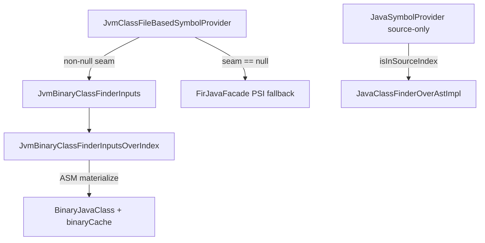
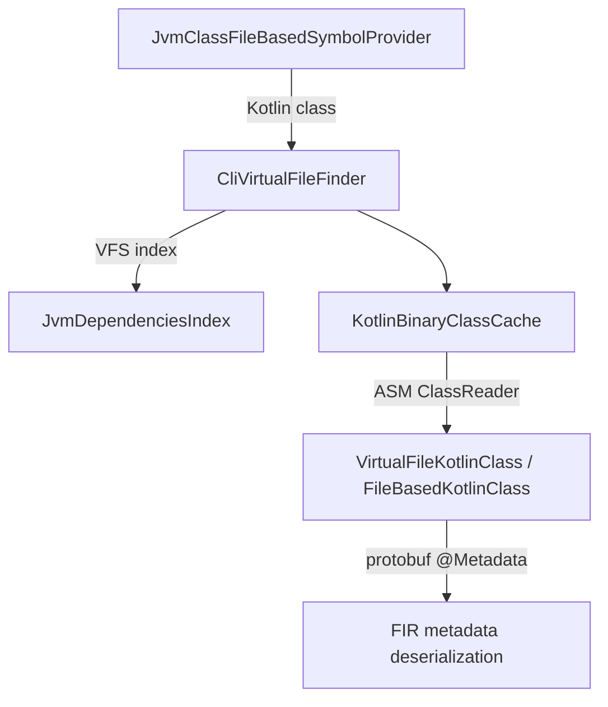

# Binary/Source Finder Divide — Review & Recommendations (2026-07-22)

Review of the `~ [j] implement binary/source finder divide` commit (`266caf3b9da2`) as it
stands on the current branch head, plus a completeness check of the wider `java-direct`
plan. Total removal of the PSI *fallback* is out of scope (known-deferred).

> **Partly superseded (2026-07-29).** The two lookup vocabularies this review describes are
> gone. The source-only probes on `JavaClassFinder`/`FirJavaFacade` (`isInSourceIndex`,
> `hasPackageInSources`, `sourceClassNamesInPackage`) and the deserializer seam
> (`JvmBinaryClassFinderInputs`) were deleted; sidedness is now expressed only by *which*
> `JavaClassFinder` a session is given. `JvmBinaryClassFinderInputsOverIndex` became
> `JavaClassFinderOverBinaryIndex : JavaClassFinder` and absorbed `LibraryJavaClassFinder`.
> Also note §3 wrongly claimed `isInSourceIndex` delegated to
> `JavaClassFinderOverAstImpl.isClassInIndex` — it never did; it evaluated to a constant
> `true`. §4.2's dead `CombinedJavaClassFinder.kt` was already removed by the divide commit.
> Sections about the seam, its fallbacks and its flag-gating are historical.

---

## 1. Scope & method

- Read the full divide commit diff and reconciled it against branch head (later commits
  `d9220d3` / `800b4bd` / `df11d1b` touched neighbouring code).
- Cross-checked the plan/status docs: `PSI_CLASS_FINDER_USAGE_AND_REPLACEMENT.md`,
  `MERGED_REFACTORING_PLAN_2026_05_04.md`, `ITERATION_RESULTS.md`, `RESOLUTION_SCHEMA.md`.
- Compared the new binary reader against the existing precedent it ports from,
  `KotlinCliJavaFileManagerImpl` (CLI's non-PSI binary Java reader), and against
  `KotlinBinaryClassCache` / `VirtualFileFinder`.

---

## 2. Completeness of the overall plan (excluding PSI-fallback removal)

| Track / item | Planned end-state | Status on branch |
|---|---|---|
| PSI-removal **Phase 1** — index-based binary reader | Replace PSI binary half with `JvmDependenciesIndex`+ASM reader | **Implemented** as `JvmBinaryClassFinderInputsOverIndex` |
| PSI-removal **Phase 2** — structural split | `JavaSymbolProvider` source-only; binary lookups owned by `JvmClassFileBasedSymbolProvider` via a deserializer seam | **Implemented** (`JvmBinaryClassFinderInputs` + source-only probes on `JavaClassFinder`/`FirJavaFacade`) |
| Resolver-unification Stages 1–5 | Single FIR-native classifier resolution path | **Landed** (per docs) |
| PSI-removal **Phase 3** — source PSI/AST switch behind a flag | Transitional `JavaClassFinderFactory` choice | **Pending / next** (tracked, not PSI-fallback removal) |
| Delete dead `CombinedJavaClassFinder.kt` | remove leftover | **Not done** — see §4.2 |
| `useJavaDirect` flag / old `if (true /*…*/)` hardcode | honor the flag or commit to always-on | Hardcode gone; flag honored for the **source** side, `df11d1b` flips default to on. Binary side is unconditional — see §4.1 |
| Restore binary-Java redeclaration coverage (`getJavaClassLikeSymbolByClassId`) | extend the helper to consult the deserializer with cross-session scoping | **Deferred** (documented in the helper KDoc; no test fixture yet) — see §4.6 |
| Close IJ-FP regression delta | re-baseline `IJ_FP_REGRESSION_ANALYSIS` | **Pending** (tracked, needs re-baseline) |

**Bottom line:** everything the divide commit set out to do (the Phase-1/2 binary/source
split) is implemented and wired end-to-end. The still-open items are exactly the ones the
docs already track as “next”, plus one concrete leftover (dead `CombinedJavaClassFinder`)
and one wiring subtlety worth an explicit decision (§4.1).

---

## 3. The binary/source divide — how it actually works now

Source and binary Java are now served by two independent providers in the library/source
sessions:

- **Source side** — `JavaSymbolProvider` is narrowed to Java *source* only. Its class-id
  gate moved from `javaFacade.hasTopLevelClassOf` (source∪binary) to the new
  `javaFacade.isInSourceIndex` probe; on `java-direct` that delegates to
  `JavaClassFinderOverAstImpl.isClassInIndex` (the AST package index). `hasPackage` and the
  symbol-names provider likewise moved to the new `hasPackageInSources` /
  `sourceClassNamesInPackage` probes. On non-`java-direct` single-side finders the new
  `JavaClassFinder` probe defaults (`isInSourceIndex = true`, etc.) make this a no-op.
- **Binary side** — `JvmClassFileBasedSymbolProvider` now owns binary lookups through the
  new `JvmBinaryClassFinderInputs` seam (`hasTopLevelBinaryClass`,
  `knownBinaryClassNamesInPackage`, `hasBinaryPackage`, `findBinaryClass`). When the seam
  is non-null the four `javaFacade.*` calls (`hasTopLevelClassOf`,
  `knownClassNamesInPackage`, `hasPackage`, `findClass`) are replaced by it; when null the
  deserializer falls back to `FirJavaFacade` (PSI/LL/IDE/scripting/IC/jklib).
- **Library facade shrinks to `package-info` only** — `LibraryJavaClassFinder` returns
  `null`/empty for class lookups and only surfaces the annotations of a binary
  `package-info.class` (for default-nullability qualifiers), reusing the same index adapter
  the deserializer reads through.

The source∪binary name union is reconstituted at the composite symbol-names-provider layer
(source-only set joined with `JvmClassFileBasedSymbolProvider.knownTopLevelClassesInPackage`).



---

## 4. Findings & recommendations

### 4.1 Binary seam is wired unconditionally, not gated by `useJavaDirect` (decision needed)

In `JvmFrontendPipelinePhase.prepareJvmSessions` the builder is created and passed to
`createLibrarySession` **regardless of the flag**:

```
val javaDirectBinaryClassFinderInputs = createJavaDirectBinaryClassFinderInputsBuilder(projectEnvironment)
val javaDirectFacade = if (configuration.useJavaDirect) { createJavaDirectSourceJavaFacadeBuilder(...) } else AbstractProjectEnvironment::getFirJavaFacade
...
createLibrarySession(..., createJavaFacade = javaDirectFacade, createBinaryClassFinderInputs = javaDirectBinaryClassFinderInputs)
```

`createJavaDirectBinaryClassFinderInputsBuilder` returns a non-null
`JvmBinaryClassFinderInputsOverIndex` whenever the `VirtualFileFinderFactory` is a
`CliVirtualFileFinderFactory` — i.e. **on every CLI JVM compile**. Consequences:

- The flag now only toggles the **source** finder; the **binary** reader is index/ASM-based
  for *all* CLI compilation, including the non-`java-direct` reference path.
- This is consistent with the plan (Phase 1/2 make the binary side index-based
  independently of the source switch), so it looks intentional — but it should be an
  explicit, documented decision, because:
  - The PSI regression gate no longer validates the *binary* reader against PSI (both flag
    states now share the same binary path); only the source half differs between them.
  - Any regression in `JvmBinaryClassFinderInputsOverIndex` affects `useJavaDirect=false`
    users too, so the “PSI fallback” safety net does **not** cover the binary side.

**Recommendation:** confirm intent explicitly. Either (a) document that the index binary
reader is unconditionally-on by design and keep a way to force the `FirJavaFacade` binary
fallback for A/B regression testing, or (b) gate `createBinaryClassFinderInputs` behind the
same flag so the off-path remains a true full PSI reference. Given the PSI-removal
direction, (a) is the likely choice — but it needs to be stated.

### 4.2 `CombinedJavaClassFinder.kt` is now dead code — delete it

The divide commit removed the only production wiring (`JavaDirectFacadeBuilder` no longer
builds a combined finder — source and binary are now separate providers). A whole-module
search finds no remaining references to `CombinedJavaClassFinder` other than the file
itself. The plan already lists “delete the dead `CombinedJavaClassFinder.kt`”. It is still
present.

**Recommendation:** delete `compiler/java-direct/src/.../CombinedJavaClassFinder.kt`.

### 4.3 `KotlinBinaryClassCache` is correctly avoided on the new binary path (confirmed)

This was the central question. Findings:

- `KotlinBinaryClassCache` is referenced only in `KotlinCoreEnvironment` (service
  registration) and `VirtualFileFinder.findKotlinClass*`. It caches **Kotlin** binary
  classes / raw `.class` content for *metadata* detection — it is **not** a Java-model
  cache.
- The new binary path does **not** route Java-class materialization through it. Instead
  `JvmBinaryClassFinderInputsOverIndex.findClassImpl` builds the Java model directly via
  ASM (`BinaryJavaClass`) and memoizes it in a **private per-session plain map**
  `binaryCache: MutableMap<ClassId, JavaClass?>` (plus `topLevelClassesCache` /
  `topLevelClassesCacheAllScope` for VF resolution and `knownClassNamesCache` per package).
- This exactly mirrors the long-standing precedent `KotlinCliJavaFileManagerImpl.findClass`
  (same `binaryCache`, same `ClassifierResolutionContext { … allScope }`, same
  `isNotTopLevelClass` guard, same `virtualFile.contentsToByteArray()` read). So “avoid
  `KotlinBinaryClassCache`” is not a divergence — the non-PSI binary Java reader never used
  it; that cache is Kotlin-metadata-only.
- `KotlinBinaryClassCache` is still (correctly) used **upstream** of the seam: in
  `extractClassMetadata` the deserializer first calls
  `kotlinClassFinder.findKotlinClassOrContent(classId)` (→ `VirtualFileFinder` →
  `KotlinBinaryClassCache`) to decide Kotlin-vs-Java and to obtain the `.class` bytes, then
  passes those bytes to `findBinaryClass(classId, knownContent)` — so for the common
  top-level case the file is read once, not twice. For inner classes and `package-info`
  (`knownContent == null`) the bytes are read directly via `contentsToByteArray()`, again
  matching the precedent.

**Verdict:** the caching design is correct and consistent. Caching used *instead* of
`KotlinBinaryClassCache` = the per-session ASM-materialized `binaryCache` (Java model) +
the shared `JvmDependenciesIndex` (VF lookup) + `KotlinBinaryClassCache` retained only for
the Kotlin-ness/content probe.

### 4.4 Caches are plain (non-thread-safe) maps — matches precedent, worth a note

`binaryCache`, `topLevelClassesCache*`, `knownClassNamesCache` are plain `HashMap`s mutated
via `getOrPut`. FIR resolves concurrently, so in principle these could be touched from
multiple threads. However this is the **same** non-thread-safe pattern the precedent
(`KotlinCliJavaFileManagerImpl`, `Object2ObjectOpenHashMap`) has used in the same
deserializer-driven library path for years without issues, which strongly implies the
library binary-read path is effectively serialized or the races are benign (idempotent
recompute).

**Recommendation (low priority):** leave as-is for parity, but add a one-line note that the
maps assume effectively-single-threaded library loading; revisit if concurrent library
symbol loading is ever introduced. For consistency with the precedent, consider
`Object2ObjectOpenHashMap` instead of `HashMap`.

### 4.5 `knownBinaryClassNamesInPackage` is unscoped — parity note

The private `knownClassNamesInPackage` walks `index.traverseClassVirtualFilesInPackage`
**without** applying `scope`, so it can report class names present anywhere on the index
rather than only within the session scope. This matches the non-PSI precedent
(`KotlinCliJavaFileManagerImpl.knownClassNamesInPackage`, also unscoped) but differs from
the PSI `JavaClassFinderImpl.knownClassNamesInPackage` (scoped via `javaSearchScope`).
Over-reporting is safe (the subsequent scoped `findBinaryClass` returns `null` for
out-of-scope ids, so no wrong symbols are produced), but it is a behavioural divergence from
the PSI path in multi-scope setups.

**Recommendation (low priority):** acceptable as-is (matches the non-PSI manager and is
safe). If exact PSI parity on reported names is ever required (e.g. multi-module CLI), add a
scope filter here to match `findBinaryClass`.

### 4.6 Deferred: binary-Java visibility in `getJavaClassLikeSymbolByClassId`

The new `FirSession.getJavaClassLikeSymbolByClassId` helper (used by the JVM redeclaration
checker, direct Java actualization, and Lombok discovery) is currently **source-only**
(`javaSymbolProvider?.getClassLikeSymbolByClassId`). The KDoc documents that binary-Java
visibility (e.g. Kotlin-vs-binary-Java redeclaration) is deferred and that all three callers
are OK with source-only behavior today, with no test fixture exercising the binary case.

**Recommendation:** keep as-is for now (it is explicitly tracked), but when it is picked up,
add the missing regression fixture first (a Kotlin class redeclaring an external binary Java
class) so the restored coverage is demonstrated rather than assumed.

### 4.7 Duplication with `KotlinCliJavaFileManagerImpl` (simplification opportunity)

`JvmBinaryClassFinderInputsOverIndex.findClassImpl` is a near-verbatim copy of the binary
branch of `KotlinCliJavaFileManagerImpl.findClass` (top-level VF resolution, `$`/inner
handling, per-call `ClassifierResolutionContext`, `binaryCache`). Per the module’s
“default to one generic path” discipline, this is a candidate for a single shared
index+ASM binary-class reader used by both.

**Recommendation (medium, post-merge):** extract the shared ASM binary-reading core into one
helper and have both the CLI file manager and the new seam delegate to it, so the two cannot
drift. The current divergences (scope two-slot caching in §4.5, the `@Metadata` filter in
`findBinaryClass`) are small enough to be parameters of a shared reader.

---

## 5. Correctness spot-checks (passed)

- `findBinaryClass` applies the required `isFromSource || !hasMetadataAnnotation()` filter,
  matching `FirJavaFacade.findClass` — Kotlin `@Metadata` classes are not leaked to the Java
  branch.
- Two-slot top-level VF cache (scope vs all-scope) correctly prevents a `null` cached under
  a narrow session scope from masking an all-scope cross-reference hit — this is actually a
  refinement over the single-slot precedent.
- `ClassifierResolutionContext` is created **per top-level call** (not shared), avoiding the
  type-parameter bleed the comment warns about.
- `hasPackage` on the seam path correctly ORs `hasBinaryPackage` with
  `packagePartProvider.findPackageParts(...)` so `@file:JvmPackageName`-shifted packages
  (no on-disk directory) still resolve — this is the cross-module case the
  `CompileKotlinAgainstKotlin` gate guards.

---

## 6. Does Kotlin binary deserialization go through PSI? — No (confirmed)

The follow-up question: *when `java-direct` is enabled, is Kotlin binary
deserialization definitely not routed through the PSI part, so we can say for sure that
PSI class loading is totally unused and could theoretically be removed?*

### 6.1 The Kotlin-binary read chain is pure VFS-index + ASM (no PSI)

Tracing the deserializer end-to-end for a **Kotlin** library class:

1. `JvmClassFileBasedSymbolProvider.extractClassMetadata` / `computePackagePartInfo`
   obtain the class solely through
   `kotlinClassFinder.findKotlinClassOrContent(classId, ownMetadataVersion)`
   (`JvmClassFileBasedSymbolProvider.kt:74-75`, `:176`). The `javaFacade` / binary seam is
   consulted **only** when the result is *not* a `KotlinClass` — i.e. for Java classes
   (`:182-186`, `findBinaryClass`). So the Kotlin branch never touches the Java finder at
   all.
2. `kotlinClassFinder` is what `AbstractProjectEnvironment.getKotlinClassFinder` returns; on
   CLI that is `VfsBasedProjectEnvironment.getKotlinClassFinder` →
   `VirtualFileFinderFactory.getInstance(project).create(scope)` →
   `CliVirtualFileFinderFactory.create` → **`CliVirtualFileFinder`**
   (`VfsBasedProjectEnvironment.kt:69-70`, `CliVirtualFileFinderFactory.kt:33-34`). This is
   independent of `useJavaDirect`.
3. `CliVirtualFileFinder` locates the `.class`/`.sig` `VirtualFile` purely through the
   shared classpath index `JvmDependenciesIndex.findClassVirtualFiles`
   (`CliVirtualFileFinder.kt:33-34`, `:81-87`) — VFS + index, **no PSI, no `PsiClass`,
   no `ClsFileImpl`**.
4. `VirtualFileFinder.findKotlinClassOrContent` hands that `VirtualFile` to
   `KotlinBinaryClassCache.getKotlinBinaryClassOrClassFileContent`
   (`VirtualFileFinder.kt:37-39`).
5. That materializes the class via `VirtualFileKotlinClass.create`
   (`VirtualFileKotlinClass.kt:67-96`) → `FileBasedKotlinClass.create`, which parses the
   raw bytes with an ASM `ClassReader` (`FileBasedKotlinClass.java:87-108`) to read the
   `@Metadata` header. No PSI is involved.
6. The `@Metadata` protobuf (`data`/`strings`) is then deserialized by the FIR
   deserializer (`readClassDataFrom` / `readPackageDataFrom`) — again pure binary, no PSI.
7. Annotation loading on the same classes (`AnnotationsLoader`,
   `JvmBinaryAnnotationDeserializer`) also reads only through the same `kotlinClassFinder`
   (ASM), never through PSI.



### 6.2 This was always ASM, and `KotlinBinaryClassCache` is not PSI

Kotlin binary deserialization has *never* gone through PSI in the CLI compiler — the
ASM-backed `FileBasedKotlinClass`/`VirtualFileKotlinClass` reader is the same mechanism K1
and FIR have always used. `KotlinBinaryClassCache` (see §4.3) is an ASM/`.class`-content
cache for the *Kotlin-ness* probe and header bytes, **not** a PSI cache; retaining it is not
a PSI dependency. So the `java-direct` work does not change the Kotlin-binary story — it was
already PSI-free, and it stays PSI-free regardless of the `useJavaDirect` flag (the
`kotlinClassFinder` is the index-based `CliVirtualFileFinder` in both flag states).

### 6.3 Verdict on "PSI class loading is totally unused when java-direct is on"

Combining this with the Java findings from §3–§5, when `java-direct` is enabled, **no
compiled-class loading for FIR resolution goes through PSI**:

| Domain | Reader on `java-direct` | PSI? |
|---|---|---|
| Kotlin **binary** (library `.class`) | `CliVirtualFileFinder` (index) + `KotlinBinaryClassCache` + ASM | **No** (and never was) |
| Java **binary** (`.class`) | `JvmBinaryClassFinderInputsOverIndex` (index + ASM `BinaryJavaClass`) | **No** |
| Java **source** (`.java`) | `JavaClassFinderOverAstImpl` (lexer/AST index) | **No** |

So the answer to the question is **yes** — with `java-direct` enabled, the PSI
class-loading path (the `KotlinCliJavaFileManagerImpl` PSI branch:
`findPsiClassInVirtualFile` → `JavaClassImpl` over `PsiClass`, and the IntelliJ `ClsFileImpl`
compiled-class machinery) is not exercised by symbol resolution and is, in principle,
removable. The following caveats define what "removable" precisely covers and must be
handled by the (already-deferred) PSI-fallback-removal stage:

1. **Java-source PSI branch is the off-flag fallback.** `KotlinCliJavaFileManagerImpl` still
   contains the PSI path and is still registered as the `JavaFileManager` service; it stays
   live whenever `useJavaDirect=false`. Removing PSI class loading is therefore gated on
   committing to `java-direct` always-on (see §4.1), which is exactly the deferred
   PSI-fallback removal.
2. **`findClass(qName)` has non-FIR callers.** `KotlinCliJavaFileManagerImpl.findClass(qName,
   scope)` is documented as "called from IDEA to resolve dependencies in Java code"; it
   returns `PsiClass` and is not on the FIR CLI resolution path, but any surviving caller
   (IDE / other tooling) must be re-pointed or confirmed dead before the PSI branch is
   deleted.
3. **Kotlin *source* is still parsed to PSI (`KtFile`).** This is frontend source parsing,
   a *different* concern from "PSI class loading" (loading compiled/binary classes) and is
   out of scope for this question — it is not part of what becomes removable here.
4. **The IntelliJ core environment still constructs PSI infrastructure.** `java-direct`
   removes the *use* of PSI for class loading, not the surrounding platform bootstrap; the
   `KotlinBinaryClassCache` service in particular is ASM-based and must be kept.

**Bottom line:** Kotlin binary deserialization is definitively PSI-free (verified through
the full chain above), so the "PSI class loading is unused when `java-direct` is on"
statement holds for all compiled-class loading. The only thing standing between "unused" and
"removed" is the deliberate always-on decision (§4.1) plus retargeting the non-FIR
`findClass(qName)` PSI caller — i.e. the work already tracked under PSI-fallback removal, not
a new blocker.

---

## 7. What "Phase 3 leftovers" actually are

Since §6 establishes that *all* compiled-class loading (Kotlin binary, Java binary, Java
source) is already PSI-free when `java-direct` is on, "Phase 3" is no longer about *making*
things PSI-free — that is done. Phase 3 is now purely the **checklist that turns "PSI class
loading is unused" into "PSI class loading is gone"**, i.e. removing the still-live-but-idle
fallback and its bootstrap. The concrete leftovers:

1. **Commit to `useJavaDirect` always-on (or keep the transitional flag for 1–2 releases).**
   `df11d1b` flips the default on, but the flag still selects the *source* finder and the
   off-path still exists. Phase 3's defining decision (per the plan: "`JavaClassFinderFactory`
   chooses between AST and legacy PSI source behind a flag for 1–2 releases") is to set the
   sunset window and then drop the branch. This is the same decision as §4.1.
2. **Retire the off-flag source PSI finder.** Once the AST source finder
   (`JavaClassFinderOverAstImpl`) is validated over the sunset window, remove the
   `useJavaDirect=false` source path (the PSI `JavaClassFinderImpl` /
   `KotlinJavaPsiFacade` route) from the CLI FIR pipeline.
3. **Make the binary seam unconditional in the deserializer.** Remove the
   `?: javaFacade.*` PSI-fallback branches in `JvmClassFileBasedSymbolProvider`
   (`hasTopLevelBinaryClass`, `knownTopLevelClassesInPackage`, `hasPackage`,
   `findBinaryClass`) and make `binaryClassFinderInputs` non-nullable on the CLI path once
   §4.1 is decided.
4. **Retarget or confirm-dead the non-FIR `findClass(qName)` PSI caller** (§6.3 item 2) —
   `KotlinCliJavaFileManagerImpl.findClass(qName, scope)` returns `PsiClass` for
   "IDEA resolving dependencies in Java code"; it must be re-pointed or proven dead before
   its PSI branch is deleted.
5. **Delete the PSI binary branch of `KotlinCliJavaFileManagerImpl`** (`usePsiClassFilesReading`
   path, `findPsiClassInVirtualFile` → `JavaClassImpl`-over-`PsiClass`) and eventually the
   whole manager, if no non-FIR caller remains after (4).
6. **Delete dead `CombinedJavaClassFinder.kt`** (§4.2).
7. **Restore binary-Java redeclaration coverage** in `getJavaClassLikeSymbolByClassId`
   plus its regression fixture (§4.6).
8. **Close the IJ-FP regression delta / re-baseline** (tracked in the plan docs).
9. **Address the caching regression that removal *creates*** — see §8. Deleting the
   project-level PSI Java manager also deletes a project-lifetime cache; the replacement
   (`JvmBinaryClassFinderInputsOverIndex`) is currently per-compilation, so a warm-environment
   regression must be handled *as part of* Phase 3, not after it.

Items 1–3 are the "total removal of the PSI fallback" that is explicitly deferred; items
4–9 are the independent cleanups/decisions that can (and mostly should) land before it.

---

## 8. Per-session vs cross-compilation caching (daemon / long-lived environment)

The question: with PSI class loading unused, is the current per-session caching *weaker*
than the old PSI-based caching for daemon-style runs where the environment stays alive
between compilations — and can we measure and improve it?

### 8.1 First, correct the premise about `KotlinBinaryClassCache`

`KotlinBinaryClassCache` does **not** become unused, and it was never the strong cache the
question assumes:

- It is still used on the Kotlin-binary path (§6) regardless of `useJavaDirect`; it is
  **not** PSI (§4.3, §6.2).
- Structurally it is an **application-level service** but only a **single-slot,
  per-thread `ThreadLocal`** memo: `RequestCache` holds exactly one
  `(virtualFile, modificationStamp, result)` and is overwritten on the next different file
  (`KotlinBinaryClassCache.kt:22-45,77-85`). It exists to avoid re-reading the *same* file
  twice back-to-back (e.g. `findKotlinClass` then `findKotlinClassOrContent`), **not** to
  retain a working set across a compilation, let alone across compilations.

So "PSI unused ⇒ `KotlinBinaryClassCache` unused ⇒ caching weaker" does not hold: that cache
is orthogonal, still live, and never provided cross-compilation reuse.

### 8.2 The real caching change is the Java **binary class model**, and it is real

The genuine difference is the lifetime of the materialized `BinaryJavaClass` model and its
supporting per-package name / top-level VF caches:

| | Legacy (PSI/off-flag) Java binary path | New `java-direct` binary path |
|---|---|---|
| Reader | `JavaClassFinderImpl` → `KotlinJavaPsiFacade` → `KotlinCliJavaFileManagerImpl` | `JvmBinaryClassFinderInputsOverIndex` |
| Where the cache lives | **project-level service** (`project.getService(CoreJavaFileManager)`, `createCoreFileManager()`), `binaryCache` / `topLevelClassesCache` | instance created by `createJavaDirectBinaryClassFinderInputsBuilder`, whose `cache` map is a **local of one `prepareJvmSessions` call** |
| Lifetime | **project lifetime** → survives across compilations *iff the project/environment is reused* | **one compilation** → discarded when the pipeline finishes, even if the environment lives on |
| Shared classpath index | `JvmDependenciesIndex` (env-level) | same `JvmDependenciesIndex` (env-level) — **still warm** |

Consequences in a *live-environment* scenario (in-process Build Tools API, Analysis API /
IDE-style reuse, or a daemon that reuses the `KotlinCoreEnvironment`/project, not just the
JVM):

- The classpath **index** (classId → VirtualFile roots) is still shared and warm — the
  expensive jar/dir scan is not repeated.
- But every compilation **re-materializes** all `BinaryJavaClass` instances: re-reads
  `.class` bytes (`virtualFile.contentsToByteArray()`), re-runs the ASM `ClassReader`
  signature parse, and re-walks `traverseClassVirtualFilesInPackage` for
  `knownClassNamesInPackage`. The legacy project-level manager kept those results.

Caveats that bound the impact:

- The standalone **one-shot CLI** creates a fresh environment/project per invocation, so the
  legacy caches were *also* cold there — no regression in that mode; the delta appears only
  when the project is genuinely reused.
- The legacy PSI-manager caches were plain strong-referenced maps too, so this is a
  *lifetime* regression, not an algorithmic one.

### 8.3 How to measure it

The hooks are mostly already present:

- `PerformanceManager.tryMeasureSideTime(PhaseSideType.FindJavaClass)` already wraps the
  legacy `KotlinCliJavaFileManagerImpl.findPsiClass`, and `PhaseSideType.BinaryClassFromKotlinFile`
  wraps `VirtualFileKotlinClass.create`. **`JvmBinaryClassFinderInputsOverIndex` is currently
  not instrumented** — add the same side-time measurement plus explicit hit/miss counters on
  `binaryCache` / `knownClassNamesCache` / `topLevelClassesCache*` (and reuse
  `PhaseCMeasurementCounters` from the module).
- Experiment: drive **N consecutive compilations of a fixed module set in one reused
  environment** (a warm loop) and compare three configurations: (a) current per-session
  cache, (b) proposed env-hoisted cache (§8.4), (c) the legacy off-flag path. Metrics per
  compilation #2..N: number of `BinaryJavaClass` constructions, number of
  `contentsToByteArray()` reads, cache hit ratios, ASM-parse count, and frontend-phase wall
  time. On the one-shot CLI the three should be ~equal; the gap should show only from the
  2nd compile onward with a live environment.
- Harness options: Build Tools API in-process executor / daemon integration tests, an
  Analysis API standalone session doing repeated resolution, or a JMH loop wrapping
  `prepareJvmSessions` + frontend over a stable classpath.

### 8.4 Improvements (if measurement confirms a warm-reuse regression)

1. **Hoist the binary cache to environment/project scope.** The builder already memoizes one
   `JvmBinaryClassFinderInputsOverIndex` per `(scopeIdentity, enableCtSym)` — only its
   *owner* is short-lived. Move that `cache` map (and hence the instances, with their
   `binaryCache` / name caches) from a per-`prepareJvmSessions` local to a field on
   `VfsBasedProjectEnvironment` (or a dedicated project-level service). This restores the
   legacy project-lifetime parity with a near-trivial lifetime change.
2. **Validate by `VirtualFile.modificationStamp`.** A persisted cache must be invalidated
   when classpath jars change between compilations — mirror the modification-stamp check
   `KotlinBinaryClassCache` already uses, or clear on classpath change, so daemon reuse stays
   correct.
3. **Make the caches thread-safe once shared.** The current plain `HashMap`s are safe only
   because they are per-session and effectively serialized (§4.4). An env-scoped, potentially
   concurrently-touched cache needs `ConcurrentHashMap` / synchronization.
4. **Bound memory / use soft references.** IntelliJ's `ClsFileImpl` caches were
   soft-referenced and evictable; a strong-referenced env-level map risks unbounded growth in
   a long-lived daemon. Prefer soft references or a size bound.
5. **Unify with `KotlinCliJavaFileManagerImpl` (§4.7).** A single env-scoped shared ASM
   binary reader used by both the CLI file manager and the new seam would deliver the
   project-lifetime caching *and* remove the duplication in one move.

**Bottom line:** the premise is half-right. `KotlinBinaryClassCache` is not the affected
cache (and was only a 1-deep memo anyway), but there *is* a genuine caching-lifetime
regression for the Java **binary class model** in reused-environment scenarios: it dropped
from project-lifetime to per-compilation. It is measurable with light added instrumentation,
and the fix is cheap — hoist the already-memoized finder to environment scope with
modification-stamp validation. This should be treated as part of Phase 3 (§7 item 9),
because it is the caching cost of removing the project-level PSI Java manager.

---

## 9. Suggested next actions (priority order)

1. Decide & document the unconditional binary-seam wiring / `useJavaDirect` always-on
   (§4.1, §7).
2. Delete dead `CombinedJavaClassFinder.kt` (§4.2, §7 item 6).
3. Instrument `JvmBinaryClassFinderInputsOverIndex` and run the warm-reuse experiment
   (§8.3); if it confirms a regression, hoist the binary cache to environment scope with
   modification-stamp validation (§8.4).
4. (Optional) unify the two ASM binary readers (§4.7, §8.4 item 5).
5. When resumed: add binary-redeclaration fixture before extending
   `getJavaClassLikeSymbolByClassId` (§4.6). **Done differently (2026-07-30):** the helper was
   reverted to master's direct `javaSymbolProvider?.getClassLikeSymbolByClassId` call, so the
   fixture is a prerequisite for *introducing* binary coverage, not for keeping a seam — see §10.
6. (Optional) thread-safety / scope-parity notes (§4.4, §4.5).

---

## 10. Top-level-class cache overlap: measurement and merge (2026-07-30)

`JavaClassFinderOverBinaryIndex` kept two `FqName -> VirtualFile?` maps, chosen by
`applyScopeFilter`. The two population paths differed in exactly one expression:
`candidates.firstOrNull { it in scope }` (session's own lookups) vs `candidates.firstOrNull()`
(cross-references out of bytecode, which must see the whole classpath).

**Method.** A temporary harness registered every finder's two maps, counted lookups/misses per
mode, and at JVM shutdown compared the maps key-by-key. Both `JavaUsingAst*` suites were run
with `--rerun`; the harness was removed afterwards.

| | phased | box |
|---|---|---|
| finder instances | 1615 | 1469 |
| …with both maps non-empty | 1290 | 1457 |
| scoped entries | 9729 | 16157 |
| all-scope entries | 8653 | 14920 |
| keys present in both | 6755 (69% of scoped) | 12163 (75%) |
| …with **identical** value | 6755 (100%) | 12163 (100%) |
| …with differing value | 0 | 0 |
| lookups where the index returned >1 candidate | 0 | 0 |
| lookups where the first candidate was outside `scope` | 0 | 0 |

So the overlap is large, the duplicated entries never disagree, and in these corpora the scope
filter never rejected anything: single-root candidate lists make the two expressions equivalent.

**Change.** One `FqName -> TopLevelClassFiles(anywhere, inScope)` cache, filled by a single pass
over the index candidates (`anywhere` = first candidate, `inScope` = first candidate also in
`scope`). The two answers stay distinct — the filter is *not* dropped, because a multi-root
classpath with per-module scopes can still make them differ — but the index is consulted once per
top-level name instead of once per name *per mode*: 31145 → 18982 index lookups over the phased
+ box corpora (−39%), against ~2.8k extra scope-containment checks, which are far cheaper.

The scoped answer is still consulted before the `ClassId`-keyed `binaryCache`, so an out-of-scope
file cannot leak into a scoped result through the shared class cache.
