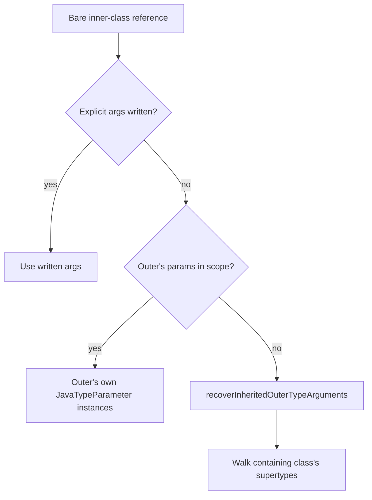
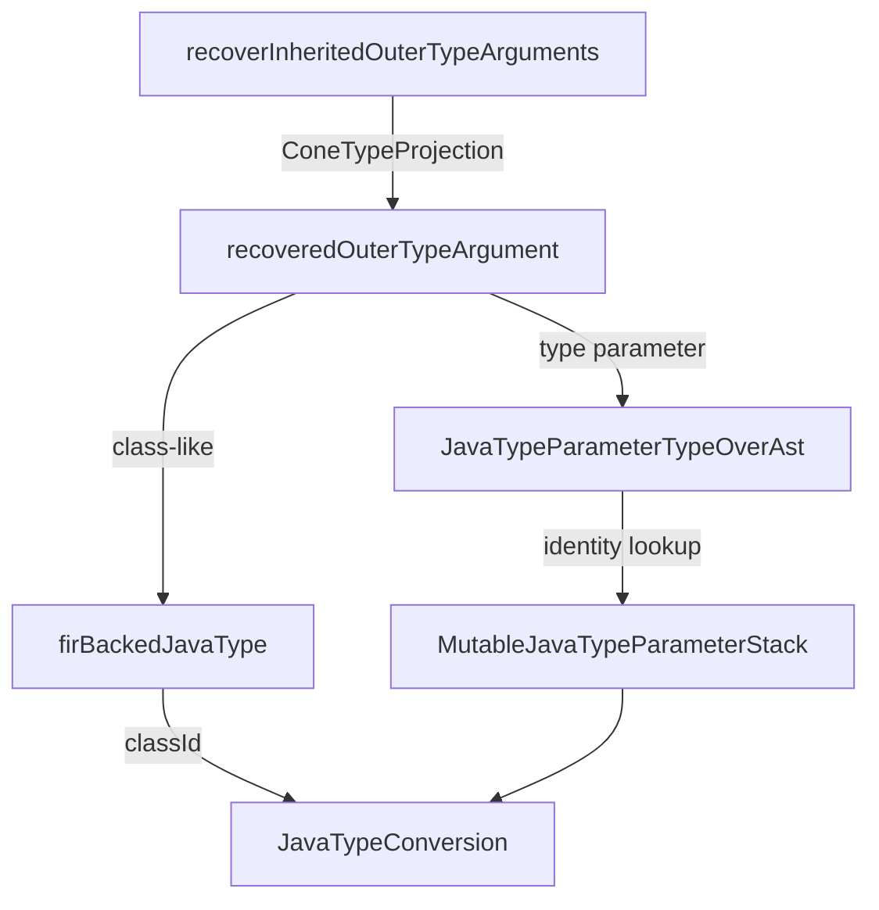

# Implicit Outer Type Arguments — Review Decisions (2026-08-26)

> **Partly superseded (2026-08-27).** A second round of review threads on the same PR changed two of
> the decisions below: §4's separate `computeIsRaw` walk and §5's "a type parameter cannot go through
> `firBackedJavaType`" are both gone. Raw-ness is now derived from `null` entries in
> `typeArguments`, and `firBackedJavaType` takes a `declarationChainRoot`. Read
> `RAW_TYPE_ARGUMENT_UNIFICATION_2026_08_27.md` first; §§1–3 and 6 here are unaffected and still
> the reference for the per-outer scope check and the `classId` fallback.

Rationale for the design decisions taken in response to the review of PR #7500 ("Drop PSI-based
`JavaClassFinder` fallback in java-direct") on the two files that carry the implicit-outer-type-argument
logic:

- `src/org/jetbrains/kotlin/java/direct/model/JavaTypeOverAst.kt` — `JavaClassifierTypeOverAst.computeIsRaw`,
  `computeTypeArguments`, `isInScopeOfDeclaringClass`, `isQualifiedByInheritor`;
- `src/org/jetbrains/kotlin/java/direct/resolution/JavaTypeResolver.kt` — `recoverInheritedOuterTypeArguments`,
  `recoveredOuterTypeArgument`, `javaTypeParameterInDeclarationChain`.

Every Java example below was checked against `javac` (`-Xlint:rawtypes` where raw-ness is at stake);
the verdicts quoted as "javac says" are copied from its output.

---

## 1. The feature in one page

A bare reference to a non-`static` inner class carries type arguments that are *not written* at the
reference: `Inner` inside `Outer<T>` denotes `Outer<T>.Inner`. The Java model must hand these implicit
arguments to FIR, because `JavaClassifierType.typeArguments` is the only channel `JavaTypeConversion`
reads.

Where the implicit arguments come from depends on the reference:



Two hard constraints shape everything below.

**C1 — identity, not names.** FIR converts a `JavaTypeParameter` by looking it up in the class's
`MutableJavaTypeParameterStack`, a `mutableMapOf<JavaTypeParameter, FirTypeParameterSymbol>` populated in
`FirJavaFacade.createFirJavaClass` from the very instances `JavaClass.typeParameters` returned. Only those
instances convert; anything else becomes `ConeErrorType(ConeUnresolvedNameError)`.

**C2 — scope is per enclosing class, not per reference.** Whether an outer's parameters are usable at a
reference is decided by walking the classes lexically enclosing the *reference*, stopping at the first
`static` one (JLS: a `static` nested class has no enclosing instance).

---

## 2. `computeTypeArguments` — one scope check per outer class

> Reviewer: *"Can't we just check `isInScopeOfDeclaringClass` here once and put all its parameters to
> `lexicalArgs` declared as a mutable list? It would generally feel natural and performance-wise."*

### What changed

The parallel `outerTypeParamOwners` list, the nullable `lexicalArgs` and both `mapIndexed`s are gone:

```kotlin
val outerTypeParams = mutableListOf<JavaTypeParameter>()
var anyOutOfScope = false
var outer = javaClass.outerClass
while (outer != null) {
    if (outer.typeParameters.isNotEmpty()) {
        if (!isInScopeOfDeclaringClass(outer)) anyOutOfScope = true
        outerTypeParams.addAll(outer.typeParameters)
    }
    outer = if (outer.isStatic) null else outer.outerClass
}
```

`isInScopeOfDeclaringClass` is now called **at most once per outer class** instead of once per type
parameter, and each class's parameters are taken at once via `addAll` — the performance point of the
comment. What is deliberately *not* done is the literal reading, "one check for the whole walk, gating the
insertion".

### Why the check stays inside the loop

The scope verdict is not uniform along the chain, and the innermost outer is not representative.

**Example A — a non-generic class between the reference and the generic outer.**

```java
class Outer<T> {
    class Mid { class Inner { T get() { return null; } } }
    class Holder extends Mid {
        Inner foo() { return null; }
    }
    static void use(Outer<String>.Holder h) {
        String s = h.foo().get();   // javac: OK
        Integer i = h.foo().get();  // javac: incompatible types: String cannot be converted to Integer
    }
}
```

`Inner` written inside `Holder` denotes `Outer<T>.Mid.Inner`. The current loop skips `Mid`
(`typeParameters.isEmpty()`) and checks scope only for `Outer` — in scope, because `Holder` is an inner
class of `Outer` — so the implicit argument is `Outer`'s own `T` and `get()` is `String`.

A single check on `javaClass.outerClass` would inspect `Mid`, which does **not** lexically enclose the
reference (`Holder`'s chain is `Holder → Outer`). The whole chain would be declared out of scope; with the
suggested gating, `Outer`'s `T` would never be inserted and `get()` would lose `String`.

**Example B — two generic outers with different verdicts.**

```java
class A<T> {
    class B<U> { class Inner { T t() { return null; } U u() { return null; } } }
    class C extends B<String> {
        Inner foo() { return null; }
    }
    static void use(A<Integer>.C c) {
        Integer i = c.foo().t();    // A's T — lexically in scope inside C
        String s = c.foo().u();     // B's U — only through C's supertype B<String>
    }
}
```

`B` is out of scope at the reference (`C` merely inherits it) while `A` is in scope, so there is no single
verdict to hoist. One check per outer class is the minimum granularity that can tell `B` from `A`, and it
is exactly what decides between "use the declaring parameter instance" and "recover from the supertype
hierarchy".

### Why insertion is unconditional

The old code's fallback was `lexicalArgs[index] ?: typeParam` — an out-of-scope parameter produced exactly
the same element as an in-scope one. Per-element nullability was write-only information; the only thing
consumed was *whether any* parameter was out of scope, to decide whether to attempt recovery. Gating the
insertion would therefore either change nothing or silently drop parameters (Example A). Hence the single
`anyOutOfScope` flag.

This also settles the neighbouring thread ("if any of them is null, then all of them should be null"): the
mixed case no longer influences the result, only the decision to attempt recovery.

---

## 3. `isInScopeOfDeclaringClass` — why the `classId` branch stays

> Reviewer: *"Is it really a possible scenario for java direct? I mean two classes not being referentially
> equal, but having the same `classId`."*

```kotlin
private fun isInScopeOfDeclaringClass(declaringClass: JavaClass): Boolean {
    val declaringClassId = declaringClass.classId
    var enclosing: JavaClass? = resolutionContext.scopeContext.containingClass
    while (enclosing != null) {
        if (enclosing === declaringClass) return true
        // Defensive: FirBackedJavaClassAdapter is built fresh per call, ...
        if (declaringClassId != null && enclosing.classId == declaringClassId) return true
        if (enclosing.isStatic) return false
        enclosing = enclosing.outerClass
    }
    return false
}
```

For the source path the reviewer is right that identity is the normal case: `classifierAdapterFor` returns
the class finder's *canonical* instance for source Java precisely because of constraint **C1**, and
`JavaClassOverAst.outerClass` is a constructor property, so identity holds within one file model.

The branch is not dead, though. `FirBackedJavaClassAdapter` is constructed fresh on every call — in
`recoverInheritedOuterTypeArguments`, in `findTypeArgsForClassInHierarchy`, and lazily in its own
`outerClass` — so two non-identical instances with the same `ClassId` do exist whenever a class is visible
both as source and through the symbol provider. The realistic trigger is an incremental build where the
previous build's `.class` file for a class currently being compiled is on the classpath (cf.
`IncrementalJavaClassFromPreviousOutputTest`).

**Decision:** keep it, with a one-line justification in the source. Removing it would make correctness
depend on a property (single instance per class across finder *and* symbol provider) that nothing in the
module enforces, and the failure mode is silent — the reference would fall into recovery, and on a
recovery miss degrade to a wildcard.

---

## 4. `computeIsRaw` — raw-ness follows the written qualifier

> Reviewer: *"This part looks suspicious. Do we consider the reference raw even while it's declared inside
> the type parameter owner?"*

The literal concern is already covered by the `rawTypeNameParts.size > 1` guard, and for a *qualified*
reference written inside the owner, raw is what javac says:

```java
class Outer<T> {
    class Inner {}
    static class SNested {}
    Outer.Inner qualifiedInsideOwner() { ... } // javac: warning: [rawtypes] found raw type: Outer.Inner
    Inner simpleInsideOwner() { ... }          // no warning — Outer<T>.Inner
    Outer.SNested staticNested() { ... }       // no warning — static severs the chain
}
```

All three already matched the implementation. But the question exposed a **real bug**: raw-ness was derived
from the declaring-outer chain of the *resolved* class instead of from the qualifier *written* in source.

```java
class Sub extends Outer<String> {
    Sub.Inner viaSubclass() { ... }      // javac: no rawtypes warning, get() is String
    Outer.Inner viaDeclaringOuter() {}   // javac: raw
}
```

For `Sub.Inner`, `javaClass` is `Outer.Inner` and `javaClass.outerClass` is the generic `Outer`, so the walk
returned `isRaw = true` — while `computeTypeArguments` recovered `[String]` for the very same reference
through `recoverInheritedOuterTypeArguments`. The two answers contradicted each other, and raw won
(erasure), so `String` was lost.

### The fix

```kotlin
if (!outerHasExplicitArgs && !isQualifiedByInheritor(javaClass)) { ... walk the declaring chain ... }

private fun isQualifiedByInheritor(javaClass: JavaClass): Boolean {
    val declaringOuterName = javaClass.outerClass?.name?.asString() ?: return false
    if (rawTypeNameParts[rawTypeNameParts.size - 2] == declaringOuterName) return false
    val classId = javaClass.classId ?: return false
    return with(resolutionContext) { recoverInheritedOuterTypeArguments(classId) } != null
}
```

The check is keyed on the segment actually written before the class name, so `Sub.Inner` and `Outer.Inner`
written in the same place get different verdicts, and it only overrides the walk when recovery genuinely
produces arguments — i.e. exactly when `isRaw = true` would contradict `typeArguments`.

**Scope of the fix (deliberate).** Like `recoverInheritedOuterTypeArguments` itself, this only covers
references written inside the inheriting class; `Sub.Inner` written in an unrelated class still falls back
to the declaring chain. A fully qualifier-driven rewrite would require resolving the qualifier segment as a
classifier in its own right, which is a larger change than the bug warrants and would have to be mirrored in
`computeTypeArguments` to stay consistent.

**Test:** `compiler/testData/diagnostics/tests/j+k/inheritedInnerQualifiedRawType.kt`. A raw type is
silently compatible with anything, so both directions are pinned through erasure of the inner class's own
members: a `String` must pass through the subclass-qualified reference, an `Int` must pass through the raw
one. The same data file is green through the shared PSI/light-tree gates, so the expectation is
javac-correct rather than java-direct-specific.

---

## 5. `recoveredOuterTypeArgument` — why a type parameter cannot go through `firBackedJavaType`

> Reviewer: *"To be honest, I still didn't get why can't we just return a `JavaType` implementation over the
> given `ConeTypeParameterType`, too. So, `firBackedJavaType` would work for any types and not silently
> return a wildcard for a basically valid given type."*

This is the most counter-intuitive decision in the change, so the full flow follows.

### The flow



Recovery reads the arguments off a *resolved FIR supertype*, so it produces cone projections
(`kotlin/Int!`, `E1!`). They then have to travel **back** through the Java model, because that is the only
input `JavaTypeConversion` accepts, and be converted to cone types again. The round trip is what makes a
type parameter special.

### Why the cone route cannot carry a type parameter

`JavaTypeConversion.toConeTypeProjection` accepts exactly four shapes (`JavaClassifierType`,
`JavaArrayType`, `JavaPrimitiveType`, `JavaWildcardType`), and for a classifier type
`toConeKotlinTypeForFlexibleBound` dispatches on `classifier`:

```kotlin
is JavaTypeParameter -> {
    val symbol = javaTypeParameterStack[classifier]
    if (symbol != null) ConeTypeParameterType(symbol.toLookupTag(), ...)
    else ConeErrorType(ConeUnresolvedNameError(classifier.name))
}
```

`javaTypeParameterStack` is the identity map from constraint **C1**. So there are exactly three possible
designs:

| Route | Result |
|---|---|
| Hand back the model's own `JavaTypeParameter` (current) | stack hit → correct `ConeTypeParameterType` |
| Keep `firBackedJavaType` as it is | `else ->` arm → unbounded wildcard, i.e. `*` instead of `String`'s parameter |
| Add a type-parameter branch to `firBackedJavaType`, wrapping the cone type in a fresh `JavaTypeParameter` | stack **miss** → `ConeErrorType(ConeUnresolvedNameError)` |

The third option — the one the comment asks for — is strictly worse than the wildcard it is meant to
replace: an unresolved-name error type instead of a lax but harmless `*`. A fresh wrapper cannot be a key in
a map that was populated from the instances `FirJavaFacade` took out of `JavaClass.typeParameters`.

Making the cone route work would mean changing the identity protocol in shared FIR code — e.g. teaching the
stack lookup to fall back to matching by `FirTypeParameterSymbol`, or widening `toConeTypeProjection` with a
cone-carrying `JavaType` shape. Both are compiler-wide changes to a path shared with PSI, for a java-direct
corner case that the identity route already handles exactly.

**Decision:** `firBackedJavaType` stays class-like-only, and `recoveredOuterTypeArgument` resolves type
parameters to the model's own instances. The wildcard fallback is then only reached for residuals that have
no binding at the reference at all (§6), where `*` is the correct lax answer rather than a silent loss.

### One trap worth knowing

Arguments read off a resolved FIR supertype are **flexible** (`kotlin/Int!`, `E1!`). Without
`lowerBoundIfFlexible()` neither branch matches — a `ConeFlexibleType` is not a `ConeClassLikeType` and not a
`ConeTypeParameterType` — and *everything* degrades to a wildcard, including the class-like arguments. This
is the unwrap at the top of `recoveredOuterTypeArgument`.

---

## 6. `javaTypeParameterInDeclarationChain` — match the owner, then the name

> Reviewer: *"Feels like here the same name-shadowing issue might happen, can't it?"*

Yes, and the reviewer was right. The lookup used to be by name only:

```kotlin
current.typeParameters.firstOrNull { it.name == name }?.let { return it }
```

For the common case that is sound — the arguments are read off the inheriting class's *own* supertype
clause, so a residual parameter was written there and the innermost-first walk mirrors Java's shadowing. The
hole is that a residual parameter need not belong to the inheriting class at all: `substituteTypeArgs`
returns the declared supertype unchanged when the actual type has no arguments, so
`findTypeArgsForClassInHierarchy` can propagate a parameter of an *intermediate* class.

```java
class Outer<E> { class Inner { E get() { return null; } } }
class Mid<X> extends Outer<X> {}
class A<T> {
    class Sub<U> extends Mid<T> {
        Inner foo() { return null; }   // recovers A's T, not Sub's U
    }
}
```

javac types `foo().get()` as `A`'s `T` (`incompatible types: T cannot be converted to U` for the other
reading). A by-name walk starting at `Sub` would have matched whatever same-named parameter it met first.

### The fix

The name is not needed: the projection is a `ConeTypeParameterType` whose `lookupTag` is a
`ConeTypeParameterLookupTagImpl` and therefore carries the `FirTypeParameterSymbol`.

```kotlin
private fun javaTypeParameterInDeclarationChain(startClass: JavaClass, symbol: FirTypeParameterSymbol): JavaTypeParameter? {
    val ownerClassId = (symbol.containingDeclarationSymbol as? FirClassSymbol<*>)?.classId ?: return null
    var current: JavaClass? = startClass
    while (current != null) {
        if (current.classId == ownerClassId) return current.typeParameters.firstOrNull { it.name == symbol.name }
        if (current.isStatic) return null
        current = current.outerClass
    }
    return null
}
```

The **owner class** is matched first, by `ClassId`, and only then the parameter by name within that class —
where names are unique per JLS. A parameter whose owner is outside the declaration chain returns `null` and
falls back to `firBackedJavaType`, i.e. a wildcard: such a parameter has no binding at this reference
anyway, so a lax `*` is right and a wrong symbol would not be.

**Test:** `compiler/testData/diagnostics/tests/j+k/outerTypeParameterRecoveredThroughIntermediateClass.kt`
(the shape above). It fails when the lookup is restricted to the inheriting class alone, and is green through
the PSI and light-tree gates.

A raw-supertype variant (`class Sub<T> extends Base` with raw `Base`) looks like the same trap but is not
usable as a test: FIR erases raw supertypes before recovery, so no type parameter survives to be mis-bound.

---

## 7. Summary of decisions

| # | Thread | Decision |
|---|---|---|
| 1 | Loop shape in `computeTypeArguments` | Applied per outer class, not once per walk — §2, Examples A/B are counter-examples to the literal reading. |
| 2 | `classId` branch in `isInScopeOfDeclaringClass` | Kept as defensive, with an in-source one-liner; reachable through duplicate `FirBackedJavaClassAdapter` instances on incremental classpaths. |
| 3 | `computeIsRaw` enclosing walk | Bug fixed: raw-ness now follows the written qualifier for inherited inner classes; new testData. |
| 4 | `firBackedJavaType` for type parameters | Not done, by necessity: the cone route yields an unresolved-name error type, worse than today's wildcard, unless shared FIR identity matching changes. |
| 5 | Name shadowing in the recovery lookup | Fixed: match the parameter's owner `ClassId` first, name only within the owner; new testData. |
| 6 | Comment verbosity (three threads) | The three long blocks in `JavaTypeOverAst.kt` were cut to 2–3 lines each; the rationale that no longer fits a source comment lives here. |
