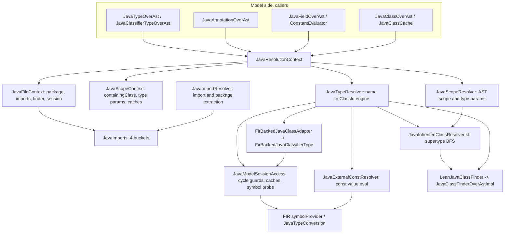

# Resolution Schema: Entities and Scenarios

High-level map of the `org.jetbrains.kotlin.java.direct.resolution` package: the entities
involved in resolving references inside a Java source file and the algorithms they follow for
the main scenarios. Kept at the level of classes/files; method names appear only where they
distinguish a branch. For the end-to-end *type-name → ClassId → FIR symbol* call chain see
`RESOLUTION_PIPELINE.md`; this document is the structural companion to it.

**Collapsed schema (see `archive/COLLAPSE_RESOLUTION_PIPELINES_2026_07_06.md` for the full design/rationale).**
The four class representations a reference can resolve to — current-file source, other-file
source, binary Java (`FirJavaClass`), and Kotlin/deserialized (`FirRegularClass`) — used to be
handled by genuinely different, hand-rolled code paths in the *structural* (`JavaClass`-returning)
pipeline (Scenario C/E), even though the *`ClassId`-returning* pipeline (Scenario D/F) had already
generalized them behind one BFS. That gap is now closed: `FirBackedJavaClassAdapter` gained a real
`findInnerClass`/`innerClassNames` (using enhancement-free FIR primitives, no new laziness needed),
`classifierAdapterFor` routes a source-backed `ClassId` to its canonical, identity-preserving
`JavaClassOverAst` instead of a second wrapper, and `findInnerClassFromSupertypes`/
`findClassInCurrentScope` reuse that materializer as their binary/Kotlin tail. What remains
representation-specific is exactly two narrow, independently-justified exceptions — the same-file
raw-text supertype walk (cycle safety) and the identity-routing check itself (object-identity
preservation) — called out explicitly in Scenario C and Scenario A below.

---

## 1. Entity Map

### Roles

- **`JavaResolutionContext`** — positional data carrier. Wraps an immutable per-file
  `JavaFileContext` (package, `JavaImports`, `LeanJavaClassFinder`, `FirSession`) and a
  per-position `JavaScopeContext` (containing class, in-scope type parameters, same-file
  top-level class provider). Scope transitions
  (`withTypeParameters` / `withInheritedTypeParameters` / `withContainingClass`) fork a new record.
- **`JavaTypeResolver`** — the stateless engine: JLS 6.4.1 simple-name dispatcher, JLS 6.5.2
  qualified-name dispatcher, supertype-`ClassId` walking, session probes (`tryResolve`),
  outer-arg recovery, adapter creation.
- **`JavaScopeResolver`** — AST-only scope lookups: in-scope type parameters and the current-scope
  classifier walk (`findClassInCurrentScope`).
- **`JavaImportResolver`** / **`JavaImports`** — four-bucket import model
  (`simpleTypeImports`, `staticSingleImports`, `typeStarImports`, `staticStarImports`) and package
  extraction, including parser error-recovery shapes.
- **`JavaInheritedClassResolver.kt`** (`findInnerClassFromSupertypes`,
  `resolveInheritedInnerClassToClassId`) — supertype-hierarchy traversal for inherited member
  types.
- **`JavaExternalConstResolver`** — cross-language `const val` / constant-field evaluation.
- **`JavaModelSessionAccess`** — the single chokepoint to `FirSession.symbolProvider`, with the
  per-session cycle guards and the TYPE_USE cache.
- **`LeanJavaClassFinder`** — narrow cross-file source-index interface.
- **`FirBackedJavaClassAdapter`** — `JavaClass` view of a resolved `ClassId`, exposing outer chain,
  type parameters, resolved supertypes, and (nested-class-)declared members for cross-file,
  binary Java, and Kotlin references — the single generic materializer every representation is
  routed through once a `ClassId` is known (see `classifierAdapterFor`, Scenario A/C/E).

---

## 2. Cross-cutting invariants (apply to every scenario below)

- **`ClassId`, not strings.** Resolution always yields a `ClassId` so the package/class boundary is
  unambiguous (`a.b` = class `b` in package `a` *vs* nested `a.b` in root).
- **`tryResolve(classId)`** is the existence oracle: `true` iff the session symbol provider knows
  `classId` and it is **not** a Kotlin builtin (the `origin != BuiltIns` filter keeps parity with
  PSI's file-backed finder). All probes funnel through it.
- **Single session chokepoint.** Every symbol-provider read goes through
  `FirSession.cycleSafeClassLikeSymbol`, whose `(session, classId)`-keyed in-flight set breaks the
  KT-74097 PUBLICATION-lazy recursion (returns `null` on re-entry).
- **Supertype-walk guard.** `FirSession.cycleGuardedSupertypeWalk(classId)` bounds direct
  (`A extends A`) and indirect (`A -> B -> A`) inheritance cycles; re-entry returns the default.
- **No-symbol-provider fixtures.** Parsing-level unit fixtures have no `FirSymbolProvider`;
  `tryResolve` is `false`, adapters are `null`, and AST-only paths (type params, scope classes)
  still work.
- **Ambiguity = no resolution.** When two distinct `ClassId`s match the same name at the same rank
  (star-import collision, two inherited inner classes), the resolver returns `null` (matches
  `javac`'s error), letting the next-rank step or FIR's fallback take over.

---

## 3. Resolution Scenarios

### Scenario A — Classifier for a type reference (model entry dispatcher)

Entry: `JavaTypeOverAst.computeClassifier` over `JavaResolutionContext`. Decides *what kind* of
classifier a written reference denotes.

1. Split the reference into `rawTypeNameParts` (identifiers only; annotations / `<...>` dropped).
2. If single-part, try in priority order and return the first hit:
   1. own type parameter — `JavaScopeResolver.findTypeParameter` (high priority).
   2. in-scope class — `JavaScopeResolver.findClassInCurrentScope` (Scenario C).
   3. inherited (outer) type parameter — `findInheritedTypeParameter` (low priority, shadowed by 2).
3. Resolve `parts[0]` via `findClassInCurrentScope`. If it is a `JavaClass`, navigate each
   remaining part with `declaredOrFullyInherited` — declared members plus the class's full
   inherited member types (same-file, cross-file Java source, binary Java, and Kotlin, Scenario C) —
   and return the final inner class. This explicit in-scope pass is kept as a distinct step *before*
   step 4 and is **not** redundant with it: `resolve`'s class-existence probe needs a `FirSession`
   symbol provider (`cycleSafeClassLikeSymbol`), so on a session-less model only this AST/model walk
   can navigate a same-file / in-scope reference (the `JavaParsingTypeResolutionTest` parsing
   fixtures rely on exactly this); when a session *is* present it also saves a per-segment
   symbol-provider round-trip. Once `parts[0]` is an in-scope class, a missing segment is a hard miss
   (`return null`, JLS 6.5.2) — we do not fall through to step 4's whole-reference reinterpretation.
4. Otherwise resolve the whole name to a `ClassId` via `JavaTypeResolver.resolve` (Scenarios B/D)
   and materialize it via `classifierAdapterFor`: the canonical, identity-preserving
   `JavaClassOverAst` when the `ClassId` is source-backed, or a `FirBackedJavaClassAdapter`
   otherwise.
5. If nothing matched, return `null` (FIR's `findClassId` fallback then runs).

Corner cases: type-parameter-vs-inner-class shadowing (2 before 3); step 4's identity routing
matters because a same-file class reached this way must be the exact same object FIR already
matches its type parameters against by reference identity — a second, non-navigable
`FirBackedJavaClassAdapter` wrapper would break that (see Scenario A/C's identity note below).

### Scenario B — Simple name to `ClassId` (JLS 6.4.1 shadowing ladder)

Entry: `JavaTypeResolver.resolve` → `resolveSimpleNameToClassIdImpl`. A flat ordered ladder; each
step probes candidate `ClassId`s through `tryResolve` and returns the first hit.

1. **Local scope** (`resolveFromLocalScope`) — member types declared *and* inherited by the
   containing-class chain, walked innermost→outermost, interleaving declared and inherited per
   level. The inherited half delegates directly to `resolveInheritedInnerClassToClassId`'s
   origin-agnostic ladder (Scenario E), probed via `tryResolveInherited` (source-index-first,
   FIR-fallback) — no separate cached fast path. *(skipped in the reentrance-safe flavor)*
2. **Same-file top-level** (`resolveFromSameFile`) — via `sameFileTopLevelClassProvider`.
3. **Single-type import** (`resolveFromExplicitImport`) — `import a.b.C;`, rank 4.
4. **Single-static import, type arm** (`resolveFromStaticSingleImport`) — `import static a.b.C.X;`,
   rank 4, probed after step 3.
5. **Same-package, other file** (`resolveFromSamePackage`) — `ClassId(package, name)`.
6. **`java.lang.*`** (`resolveFromJavaLang`) — implicit import; also accepts a
   `JavaToKotlinClassMap` hit.
7. **Type-import-on-demand** (`resolveFromTypeStarImports`) — `import a.b.*;`, rank 6; falls back to
   member types of an imported *class* (`import a.D.*`).
8. **Static-import-on-demand** (`resolveFromStaticStarImports`) — `import static a.b.C.*;`, rank 7.

Corner cases: rank-4 type import probed before rank-4 static import; star-import ambiguity →
`null`; the class-as-`PackageOrTypeName` fallback in steps 7–8.

### Scenario C — In-scope (AST) classifier lookup

Entry: `JavaScopeResolver.findClassInCurrentScope`. Produces a structural `JavaClass` with its full
outer chain (needed for navigation and outer-arg substitution) — sourced from *any* of the four
class representations, not just same-file AST.

1. **Declared-plus-fully-inherited lookup** (`declaredOrFullyInherited`) at every level of the
   containing-class chain, innermost to outermost (self, outer class, outer's outer class, ...).
   Per JLS 6.4.1, a member type declared or inherited at an inner level shadows one declared or
   inherited at an enclosing level, so one loop applies the *same* full lookup at every level
   (previously only the innermost level got full coverage; outer levels were same-file-only — a
   confirmed gap, now closed). Each level's lookup is itself two steps:
   1. **Declared or same-file-inherited** (`declaredOrSameFileInherited` → `findInnerClass`, then
      `findInnerClassInSameFileSupertypes` on raw AST text).
   2. **Cross-file Java source, binary Java, or Kotlin inherited** member type
      (`findInnerClassFromSupertypes`, Scenario E) — reached only when step 1 found nothing for
      this level.
2. Same-file top-level class (`sameFileTopLevelClassProvider`).

Corner case: the same-file supertype walk (step 1's second half) works on **raw AST text**
(`directSupertypeRefNames`), deliberately kept distinct from the resolved-classifier walk in
`findInnerClassFromSupertypes` (step 2) — reading `javaClass.supertypes` here would re-enter type
construction (`classifier → findClassInCurrentScope`), an actual cycle hazard no amount of
laziness removes; package-qualified supertypes are declined by the raw-text walk and handed to the
`ClassId` path. This is the *only* representation-specific split left in this scenario — the
prior, second exception (same-file source objects needing to stay off the generic `ClassId`
ladder to preserve identity) is now handled by `classifierAdapterFor`'s routing (Scenario A step 4),
not by keeping this whole scenario source-only.

### Scenario D — Qualified / nested name to `ClassId` (JLS 6.5.5)

Entry: `JavaTypeResolver.resolve` (dotted name) → `resolveQualifiedNameToClassIdFromParts`.
A single left-to-right, non-recursive pass mirroring javac's PackageOrTypeName classification
(JLS 6.5.4):

1. **Leftmost type** (JLS 6.5.4): the first segment as a simple type name in scope (Scenario B);
   failing that, the package prefix grows one segment at a time until a segment names a
   top-level type in it (`java.util.List` → packages `java`, `java.util`, type `List`).
2. **Member-type descent** (JLS 6.5.5.2): each remaining segment must be a member type of the
   previous one — declared (`createNestedClassId` + existence probe), or inherited from its
   supertypes (`findInheritedNestedClass`, materializing the prefix class via
   `classifierAdapterFor` and delegating to `resolveInheritedInnerClassToClassId`, Scenario E).
   Reading the prefix class's own supertypes from raw AST text this way (rather than seeding
   directly from `directSupertypeClassIds`) means this step can never be cycle-guard-skipped,
   even when the prefix class's own `SUPER_TYPES` phase is on the call stack — e.g. a qualified
   reference to a class's own inherited nested class used as a generic argument in its own
   extends/implements clause (`qualifiedInheritedNestedClassInOwnImplementsClause.kt`). A previous
   `collectInheritedInnerClasses`-based re-entrance fallback for a guard-skip on this step was
   removed as dead code once this step became un-guard-skippable — it was also source-only, the
   same cross-origin ambiguity blind spot fixed elsewhere in this scenario.

Like javac, the leftmost-type interpretation is committed: when the descent fails (full
resolution), the function returns the *nonexistent* nested id of the committed prefix instead of
retrying the name as a plain `package.Class` split — the id has no symbol, so the reference stays
unresolved downstream (red code). On a package/type name clash (JLS 6.1) the shadowing type
therefore wins, matching javac and diverging from the PSI Java model, which loosely resolves the
package interpretation; such tests are skipped for java-direct
(`SkipTestsPinningPsiJavaModelDeviationsMetaConfigurator`) and mirrored by javac-strict copies in
the java-direct-owned `testData/diagnostics` root (`qualifiedNamePackageClassClash.kt`,
`PackageVsClass2.kt`; KT-87813). The reentrance-safe flavor (`fullResolution = false`) returns
`null` instead of a dangling id, so supertype-walk seeding is never poisoned by a nonexistent
class.

Corner cases: `Map.Entry`-style inherited nested classes (the descent probes declared-then-
inherited at *every* segment, so multi-segment tails after an inherited hop work too).

### Scenario E — Inherited member type via supertypes

Entry: `findInnerClassFromSupertypes` / `resolveInheritedInnerClassToClassId`
(`JavaInheritedClassResolver.kt`). Two outputs, both reaching every class representation through
the same single, origin-agnostic BFS — same-file, cross-file Java source, binary Java, and Kotlin
supertypes are all walked uniformly, with no representation-specific arm:

- `findInnerClassFromSupertypes` → a `JavaClass` with AST outer chain (for the AST pipeline /
  outer-arg substitution). Just materializes the `ClassId` found by `resolveInheritedInnerClassToClassId`
  (below) via `classifierAdapterFor` (Scenario A step 4); ambiguity detection is entirely
  `resolveInheritedInnerClassToClassId`'s job, since every candidate — regardless of origin — is
  compared together in one walk
  (`testData/diagnostics/tests/jvm/javaDirect/ambiguousInheritedInnerClassAcrossSourceAndKotlinSupertypes.kt`).
  An earlier same-file-only arm (`resolveSameFileSupertype` + recursive same-file walk) was
  removed: its only reason to exist was working with no `LeanJavaClassFinder`/FIR session at all,
  which is a testability property, not a production constraint — every production
  `JavaResolutionContext` has both. `JavaParsingTypeResolutionTest`'s tests for this case now use a
  same-file-only `LeanJavaClassFinder` test double instead.
- `resolveInheritedInnerClassToClassId(simpleName, containingClass)` → a bare `ClassId` via a
  single, origin-agnostic BFS (`walkSupertypeClassIds`) over [containingClass]'s own supertypes
  (outer-class coverage is the caller's job — Scenario C's per-level loop — not this function's,
  since the confirmed-always-`false` `includeOuterClasses` parameter and its outer-walk loop were
  removed). Takes only these two parameters — no injectable lambdas — since it has exactly one
  production shape: probing existence via `tryResolveInherited` and expanding ancestors via
  `directSupertypeClassIds`, both bound directly to the ambient `JavaResolutionContext`.
  One exception: [containingClass]'s own direct supertypes are read from raw AST text
  (`splitCanonicalFqName()`, bracket-aware — so a reference with type arguments on a non-final
  segment such as `a.B<String>.C` is not truncated to `a.B`) and resolved via the
  reentrance-safe `resolveWithoutInheritance` rather than through `directSupertypeClassIds`,
  because [containingClass]'s own `SUPER_TYPES` FIR phase can still be on the call stack when
  this runs (e.g. resolving a name used inside [containingClass]'s own extends/implements
  clause); reading `.classifier` there would re-enter that in-progress computation. Every
  ancestor beyond that first level is walked uniformly via `directSupertypeClassIds`
  (Scenario F), regardless of origin. Regression-tested end-to-end by
  `simpleInheritedNestedClassInOwnImplementsClause.kt` — an unqualified reference inside a
  class's own `implements` clause to its own inherited (through two supertypes) nested class,
  which only resolves if the raw-AST-text seed is used instead of the guarded
  `directSupertypeClassIds(containingClass)`.
  `JavaTypeResolver.findInheritedNestedClass` (Scenario D step 2, the `Outer.Nested` qualified
  shape) is this same function's other caller: it materializes `outerClassId` via
  `classifierAdapterFor` (Scenario A step 4) and passes the result as `containingClass`, so it
  inherits the same raw-AST-text safety instead of needing its own seed/BFS pair
  (`qualifiedInheritedNestedClassInOwnImplementsClause.kt`).

`walkSupertypeClassIds` — private, single call site (`resolveInheritedInnerClassToClassId`), so it
takes just `simpleName`/`initialAncestorIds` and reads `tryResolveInherited`/
`directSupertypeClassIds` off the ambient `JavaResolutionContext` directly rather than through
injected lambdas. It initializes one `visited` set internally and shares it across the whole walk,
probing every ancestor at a given level — source, binary Java, and Kotlin alike — expanding to the
next level per ancestor, not per level, so a match found through one ancestor cannot stop an
unrelated sibling ancestor from being expanded further. This closes a previously-latent bug where
a match at one ancestor suppressed expansion of every other ancestor at the same level, hiding a
deeper conflicting match reached only through one of them
(`ambiguousInheritedInnerClassAcrossSourceAndKotlinSupertypes.kt`). Termination relies on `visited`
(bounded by the finite set of distinct `ClassId`s reachable from the seed) plus
`directSupertypeClassIds`'s own per-session cycle guard, not a depth cap — malformed cyclic
hierarchies terminate via `visited`, not by giving up after N levels.

Same fix applies one layer up: `resolveInheritedInnerForLevel`'s `Step 1` in Scenario B used to
special-case cross-file Java source via a cached `collectInheritedInnerClasses` map, returning a
single non-ambiguous candidate without ever probing a same-level Kotlin/binary competitor. It now
always delegates to `resolveInheritedInnerClassToClassId` via `tryResolveInherited`, and that dead
cache (`getInheritedInnerClassesForClass` / `JavaScopeContext.InheritedInnerCache`) was removed.

### Scenario F — Direct-supertype `ClassId` graph

Entry: `JavaTypeResolver.directSupertypeClassIds`, guarded by `cycleGuardedSupertypeWalk`.
Per-origin dispatch:

1. **Source Java** — finder has the class in its index: walk `JavaClass.supertypes` and read each
   `classifier.classId` (no FIR phase).
2. **Binary Java** — symbol is a `FirJavaClass`: read the pre-resolved
   `directSupertypeClassIds()` cache (never triggers enhancement).
3. **Kotlin / built-in / deserialized** — `lazyResolveToPhase(SUPER_TYPES)` then read
   `superTypeRefs` cone class ids.

Corner case: `Java.Source` (lazy `superTypeRefs`) must be distinguished from `Java.Library`
(pre-populated) to avoid premature-resolution cycles — handled by routing source Java through
the finder arm, not the FIR arm.

### Scenario G — Implicit outer-class type-argument recovery

Entry: `JavaTypeResolver.recoverInheritedOuterTypeArguments`, used by
`JavaTypeOverAst.computeTypeArguments` for a bare inherited inner-class reference whose outer args
are neither written nor lexically in scope.

1. From the lexical containing class, walk **outward** (its outer classes already have supertypes
   resolved).
2. Stop the walk at the first `static` class along the chain (a static nested class severs the
   enclosing-instance chain — JLS).
3. For each outer, descend its `FirBackedJavaClassAdapter.supertypes` looking for the inner
   class's outer `ClassId`, substituting type args down each intermediate class
   (`findTypeArgsForClassInHierarchy` / `substituteTypeArgs`).
4. Return the recovered args as FIR-backed `JavaType`s, or `null` (top-level inner, no containing
   class, static break, or not found).

### Scenario H — Annotation reference resolution

Entry: `JavaAnnotationOverAst`. Reuses the type pipeline: `JavaTypeResolver.resolve` on the
annotation's written name (same import/scope rules as Scenario B/D), yielding the annotation's
`ClassId`. The no-symbol-provider fixtures fall back to a package+name heuristic. TYPE_USE-ness for
filtering is answered by `JavaModelSessionAccess.isTypeUseAnnotationClass` (cached per session,
inspects the annotation class's own `@Target`).

### Scenario I — Cross-language constant value resolution

Entry: `JavaExternalConstResolver`, used by `JavaFieldOverAst.initializerValue` and the
enum-entry-vs-`const val` disambiguation in annotation arguments.

- `resolveExternalFieldValue(qualifier, field)` — tries, in order: top-level property via JVM
  facade (`MainKt.FOO`), class member, companion-object member; returns the evaluated literal.
- `resolveConstFieldValue(classId, field)` — enum class → companion only; otherwise class member
  then companion then top-level facade fallback.

Const values are read via `FirExpressionEvaluator` / already-evaluated initializers; unqualified
cross-language references are unsupported (return `null`).

---

## 4. Scenario → entity quick reference

| Scenario | Primary entity | Key collaborators |
|----------|----------------|-------------------|
| A. Classifier dispatch | `JavaTypeOverAst` | `JavaScopeResolver`, `JavaTypeResolver`, `FirBackedJavaClassAdapter` |
| B. Simple name → ClassId | `JavaTypeResolver` | `JavaImports`, `JavaModelSessionAccess`, Scenario D/E |
| C. In-scope classifier | `JavaScopeResolver` | `JavaInheritedClassResolver.kt`, `JavaClassOverAst` |
| D. Qualified name → ClassId | `JavaTypeResolver` | `LeanJavaClassFinder`, cycle guards |
| E. Inherited member type | `JavaInheritedClassResolver.kt` | `LeanJavaClassFinder`, Scenario F |
| F. Supertype ClassId graph | `JavaTypeResolver` | `LeanJavaClassFinder`, `FirJavaClass`, cycle guard |
| G. Outer-arg recovery | `JavaTypeResolver` | `FirBackedJavaClassAdapter`, `FirBackedJavaClassifierType` |
| H. Annotation reference | `JavaAnnotationOverAst` | `JavaTypeResolver`, TYPE_USE cache |
| I. Constant value | `JavaExternalConstResolver` | `FirSession` symbol provider, const evaluator |

All scenarios that touch the symbol provider share the same two corner-case guards
(`cycleSafeClassLikeSymbol`, `cycleGuardedSupertypeWalk`) and the same builtins-filtered
`tryResolve` oracle; the no-symbol-provider fixture mode is the common degenerate fallback.
