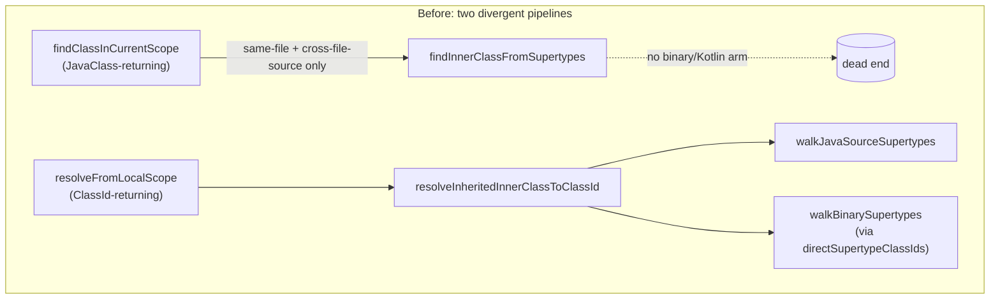
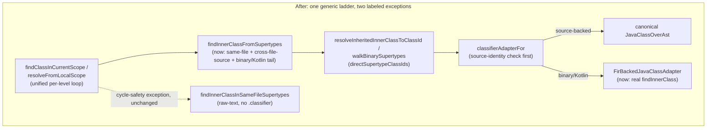

# Collapsing java-direct's representation-specific resolution pipelines

> **Archived 2026-07-13.** All 6 steps of this plan have **landed** (see the
> 2026-07-06 → 2026-07-08 entries in `archive/ITERATION_RESULTS_2026_07_13.md`); the
> single origin-agnostic resolution pipeline it describes is the current design. Kept for
> the design rationale only. Living summary: `implDocs/RESOLUTION_SCHEMA.md`.

**Status**: landed — all 6 steps complete (2026-07-06 → 2026-07-08), full
`:compiler:java-direct:test` suite green after each step. This document records the plan agreed
with reviewers for addressing the "too many representation-specific pipelines" criticism of the
class-resolution code, and is updated as delivery steps land. See `ITERATION_RESULTS.md` for the
terse per-step log; this file holds the full rationale.

## Overview & Goals

Address the reviewer criticism that `compiler/java-direct`'s class-resolution code is split into too
many representation-specific pipelines (current-file source AST, other-file source via
`LeanJavaClassFinder`, `FirJavaClass` binary Java, `FirRegularClass` Kotlin/deserialized), each
handled by separate, hand-rolled logic instead of one generic pipeline. Across three rounds of
review/analysis we established:
- The 4-way split is *real* in the structural (`JavaClass`-returning) pipeline
  (`JavaInheritedMemberResolver.findInnerClassFromSupertypes`, `JavaScopeResolver.findClassInCurrentScope`),
  which today never reaches a Kotlin/binary supertype's own inner classes.
- The split is *already mostly collapsed* in the `ClassId`-returning pipeline
  (`directSupertypeClassIds`, `resolveInheritedInnerClassToClassId`/`walkBinarySupertypes`) — one
  generic BFS parameterized by two small hooks.
- The remaining gap is that `FirBackedJavaClassAdapter` — the object meant to be "one uniform façade
  over any FIR-backed origin" — has `findInnerClass`/`innerClassNames` hardcoded to null/empty, so
  the structural pipeline can't fall through to the generic ladder for binary/Kotlin targets.
- Enough FIR-side laziness (`FirJavaClass.directSupertypeClassIds()`, `existingNestedClassifierNames`,
  `cycleSafeClassLikeSymbol`) already exists to close this without inventing new FIR machinery.
- A second, independent gap: `classifierAdapterFor` always builds a *fresh* adapter instead of first
  checking whether the target `ClassId` is source-backed and already has a canonical `JavaClassOverAst`
  — breaking same-file identity for consumers reached via the generic ladder.

Goal: collapse these into one generic, identity-aware resolution ladder used by (almost) every
caller, leaving only the two pipeline splits that are genuinely load-bearing (cycle-safety during a
class's own construction; same-file object-identity preservation for FIR's type-parameter matching)
— and fix the smaller, independently-confirmed bugs/dead code flagged during review.

## Scope

**In scope**
- Give `FirBackedJavaClassAdapter` a real `findInnerClass`/`innerClassNames` implementation using
  enhancement-free FIR primitives.
- Route `classifierAdapterFor` through the existing source-identity map before falling back to the
  generic adapter.
- Wire the now-capable adapter into `JavaInheritedMemberResolver.findInnerClassFromSupertypes`
  (binary/Kotlin tail) and unify `JavaScopeResolver.findClassInCurrentScope`'s steps 2-4 (and
  `JavaTypeOverAst.computeClassifier`'s multi-part loop) onto one per-level lookup.
- Fix the two confirmed `substringBefore('<')` truncation bugs for qualified supertypes with
  mid-reference generics (`a.B<String>.C`).
- Drop the confirmed-dead `resolve` parameter of the `resolveWithoutInheritance` callback and the
  confirmed-dead `includeOuterClasses`/outer-walk loop.
- Simplify `JavaClassCache.parseTopLevelClassFromFile` to skip the structurally-unreachable steps of
  `findClassInCurrentScope`.
- Add regression tests for the newly-reachable cross-file/Kotlin/binary paths.
- Update `implDocs/RESOLUTION_SCHEMA.md` and in-code KDocs to reflect the collapsed schema and narrow
  overclaiming comments.

**Out of scope**
- The `own type parameter shadows inner class` priority divergence from javac (review comment #6) —
  confirmed pre-existing, compiler-wide, PSI-parity-driven; not a java-direct-specific bug, left as-is
  with a tracked note.
- Fully closing the source/binary mixed-hierarchy ambiguity detection gap (review comment #7) —
  accepted perf/safety trade-off, documented rather than fixed.
- Migrating binary (`.class`/JAR) lookups off PSI (`CombinedJavaClassFinder`) — tracked separately in
  `PSI_CLASS_FINDER_USAGE_AND_REPLACEMENT.md`, unrelated to this collapse.

### Functional Requirements
- A Java source class that extends/implements a Kotlin class or a binary (compiled) Java class, where
  that supertype declares or inherits an eligible nested class, must resolve that nested class through
  **both** the `ClassId` pipeline (already working) **and** the structural `JavaClass` pipeline
  (currently broken) — including via multi-part navigation (`Outer.Inherited.Deeper`) through an
  intermediate inherited segment.
- A same-file or other-file *source* class reached via the generic `ClassId` ladder must come back as
  the same, identity-preserving `JavaClassOverAst` instance already used elsewhere (not a second,
  non-navigable wrapper).
- Qualified supertype references with type arguments on a non-final segment (`extends a.B<String>.C`)
  must not be silently truncated to `a.B`.
- All existing 2793/2793 green tests must remain green; no observable resolution behavior may regress
  for currently-working paths.

### Non-Functional Requirements
- No new FIR phase-forcing or enhancement must be introduced on the newly-added binary/Kotlin adapter
  paths — must reuse the existing enhancement-free primitives (`directSupertypeClassIds()`,
  `existingNestedClassifierNames`, `cycleSafeClassLikeSymbol`/`tryResolve`).
- Cycle-safety must be preserved exactly as today (`cycleGuardedSupertypeWalk`, `visited` sets) — no
  representation may bypass an existing guard.

## Technical Design

### Current Implementation (grounded in code, confirmed across review rounds)

- `JavaTypeResolver.kt:684-712` `directSupertypeClassIds` — the **already-generalized** `ClassId`-based
  supertype ladder: arm 1 (`finder.isClassInIndex` → AST walk, no FIR phase), arm 2 (`firClass is
  FirJavaClass` → pre-resolved `directSupertypeClassIds()` cache, no enhancement), arm 3 (else →
  `lazyResolveToPhase(SUPER_TYPES)` + `superTypeRefs`). One function, three internal arms — this is
  the model to generalize everything else toward.
- `JavaInheritedMemberResolver.kt:54-73` `findInnerClassFromSupertypes` — the **not-yet-generalized**
  structural (`JavaClass`-returning) sibling: only handles same-file supertypes
  (`resolveSameFileSupertype`) and cross-file-*source* supertypes
  (`classFinder.collectInheritedInnerClasses`/`findClass`); has no arm for `FirJavaClass`/
  `FirRegularClass` supertypes at all.
- `JavaInheritedMemberResolver.kt:108-239` `resolveInheritedInnerClassToClassId`/
  `walkJavaSourceSupertypes`/`walkBinarySupertypes` — the `ClassId`-returning sibling already **does**
  have a binary/Kotlin arm (`walkBinarySupertypes`, driven by the `directSupertypeClassIds` callback)
  — proof the capability already exists, just not wired into the structural entry point.
- `FirBackedJavaClassAdapter.kt` — meant to be the uniform façade; `supertypes` (158-169), `isStatic`,
  `typeParameters` are properly abstracted over `FirJavaClass`/`FirRegularClass`, but
  `innerClassNames` (170-171) and `findInnerClass` (173) are **hardcoded to empty/null** — this is the
  actual chokepoint blocking the structural pipeline from reaching binary/Kotlin inner classes.
- `JavaTypeResolver.kt:559-562` `classifierAdapterFor` — unconditionally builds a fresh
  `FirBackedJavaClassAdapter(classId, session)`, never checking whether `classId` is source-backed and
  already has a canonical `JavaClassOverAst` in the finder/cache — a routing gap, not a laziness gap.
- `JavaScopeResolver.kt:59-85` `findClassInCurrentScope` — steps 1-2 (innermost level) get the full
  lookup (`declaredOrSameFileInherited` + `findInnerClassFromSupertypes`), but steps 3-4 (outer-class
  chain) only call same-file-only `declaredOrSameFileInherited` — an asymmetry that mirrors the same
  representation gap one level up.
- `JavaTypeOverAst.kt:139-149` `computeClassifier`'s multi-part loop calls `declaredOrSameFileInherited`
  (same-file only) per hop, while its own KDoc (140-141) claims "an intermediate segment inherited
  from a supertype still navigates correctly" without the same-file qualifier — confirmed overclaim,
  not yet fixed.
- Confirmed-still-present bugs: `JavaSupertypeGraph.kt:235` `ref.substringBefore('<').trim()` and
  `JavaInheritedMemberResolver.kt:162` `st.presentableText.substringBefore('<').trim()` both truncate
  `a.B<String>.C`-shaped references to `a.B`, silently dropping `.C`. (`JavaInheritedMemberResolver.kt:84`'s
  `resolveSameFileSupertype` already uses `splitCanonicalFqName()` + per-segment `substringBefore('<')`
  and does **not** have this bug — it was fixed there already; the other two sites were not.)
- Confirmed dead/redundant: `resolveWithoutInheritance`'s second parameter
  (`JavaInheritedMemberResolver.kt:113`, callback type `(String, (ClassId) -> Boolean) -> ClassId?`) —
  its sole caller (`JavaTypeResolver.kt:450-456`) always closes over the same `tryResolve` it already
  received, so the parameter is structurally redundant. `includeOuterClasses`
  (`JavaInheritedMemberResolver.kt:114`, `JavaTypeResolver.kt:268/447/457`) is always called with
  `false` from the only call site (`resolveInheritedInnerForLevel`).
- `JavaClassCache.kt:72` calls `findClassInCurrentScope` with a fresh `resolutionContext` whose
  `containingClass` is always `null` (top-level parse) — under that precondition steps 1-4 are
  structurally unreachable no-ops, so this reduces to exactly step 5 (`sameFileTopLevelClassProvider`).

### Key Decisions

1. **Close the gap via a materialization fix, not a new abstraction.** The `ClassId`-based ladder
   (`directSupertypeClassIds`) is already the single generic engine. The fix is to make
   `FirBackedJavaClassAdapter` (the materializer from `ClassId` back to a navigable `JavaClass`)
   actually capable of `findInnerClass`, using primitives that already exist
   (`existingNestedClassifierNames`, `createNestedClassId`, `cycleSafeClassLikeSymbol`/`tryResolve`) —
   no new FIR laziness needs to be invented.
2. **Fix identity via routing, not pre-creation.** Every representation already creates its stable
   identity object before resolving content (`JavaClassOverAst`'s constructor is a free AST wrap;
   `FirJavaClass`/`FirRegularClass` are built from bytes/tree well before phase resolution). The
   identity break is that `classifierAdapterFor` skips consulting the existing identity map. Fix:
   check `finder.isClassInIndex(classId)` (the same check `directSupertypeClassIds` arm 1 already
   does) before constructing a generic adapter; if the class is source-backed, return the
   finder's/cache's canonical `JavaClassOverAst` instead.
3. **Keep exactly two narrow exceptions, each independently justified — do not attempt to remove them:**
   - The raw-text, non-`.classifier`-touching same-file walk (`findInnerClassInSameFileSupertypes`,
     `JavaScopeResolver.kt:118-133`) stays separate — it deliberately avoids `javaClass.supertypes` to
     dodge re-entering `computeClassifier → findClassInCurrentScope`, an actual graph-cycle hazard
     that no amount of laziness removes.
   - Same-file source targets must still resolve to the live `JavaClassOverAst`, not a
     `FirBackedJavaClassAdapter` — FIR matches `FirJavaTypeParameter` to `JavaTypeParameter` by object
     identity (`JavaClassOverAst.kt:77-79`, `JavaClassCache.kt:30-34`); Decision 2 already handles this
     by routing source-backed `ClassId`s away from the adapter.
4. **`FirBackedJavaClassAdapter.findInnerClass` results cannot chain further with full fidelity.** A
   nested class reached this way is itself another `FirBackedJavaClassAdapter` (or, if source-backed,
   gets routed to the real `JavaClassOverAst` per Decision 2) — this is fine for terminal lookups and
   for further binary/Kotlin chaining, and Decision 2 removes the one case (same-file source) where it
   would have mattered.

### Proposed Changes

1. **`FirBackedJavaClassAdapter`: implement `findInnerClass`/`innerClassNames`.**
   - For a `FirJavaClass` target: enumerate `existingNestedClassifierNames`, build candidate `ClassId`s
     via `createNestedClassId(name)`, probe existence via `cycleSafeClassLikeSymbol`/`tryResolve`-
     equivalent, wrap the result in another `FirBackedJavaClassAdapter` (subject to Decision 2's
     source-identity check first).
   - For a `FirRegularClass` (Kotlin/deserialized) target: same shape — the symbol provider answers
     nested-classifier existence directly from its index/stubs, no supertype/body resolution needed.
   - Document the identity caveat directly on the function.
2. **`classifierAdapterFor`: consult the source-identity map first.**
   - Before `FirBackedJavaClassAdapter(classId, session)`, check `finder?.isClassInIndex(classId) ==
     true` and, if so, return the finder's/`JavaClassCache`'s canonical `JavaClassOverAst` instead.
3. **`JavaInheritedMemberResolver.findInnerClassFromSupertypes`: add a binary/Kotlin tail.**
   - After the existing same-file + cross-file-source arms return nothing, add a final arm that calls
     `resolveInheritedInnerClassToClassId`/`walkBinarySupertypes` (via the caller-supplied
     `directSupertypeClassIds`) to get a `ClassId`, then materializes it via `classifierAdapterFor`.
4. **`JavaScopeResolver.findClassInCurrentScope`: unify steps 2-4 into one per-level loop.**
   - Replace the current asymmetric ladder with a single loop over `self, outerClass,
     outerClass.outerClass, ...` calling the same declared+full-inherited step at every level.
5. **`JavaTypeOverAst.computeClassifier`: use the same extended per-level step for multi-part navigation.**
   - Replace the same-file-only `declaredOrSameFileInherited` call in the multi-part loop with the
     extended declared+full-inherited step from #4. Narrow/correct the KDoc if any residual
     same-file-only edge remains.
6. **Fix the two remaining `substringBefore('<')` truncation bugs** (`JavaSupertypeGraph.kt:235`,
   `JavaInheritedMemberResolver.kt:162`) by reusing the AST/structural part-extraction approach
   already applied in `JavaInheritedMemberResolver.resolveSameFileSupertype`.
7. **Drop dead/redundant parameters:**
   - Remove the second parameter from the `resolveWithoutInheritance` callback type.
   - Remove `includeOuterClasses` and its outer-walk `while` loop from
     `resolveInheritedInnerClassToClassId`.
8. **Simplify `JavaClassCache.parseTopLevelClassFromFile`** to call `sameFileTopLevelClassProvider`
   directly instead of `findClassInCurrentScope`.
9. **Doc-only fixes:** narrow `computeClassifier`'s KDoc claim; add a short comment on the empty-name
   defensive guard in `resolveSameFileSupertype`; document the accepted source/binary cross-pass
   ambiguity limitation and the javac priority-order divergence as explicitly accepted, tracked-
   elsewhere items; explain the telescoping-recursion argument for the
   `nestedParts.size == 1`/`parts.size == 2` restrictions.

### Architecture Diagram

### File Structure (files touched)

- `compiler/java-direct/src/org/jetbrains/kotlin/java/direct/resolution/FirBackedJavaClassAdapter.kt`
  — implement `findInnerClass`/`innerClassNames`.
- `compiler/java-direct/src/org/jetbrains/kotlin/java/direct/resolution/JavaTypeResolver.kt` —
  `classifierAdapterFor` identity routing; drop `includeOuterClasses`/callback param.
- `compiler/java-direct/src/org/jetbrains/kotlin/java/direct/resolution/JavaInheritedMemberResolver.kt`
  — binary/Kotlin tail on `findInnerClassFromSupertypes`; fix `substringBefore('<')`; drop callback
  param.
- `compiler/java-direct/src/org/jetbrains/kotlin/java/direct/resolution/JavaScopeResolver.kt` — unify
  steps 2-4 into one per-level loop.
- `compiler/java-direct/src/org/jetbrains/kotlin/java/direct/model/JavaTypeOverAst.kt` — multi-part
  loop uses extended step; KDoc fix.
- `compiler/java-direct/src/org/jetbrains/kotlin/java/direct/util/JavaSupertypeGraph.kt` — fix
  `substringBefore('<')`.
- `compiler/java-direct/src/org/jetbrains/kotlin/java/direct/JavaClassCache.kt` — simplify to
  `sameFileTopLevelClassProvider`.
- `compiler/java-direct/implDocs/RESOLUTION_SCHEMA.md` — update schema description.
- New/updated test data under `compiler/java-direct`'s test resources for the regression scenarios.

### Risks
- Unifying `findClassInCurrentScope`'s levels changes which lookups run at outer levels (previously
  same-file-only) — must verify no existing test relies on an outer-level cross-file/binary lookup
  being *absent*.
- The `FirBackedJavaClassAdapter.findInnerClass` implementation must not trigger enhancement/phase-
  forcing on `FirJavaClass` targets — needs care to use only `existingNestedClassifierNames` (not
  `declarations`), matching the KT-74097 hazard already documented in the module.
- Routing `classifierAdapterFor` through the finder adds a lookup on a path that is currently
  adapter-only; expected to be perf-neutral (same cost `directSupertypeClassIds` arm 1 already pays).

## Testing

### Validation Approach
Run the existing java-direct test suite after each stage to confirm no regression (target: keep
2793/2793 green throughout), plus add targeted new tests for each newly-reachable path.

### Key Scenarios
- Java source class extends a **Kotlin** class that declares a nested class; resolve the nested class
  both directly and through the `JavaClass`-returning structural pipeline, not just the `ClassId`
  pipeline.
- Java source class extends a **binary (compiled)** Java class that declares a nested class; same
  dual-pipeline check.
- Multi-part reference where an **intermediate** segment is inherited from a cross-file source,
  Kotlin, or binary supertype (`Outer.Inherited.Deeper`) — confirm `computeClassifier` no longer
  returns `null` for this shape.
- Same-file source class reached via the generic `ClassId` ladder — confirm the returned object is
  identical (`===`) to the one obtained via direct same-file navigation, and that outer-type-argument
  substitution still works.
- Qualified supertype with type arguments on a non-final segment (`extends a.B<String>.C`) in both
  `JavaSupertypeGraph` and `JavaInheritedMemberResolver` code paths — confirm `.C` is not dropped.

### Edge Cases
- Cyclic hierarchies (`A extends B`, `B extends A`) must still short-circuit via existing guards after
  the per-level unification — no new infinite recursion introduced.
- A class with no containing class (top-level parse via `JavaClassCache`) must behave identically
  after the `sameFileTopLevelClassProvider` simplification.
- Ambiguous inherited inner class names across source and binary/Kotlin branches at the same depth
  should continue to behave per the already-accepted (documented) limitation.

### Test Changes
- Add new `.java` test fixtures (plus a Kotlin or binary companion class) under the module's
  test-data directories exercising the scenarios above.
- Extend/adjust any test currently exercising `findClassInCurrentScope` or
  `resolveInheritedInnerClassToClassId` outer-level behavior if the per-level unification changes an
  outer-level lookup that was previously same-file-only.

## Delivery Steps

### Step 1: Implement inner-class navigation on FirBackedJavaClassAdapter
FirBackedJavaClassAdapter can enumerate and resolve nested classes of a Kotlin or binary Java class
without forcing FIR enhancement.

- Implement `findInnerClass(name)` on `FirBackedJavaClassAdapter`, replacing the current hardcoded
  `null`.
- For a `FirJavaClass` target, enumerate `existingNestedClassifierNames`, build a candidate via
  `createNestedClassId(name)`, and probe existence via the same `cycleSafeClassLikeSymbol`/
  `tryResolve` shape used elsewhere in the module.
- For a `FirRegularClass` (Kotlin/deserialized) target, use the same candidate-probe shape against
  the symbol provider (no supertype/body resolution).
- Implement `innerClassNames` similarly, sourced from the same enumeration.
- Add a KDoc note on the identity limitation.

### Step 2: Route classifierAdapterFor through the existing source-identity map
Resolving a source-backed ClassId via the generic ladder returns the same JavaClassOverAst instance
used everywhere else, instead of a second non-navigable wrapper.

- Check `finder?.isClassInIndex(classId)` before constructing a `FirBackedJavaClassAdapter`.
- If the class is source-backed, return the finder's/`JavaClassCache`'s canonical `JavaClassOverAst`
  instead of a fresh adapter.
- Otherwise, fall back to constructing `FirBackedJavaClassAdapter` as today.

### Step 3: Wire the binary/Kotlin tail into the structural inner-class resolver
A Java source class inheriting a nested class from a Kotlin or binary superclass becomes visible
through the JavaClass-returning pipeline, not just the ClassId pipeline.

- Add a final arm to `findInnerClassFromSupertypes` after the existing same-file and cross-file-source
  arms: call `resolveInheritedInnerClassToClassId`/`walkBinarySupertypes` to obtain a `ClassId`.
- Materialize the found `ClassId` via `classifierAdapterFor`.
- Preserve existing ambiguity semantics: only add this arm when the same-file/cross-file-source arms
  found nothing.

### Step 4: Unify per-level lookup in findClassInCurrentScope and computeClassifier
Every level of the containing-class chain (not just the innermost) gets the same declared-plus-full-
inherited lookup, and multi-part type references correctly navigate through cross-file/Kotlin/binary-
inherited intermediate segments.

- Replace `findClassInCurrentScope`'s steps 2-4 with a single loop over `self, outerClass,
  outerClass.outerClass, ...` applying the same declared+full-inherited step at every level.
- Update `computeClassifier`'s multi-part navigation loop to use this same extended per-level step.
- Correct the KDoc above the multi-part loop.

### Step 5: Fix qualified-supertype truncation bugs and drop dead parameters
Supertype references with type arguments on a non-final segment resolve correctly, and two
confirmed-dead callback parameters are removed.

- Fix `JavaSupertypeGraph.resolveSupertypeReference`'s truncation bug.
- Apply the same fix to `JavaInheritedMemberResolver.walkJavaSourceSupertypes`'s `initialIds`
  computation.
- Remove the second (`resolve`) parameter from the `resolveWithoutInheritance` callback type.
- Remove `includeOuterClasses` and its outer-walk `while` loop from
  `resolveInheritedInnerClassToClassId`.
- Simplify `JavaClassCache.parseTopLevelClassFromFile`.

### Step 6: Add regression tests and update resolution schema docs
New tests exercise the previously-broken cross-representation paths, and the module's design docs
describe the collapsed schema.

- Add Java-source test fixtures (with a Kotlin companion class and a precompiled/binary companion
  class) that inherit a nested class, exercised both directly and via multi-part navigation.
- Add a test confirming a same-file source class reached via the generic ClassId ladder returns the
  identical (`===`) `JavaClassOverAst` instance as direct same-file navigation.
- Add a test for the qualified-supertype-with-generics truncation fix.
- Update `implDocs/RESOLUTION_SCHEMA.md` to describe the collapsed schema.
- Add the doc-only fixes identified in review.
