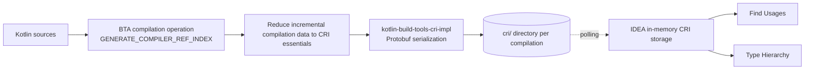

# Compiler reference index

The _compiler reference index_ (CRI) is an additional output of Kotlin compilation that IntelliJ IDEA consumes to narrow the search scope
for Find Usages and Type Hierarchy. This document describes how CRI is generated through the Build Tools API (BTA), where the artifacts are
written, and how to enable and verify them. It is aimed at contributors working on the Kotlin build tools or on the IDE consumer side.

**Status:** Enabled by default since Kotlin 2.5.0. The `GENERATE_COMPILER_REF_INDEX` BTA option is available since Kotlin 2.3.20.

## Why a BTA-based index

CRI has existed in IntelliJ IDEA for years, but only for JPS. The original implementation is coupled to three things it should not be
coupled to:

* The JPS build system.
* Internal compiler incremental compilation caches.
* `com.intellij.util.io.PersistentHashMap` as the on-disk format, which IDEA opens directly.

As a result, projects built with Gradle, Maven, or Bazel do not receive the JPS index. Without an index, Find Usages and inheritor search
walk a much wider scope than they need to, and the cost grows with the size of the repo.

The BTA-based implementation makes CRI generation available to build-system integrations. It also moves ownership of the on-disk format into
BTA so that neither the IDE nor any single build system depends on its internals. The current IDEA consumer discovers artifacts produced by
Gradle and Maven.

## What the index contains

Each compilation produces three data sets. Lookup and subtype entries use fully qualified name hashes. File-path entries map
source-path-derived file IDs to relative source paths.

| Data set          | Content                                                                     |
|-------------------|-----------------------------------------------------------------------------|
| Lookups           | Fully qualified name hash to the set of file IDs that reference that symbol |
| Subtypes          | Fully qualified name hash to its direct subtype names                       |
| File IDs to paths | File ID to the source path, which keeps the lookup data compact             |

## How it works



### Generation

Generation is a step inside the BTA compilation operation, gated by the `GENERATE_COMPILER_REF_INDEX` option on
[`BaseCompilationOperation`](../../compiler/build-tools/kotlin-build-tools-api/src/main/kotlin/org/jetbrains/kotlin/buildtools/api/BaseCompilationOperation.kt).
The same option on `JvmCompilationOperation` is deprecated in favor of the base one.

The data is sourced from existing incremental compilation structures, reduced to what CRI needs, and serialized by `CriDataSerializerImpl`
in the [`kotlin-build-tools-cri-impl`](../../compiler/build-tools/kotlin-build-tools-cri-impl) module, which is shipped as a shadow JAR.
`IncrementalJvmCompilerRunnerBase.generateCompilerRefIndexIfNeeded()` writes the files, deleting stale ones on a rebuild.

Output is per compilation rather than project-wide. The IDE merges across modules.

Generation requires incremental compilation. It also requires the compiler to run through BTA: enabling the property without BTA reports the
`GeneratingCompilerRefIndexWithoutBuildToolsApi` diagnostic and produces nothing. The warning is raised for JVM targets only.

### Consumption

On the IDE side, `BtaKotlinCompilerReferenceIndexStorageProvider` reads the artifacts directly from the Gradle and Maven build directories
and deserializes them through `CriToolchain`. Lookup and subtype data are held in `BtaLookupInMemoryStorage` and
`BtaSubtypeInMemoryStorage`.

`BtaFileWatcher` detects recompilation by polling the artifact timestamps every ten seconds and comparing them against the last seen values,
so the index refreshes for command-line builds as well as builds started from the IDE. A `DirtyScopeHolder`-style mechanism marks modules
whose index is out of date, which prevents the IDE from trusting stale data. This matches the JPS behavior.

### Design decisions

Protobuf was chosen as the serialization format because it is compact on disk and has well-understood forward and backward compatibility
rules. Those rules let the compiler side and the IDEA side evolve without lock-step releases.

Per-compilation output was chosen over a single project-wide storage because it keeps the artifacts inside the normal build output tree,
which is a prerequisite for sandboxed and hermetic build systems such as Bazel.

Ownership of the format sits in BTA rather than in IDEA internals, so the layout can change under normal Protobuf compatibility rules
instead of requiring coordinated changes in the IDE.

## Enabling it

### Gradle

Generation is on by default since Kotlin 2.5.0 and is controlled by the `kotlin.compiler.generateCompilerRefIndex` property.
When the property is not set, the index is generated if the compiler runs through BTA and the build is not detected as a CI build. CI
detection covers the usual environment variables, such as `CI`, `TEAMCITY_VERSION`, and `GITHUB_ACTIONS`.

Set the property explicitly to force generation on, including on CI, or to turn it off:

```properties
kotlin.compiler.generateCompilerRefIndex=true
```

Setting the property to `true` while `kotlin.compiler.runViaBuildToolsApi` is `false` produces a warning and no index.

### Maven

Maven requires both properties because incremental compilation is off by default:

```xml
<properties>
  <kotlin.compiler.generateCompilerRefIndex>true</kotlin.compiler.generateCompilerRefIndex>
  <kotlin.compiler.incremental>true</kotlin.compiler.incremental>
</properties>
```

Enabling generation without incremental compilation logs `Compiler reference index generation requires incremental compilation` and writes
nothing.

### IntelliJ IDEA

Enable the `kotlin.cri.bta.support.enabled` key in the registry, then reopen the project. In
**Settings | Advanced Settings | Kotlin**, ensure that **Compiler reference index** (`kotlin.compiler.ref.index`) is enabled. This setting is
enabled by default. The consuming service also requires precise incremental compilation to be enabled for the project.

## Output layout

The directory name and the file names are constants on
[`CriToolchain`](../../compiler/build-tools/kotlin-build-tools-api/src/main/kotlin/org/jetbrains/kotlin/buildtools/api/cri/CriToolchain.kt).
Do not hardcode them.

| Build system | Location, relative to the module directory   |
|--------------|----------------------------------------------|
| Gradle       | `build/kotlin/<compile task>/cacheable/cri/` |
| Maven        | `target/kotlin-ic/<goal>/cri/`               |

| Constant                     | Value                  |
|------------------------------|------------------------|
| `DATA_PATH`                  | `cri`                  |
| `LOOKUPS_FILENAME`           | `lookups.table`        |
| `FILE_IDS_TO_PATHS_FILENAME` | `fileIdsToPaths.table` |
| `SUBTYPES_FILENAME`          | `subtypes.table`       |

Gradle produces one CRI directory per Kotlin/JVM compile task. A multiplatform module can therefore contain multiple CRI directories for its
JVM compilations; non-JVM tasks do not currently generate CRI. Maven produces one directory per goal, typically `compile` and `test`.

## Verifying and troubleshooting

Confirm generation from the build side by checking that `cri/lookups.table` exists under the paths above. With the in-process execution
strategy, the build log also contains `Generating Compiler Reference Index...`.

Confirm consumption from the IDE side. Both diagnostic actions below require internal mode. For setup instructions, see JetBrains'
[Enabling internal mode](https://plugins.jetbrains.com/docs/intellij/enabling-internal.html).

* **Help | Diagnostic Tools | Kotlin CRI Diagnostics** reports whether the storage is initialized and lists dirty modules. A dirty module
  either has no artifacts yet or has changed since the artifacts were written.
* Place the caret on a symbol and run **Tools | Internal Actions | Show Compiler Index Status**. The dialog shows the selected symbol
  and its code usage scope. It also compares Kotlin and Java file counts in the use scope and code usage scope.
* Run Find Usages and Type Hierarchy on a class. On a large project, the narrowed scope is visible; on a small one, this is only a
  correctness check.

Common causes when no artifacts appear:

* The build ran on CI, or a CI environment variable is set locally, and the property was not set explicitly.
* The compiler did not run through BTA. Look for the `GeneratingCompilerRefIndexWithoutBuildToolsApi` diagnostic.
* Incremental compilation is disabled, which is the Maven default.
