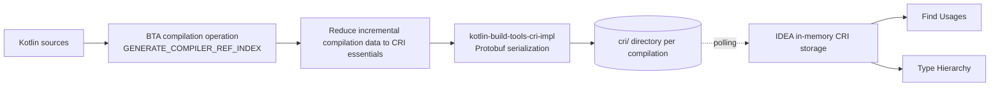

# Compiler reference index

During compilation, the Kotlin compiler tracks which files reference which symbols and the direct subtypes of each class. The _compiler
reference index_ (CRI) stores this data on disk, and IntelliJ IDEA uses it to limit Find Usages and Type Hierarchy to the relevant files.

This page covers generation through the Build Tools API (BTA), the output layout, and how to enable and verify it.

**Status:** Since Kotlin 2.5.0, Gradle enables CRI generation by default when compilation runs through BTA outside CI.
The `GENERATE_COMPILER_REF_INDEX` BTA option is available on `BaseCompilationOperation` since Kotlin 2.4.0.

## Why a BTA-based index

IntelliJ IDEA has supported CRI for years, but only for JPS. The JPS implementation couples CRI generation and consumption to:

* The JPS build system itself.
* Internal incremental compilation caches.
* `com.intellij.util.io.PersistentHashMap` as the on-disk format, which IDEA opens directly.

These dependencies prevent other build systems, such as Gradle, Maven, and Bazel, from reusing the JPS implementation. Without CRI,
Find Usages and inheritor search process a much wider scope than necessary. The cost grows with the size of the repository.

The BTA-based implementation lets any build system that uses BTA generate CRI and makes BTA the owner of the file format, so neither the IDE
nor a build system depends on its internals. IDEA currently reads the files produced by Gradle and Maven.

## What the index contains

Each compilation produces three data sets. Symbols are keyed by the hash of their fully qualified name, and source paths are stored once and
referenced by file ID.

| Data set          | Content                                                                     |
|-------------------|-----------------------------------------------------------------------------|
| Lookups           | Fully qualified name hash to the set of file IDs that reference that symbol |
| Subtypes          | Fully qualified name hash to its direct subtype names                       |
| File IDs to paths | File ID to the relative source path, which keeps the lookup data compact    |

## How it works


```mermaid
flowchart LR
    SRC[Kotlin sources] --> BTA[BTA compilation operation<br/>GENERATE_COMPILER_REF_INDEX]
    BTA --> STRIP[Reduce incremental compilation data to CRI essentials]
    STRIP --> SER[kotlin-build-tools-cri-impl<br/>Protobuf serialization]
    SER --> FILES[(cri/ directory per compilation)]
    FILES -. polling .-> STORE[IDEA in-memory CRI storage]
    STORE --> FU[Find Usages]
    STORE --> TH[Type Hierarchy]
```

### Generation

CRI is generated by the Build Tools API as an optional step of the compilation operation. The `GENERATE_COMPILER_REF_INDEX` option on
[`BaseCompilationOperation`](../../compiler/build-tools/kotlin-build-tools-api/src/main/kotlin/org/jetbrains/kotlin/buildtools/api/BaseCompilationOperation.kt)
enables it. Builds that do not run the compiler through BTA do not generate CRI.

The index is built from incremental compilation data, so incremental compilation must be enabled. The data is reduced to what CRI needs and
serialized to Protobuf by the [`kotlin-build-tools-cri-impl`](../../compiler/build-tools/kotlin-build-tools-cri-impl) module.

Each compilation writes its own files. A rebuild replaces them, while an incremental build appends to them, so they can contain stale
entries until the next rebuild.

### Consuming the index in IntelliJ IDEA

`BtaKotlinCompilerReferenceIndexStorageProvider` reads the files from the Gradle and Maven build directories,
deserializes them through `CriToolchain`, and merges them across modules. Lookup and subtype data are kept in `BtaLookupInMemoryStorage`
and `BtaSubtypeInMemoryStorage`.

`BtaFileWatcher` polls the files for changes, so the index also refreshes after command-line builds, not only after builds started from the
IDE. The IDE tracks modules whose index is out of date and excludes their stale index data from scope narrowing.

### Reading the index in other systems

Other tools can read the index through the same public API that IntelliJ IDEA uses. Load BTA with `KotlinToolchains.loadImplementation`.
`CriToolchain` creates one deserialization operation per file, and each operation returns typed entries: `LookupEntry`, `SubtypeEntry`, or
`FileIdToPathEntry`. Pass the whole file content to the operation instead of parsing the length-prefixed Protobuf records yourself.

To interpret the entries:

* `fqNameHashCode` is the `String.hashCode()` of the dotted fully qualified name, such as `"com.example.Foo".hashCode()`. Hash the
  symbol's name the same way to find its entries.
* `fileIds` resolve to source paths through the `FileIdToPathEntry` data. Gradle passes `ROOT_PROJECT_DIR` to BTA, so its paths are
  relative to the root project directory and use `/` as the separator. Maven does not, so its paths are the absolute source paths that
  the compiler received.
* `subtypes` lists the fully qualified names of direct subtypes. To collect the whole hierarchy, repeat the lookup for each subtype.
* An incremental build appends entries, so the same hash can appear more than once. Merge these entries, and expect stale data until the
  next rebuild.

> **Warning:** `fqNameHashCode` is a 32-bit hash, so different names can collide. Treat the results as candidates, not confirmed usages
> or subtypes.

For example, to find the source files that may reference `com.example.Foo`, where `criDir` is one of the `cri/` directories listed in
[Output layout](#output-layout):

```kotlin
val toolchains = KotlinToolchains.loadImplementation(btaImplementationClasspath)
val lookupData = criDir.resolve(CriToolchain.LOOKUPS_FILENAME).readBytes()
val fileIdToPathData = criDir.resolve(CriToolchain.FILE_IDS_TO_PATHS_FILENAME).readBytes()

val candidatePaths = toolchains.createBuildSession().use { session ->
    val lookups = session.executeOperation(toolchains.cri.createCriLookupDataDeserializationOperation(lookupData))
    val fileIdsToPaths = session.executeOperation(toolchains.cri.createCriFileIdToPathDataDeserializationOperation(fileIdToPathData))

    val fooHash = "com.example.Foo".hashCode()
    val fileIds = lookups.filter { it.fqNameHashCode == fooHash }.flatMapTo(mutableSetOf()) { it.fileIds }
    fileIdsToPaths.filter { it.fileId in fileIds }.mapNotNullTo(mutableSetOf()) { it.path }
}
```

### Design decisions

Protobuf is compact on disk and has well-understood forward and backward compatibility rules, so the compiler and IDEA can evolve without
lock-step releases.

Output is per compilation rather than project-wide so that it stays inside the normal build output tree, which sandboxed and hermetic build
systems such as Bazel require.

## Enabling it

### Gradle

Since Kotlin 2.5.0, generation is on by default when the compiler runs through BTA and the build is not detected as a CI build. CI detection
covers the common environment variables, such as `CI`, `TEAMCITY_VERSION`, and `GITHUB_ACTIONS`.

To enable generation explicitly, including on CI, add the following to `gradle.properties`:

```properties
kotlin.compiler.generateCompilerRefIndex=true
```

Set the property to `false` to disable generation.

If the property is `true` but `kotlin.compiler.runViaBuildToolsApi` is `false`, the build reports the
`GeneratingCompilerRefIndexWithoutBuildToolsApi` warning for JVM targets and produces no index.

### Maven

Add both properties to `pom.xml`; Maven disables incremental compilation by default:

```xml
<properties>
  <kotlin.compiler.generateCompilerRefIndex>true</kotlin.compiler.generateCompilerRefIndex>
  <kotlin.compiler.incremental>true</kotlin.compiler.incremental>
</properties>
```

Enabling generation without incremental compilation logs `Compiler reference index generation requires incremental compilation` and writes
nothing.

### IntelliJ IDEA

1. Enable the `kotlin.cri.bta.support.enabled` registry key and reopen the project.
2. Check that **Settings | Advanced Settings | Kotlin | Compiler reference index** (`kotlin.compiler.ref.index`) is enabled. It is on by
   default.
3. In **Settings | Build, Execution, Deployment | Compiler | Kotlin Compiler**, check that **Enable incremental compilation** under
   **Kotlin to JVM** is enabled. It is on by default.

## Output layout

Use the constants on
[`CriToolchain`](../../compiler/build-tools/kotlin-build-tools-api/src/main/kotlin/org/jetbrains/kotlin/buildtools/api/cri/CriToolchain.kt)
for the directory and file names instead of hardcoding them.

| Build system | Location, relative to the module directory   |
|--------------|----------------------------------------------|
| Gradle       | `build/kotlin/<compile task>/cacheable/cri/` |
| Maven        | `target/kotlin-ic/<source set>/cri/`         |

| Constant                     | Value                  |
|------------------------------|------------------------|
| `DATA_PATH`                  | `cri`                  |
| `LOOKUPS_FILENAME`           | `lookups.table`        |
| `FILE_IDS_TO_PATHS_FILENAME` | `fileIdsToPaths.table` |
| `SUBTYPES_FILENAME`          | `subtypes.table`       |

Gradle writes one CRI directory per Kotlin/JVM compile task, so a multiplatform module can have several. Non-JVM tasks do not currently
generate CRI. Maven writes one directory per source set: `compile` and `test`.

## Verifying and troubleshooting

To check generation, look for `cri/lookups.table` under the paths above. With the in-process execution strategy and Gradle's `--info` flag,
the build log also contains `Generating Compiler Reference Index...`.

To check consumption, use the IDE. The two diagnostic actions below require
[internal mode](https://plugins.jetbrains.com/docs/intellij/enabling-internal.html).

* **Help | Diagnostic Tools | Kotlin CRI Diagnostics** shows whether the storage is initialized and lists dirty modules: modules that have
  no files yet or have changed since the files were written.
* **Tools | Internal Actions | Show Compiler Index Status**, run with the caret on a symbol, shows the symbol's code usage scope and
  compares Kotlin and Java file counts in the use scope and the code usage scope.
* Run Find Usages and Type Hierarchy on a class. On a large project, the narrowed scope is visible; on a small one, this is only a
  correctness check.

If no files appear, the usual causes are:

* The build ran on CI, or a CI environment variable is set locally, and the property is not set explicitly.
* The compiler did not run through BTA. Look for the `GeneratingCompilerRefIndexWithoutBuildToolsApi` warning.
* Incremental compilation is disabled, which is the default in Maven.
