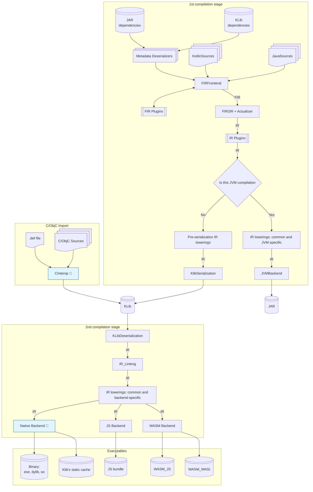

# Compiler's high-level structure graph

The Diagram below can be viewed with a Markdown editor with a Mermaid renderer,
e.g. GitHub; IntelliJ + "Markdown" plugin + "Mermaid Visualizer" plugin; VS Code; etc.; or just https://mermaid.ai/live

Please improve it using Mermaid syntax: 
- https://mermaid.js.org/syntax/flowchart.html
- https://github.com/mermaid-js/mermaid/blob/develop/README.md

### Diagram Explanation:
1. **1st Compilation Stage (sources+dependencies -> Jar or KLib)**:
    - Begins with input source code and JAR/Klib dependencies
    - Applies various stages of the compilation pipeline within Kotlin, leading to a `.jar` or `.klib` as output for the module.

2. **2nd Compilation Stage (KLibs -> executable artifact or library cache) for [Native](../native/compilation-model.md), JS, WASM backends**:
    - Deserializes/links KLibs
    - Performs numerous IR lowerings.
    - Converts IR to backend-specific representation.
    - Generates an executable artifact.
