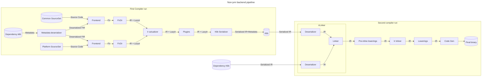
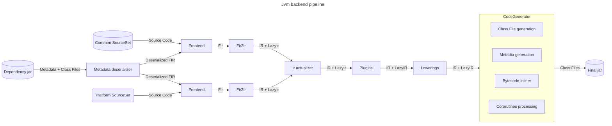
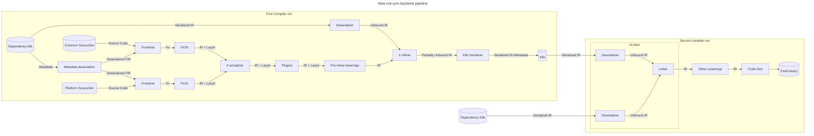

# Design Doc: Klib Inlining

Youtrack issue: [KT-64570](https://youtrack.jetbrains.com/issue/KT-64570)

## Problem statement

Current behavior of `inline` functions evolution diverge between JVM and non-JVM backends.

Basic example with different behavior looks like the following:
```kotlin
// dependency-v1:
inline fun depFun() = "lib.v1"
// dependency-v2
inline fun depFun() = "lib.v2"
// lib: depends on dependency-v1
fun libFun() = depFun()
// main: depends on lib and dependency-v2
fun main() {
    println(libFun())
}
```

On jvm this code would print `lib.v1`, as code is already inlined in libFun bytecode, and
it would not change independently of actual available function code. 

On the other side, on klib-based backends this code would print `lib.v2`, as inline function call
is stored as normal call in klib, and inlining happens after dependency resolution. 

Things become even worse, when instead of changing function was removed or incompatibly changed.

This behavior difference is a problem for library developers, as they need to think for both 
compatibility models. 

We prefer JVM behavior, because:
  - It exists longer and harder to change.
  - Klib model is not reasonably implementable on JVM, while JVM model is implementable for klibs. 
  - JVM model is more intuitive, as people think about inline function as about high-level macros.
  - JVM model is simpler ([example](examples/inline-to-crossinline.md))


## Goals and non-goals

This document is supposed to describe
  - Current inlining behavior on both JVM and non-JVM backends
  - Planned inlining behavior on non-JVM backends
  - High-level plan of migration to new behavior for non-JVM backends
  - Tricky cases found, while discussing plan

This document is not supposed to describe
  - Plans on migrating JVM backend to inlining over IR
  - Possible optimizations of inlining process itself in single-module case

## Inlining semantics

The General semantics of inline functions is described [on kotlinlang website](https://kotlinlang.org/docs/inline-functions.html)
and in [this](https://kotlinlang.org/spec/declarations.html#inlining) part of the specification.

In simple cases, behaviour of inline function should be not distinglishable from non-inline, unless
a user is using one of inline function features.

### Inlining lambdas

The most common use-case of inline functions is avoiding creating function objects for callbacks.

```kotlin
inline fun require(condition: Boolean, message: () -> String) {
  if (!condition) {
      throw IllegalStateException(message())
  }
}

fun notNull(data: Any?, name: String) {
  // while lambda needs to capture name no object would be allocated
  // and nothing would be computed unless data is null  
  require(data != null) { "Condition failed: $name is null" } 
}
```

Also, inlining lambda enables non-local return feature, which is not possible for non-inline functions.

```kotlin
fun test() {
    repeat(10) { // inline function from stdlib
        if (needReturn()) {
            return // this returns from test
        }
    }
}
```

There is a rarer case of lambda inlining when they are inlined into local class inside inline function.
This case is enabled by crossinline keyword, which makes non-local returns impossible. 
```kotlin
inline fun foo(crossinline block: () -> Unit) : Runnable {
    return object : Runnable {
        override fun run() = block() // block is inlined inside method of local class, which can be called later
    }
}
```

Also, lambda inlining behaviour can be opted-out by `noinline` keyword, if required. 

### Reified type parameters

Another important feature of inline functions is reified type parameters. 
Normally, type parameters are not observable in runtime. You can't get their
class, you can't cast to them, only to upper bounds. That's not true for reified

```kotlin
inline fun <reified U> checkType(x: Any) {
  // Normally, this would be unchecked cast, but it's checked here
  if (x is U) {
    // Normally, you can't get class of type parameter, but you can for reified
    println("$x is ${U::class}")
  } else {
    println("$x is not ${U::class}")
  }
}

fun main() {
  checkType<String>(2) // would println "2 is not class java.lang.String"  
  checkType<String>("a") // would print "a is class java.lang.String"  
  checkType<List<Int>>(listOf("a", "b", "c")) // would print "[a, b, c] is interface java.util.List", oops  
}
```

Also, reified type parameters enable creating type-parametrised array creation on JVM. 
For example, following function is unimplementable without reified types, as jvm requires
knowing element type in compile time for array creation.  
```kotlin
inline fun <reified T> createArray(size: Int, element: T) = Array<T>(size) { element }
```

#### Type erasure

On the other hand, non-reified type parameters continue behaving as their upper bounds.
For example, this code prints `I'm fine`, while would fail with reified type parameter.
```kotlin
inline fun <U> uncheckedCast(x: Any) {
  x as U
}

fun main() {
  val x = 5
  uncheckedCast<String>(x)
  println("I'm fine") // would print "I'm fine"
}
```

### Non-JVM backends compilation pipeline overview



Here is a high-level pipeline of how compilation works for klib-based backends, separated by parts intersting for the purposes of this document.
Let's look at them closer.

The first thing to notice here is that we have two compiler runs.
1. Convert source code to Klib
2. Convert a bunch of Klibs with all dependencies to the final executable binary

From the point of view of the second run, "source code" klib doesn't differ much from dependencies. 

Let's define in-memory artifacts we have:
1. **FIR** is frontend representation of kotlin code. Each fir declaration can be serialized to **metadata** and deserialized from it.
2. **LazyIr** is FIR-based IR replacement, which is required to avoid deserialization non-needed parts of dependencies. It contains only declarations, no bodies.
3. **IR** is the most important part here. It is representation parts we are planning to change work with.

Also, let's look closer to the components we have

1. Compilation starts from source code and dependencies. There can be several modules in one compilation,
   corresponding to different source-sets (e.g., common and platform). Dependencies are represented as klibs.
2. Dependency Klibs contains serialized frontend representation (a.k.a. metadata), which can be deserialized. Together with source code, it forms input for Frontend
3. For the purposes of this document, Frontend can be seen as a blackbox, converting source code to FIR. It runs on each of source sets independently
4. Fir2Ir converts FIR from source modules to IR, and referenced external Fir to LazyIR.
5. IrActualizer merges all modules to single one, and removes expect classes.
6. Plugins can make some custom changes in IR. This is a stage we don't control well.
7. Klib Serializer converts the resulting IR and FIR to Klib file. Up to some technical details, we can think that Klib is serialized IR + serialized metadata.
8. irLinker is a component that converts a bunch of klibs to IR. It consists of two logical parts, which are not separated in code well.
    * Deserializer is a part that can convert klib bytes to IR in memory
    * Linker is a part that can match declaration references with declarations.
9. Lowerings are some IR transformations, responsible for making IR simpler, so code generation is able to transform it to final binary. We separate them to three parts, which are not much different now.
    * Lowerings happening before inlining
    * Inlining lowering itself. 
    * All further lowerings
10. Code generation is a part that converts lowered IR to final binary. It can be considered as blackbox here.

### JVM backend compilation pipeline overview

Jvm backend doesn't affect our immediate plans, but need to be kept in mind for further work.


This pipeline is exactly the same before Plugins phase, but then, instead of serializing and deserializing IR to klibs,
we are directly passing to lowerings and code generation. 

As opposed to non-jvm backends, inlining here happens after all other lowerings as a part of code generation.
Moreover, it doesn't happen over IR, it happens over bytecode. 

There is an initiative of moving to IR-based inlining. In that case, it should happen somewhere inside lowerings phase.
Exact implementation of that is out of scope, while it was considered as a part of some decisions.

### IR references kinds

Let's talk about links inside IR. We plan to change significantly how we work with such links, so let's quickly discuss the current state.

We now have two ways of referring IR declaration by another one. 

1. Bound `IrSymbol`, which is a direct in-memory link to IrDeclaration object. 
2. `IdSignature`, which can be either serialized in klib, or represented as unbound `IrSymbol`. Technically,
   sometimes the key for further binding can be not `IdSignauture`, but FIR or Descriptor. 

We'd refer IR using type-1 links as **bound**, and IR using type-2 links as **unbound**.
   
Linker can be thought as a component converting IR with unbound references to Ir with bound references.
This is a complex part, especially with the handling of missing or incompatibly changed declarations.
It can't be done during the first compiler run (klib compilation), because of unclear semantics on this stage (some transitive
dependencies can't be accessed and even may be unknown) and performance reasons. 

IdSignature can be though only as unique ID, but not something containing enough information,
which is a problem. It would be much more convenient if it was structured, and some operations can be done with it 
(like getting information about call without looking at callee declaration), and linking would happen much closer to code generation. 
In that case, this ''new signature'' would be much similar to jvm function descriptor,
and the model would be closer to jvm. Changing this is out-of-scope for the current document.

Most of the compiler pipeline works with bound IR. There are two following exceptions:
1. During IR building IR can be partially unbound, as what-should-be-referred is not created yet.
2. During IR deserialization and linking can be not linked yet.

Working with unbound IR is harder, as we need to avoid using `IrSymbol.owner`.

## Target state

We are aiming to change the pipeline in the near future.
We will leave the JVM pipeline as is, for now.

### New KLib pipeline



Let's hightlight important changes from the old version 

1. Inlining happens before Klib serialization. That was our main goal
2. Pre-inline lowerings happen before serialization. This puts some [restrictions](#pre-inline-lowerings) on them. 
3. Klib serialization must be able to work with partially unlinked IR.
   * It should be trivial as signatures are already computed for unbound symbols, but would require some technical work
4. IR inlining must be able to work with unlinked IR in inlined functions. 
   * It is important that IR on call-site of inline function is always linked. 
      * Otherwise, would not be able to understand if this call needs to be inlined
   * In particular, that means we must inline all inline functions callsites inside inline function before inlining itself.
     * Because, callsites inside inline function can be not linked and this contradicts previous assumption
   * Our investigation shows that it should be possible, but a lot of new problems can occur here.

### Pre-inline lowerings

There is some work that needs to be done before inlining. Most of this work is lowerings, that get rid of some IR  
that would be meaningless or invalid after direct inlining. 

Currently, for Native this is:
* Processing [typeOf](examples/typeOf.md) intrinsic
* Processing Array constructor `Array(size:Int, init: (Int) -> Int)`, as it is only inline constructor allowed in language
* Processing of lateinit fields
  * We need to do it before inlining, because `isInitialized` intrinsic can access private field, so it should be done
    while we in class scope
* Processing of [outer this](examples/outer-this.md)
* Shared variable lowerings
  * It is prerequisite for local declarations lowering
* Processing [local declarations](examples/anonimous-objects.md)
* Special handling of function references to inline function with reified type arguments.

There are two important new restrictions. 

First, is more technical &mdash; data stored by this lowering in 
context would be not available on the second run. At least LateInit and OuterThis lowerings stores something.
We need to get rid of this or move this lowering after inlining

The second is semantic. What happens in this lowering would now be serialized to klibs. This means:
* It can't be ever changed
* If we change the lowering or add a new one, we must be ready to process both versions
* They can't change publicly accessible signatures, because otherwise we must run them on LazyIr when using module as dependency

Because of this, pre-inline lowerings should be avoided when possible. 

One more thing, which doesn't exit as separate lowering for now, but probably should be done, is type erasure.
We need too much context to do it, so we can't do it after inline function deserialization. Now it happens during inlining itself.

Here you can check step-by-step examples of how the inlining pipeline should work:
* [Basic](examples/step-by-step-basic.md)

### Debug information

Debug information within Ir is represented by (startOffset/endOffset) pair in IrElement. 
Unfortunately, with cross-file inlining it becomes more complex, as it is unclear with respect to which file this offset happens.

This information should be stored in IrInlinedExpression node, and serialized/deserialized.

We need to ensure that all information inside this node can be serialized. It is not true now. 

### Migration

**Note**: This is draft decision, more investigation is required.

There are existing klibs with inline functions not prepared for a new scheme. 
We plan to leave them as is, i.e., inline them after klib linking. 

This is a technical debt we need to accept. It shouldn't be a big issue as 
what is required for inlining before linking has much stricter restrictions,
so code working with it should be also able to work with linked IR. 

### Corner-cases

There is a bunch of corner cases in inlining. They are not very important for
further document understanding, but must not be lost during implementation.
This creates some restrictions on decisions made, but not required to understand decisions themselves.

You can skip this part on first reading.

- [typeOf](examples/typeOf.md)
- [Interaction with anonymous objects](examples/anonimous-objects.md)
- [Accessing private declarations](examples/accessing-private.md)
- [Calling from java](examples/calling-from-java.md)
- [inline override](examples/inline-override.md)
- [Using declarations not available on call-site](examples/implementation-dependency-chain.md)

## Postponed problems
- Inconsistencies between bytecode and IR inlining (JVM)
- Post-inline optimizations
