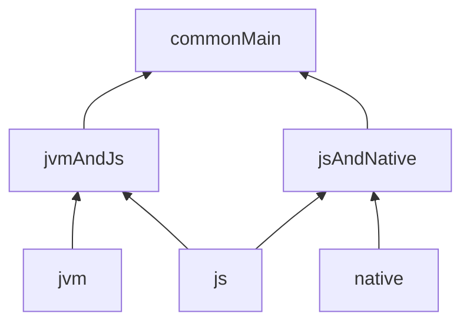
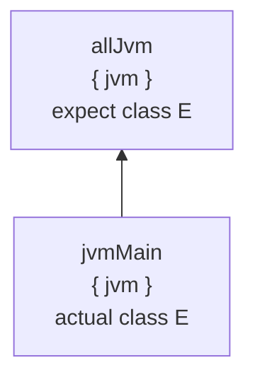
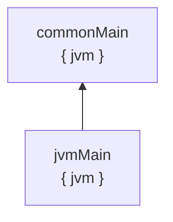
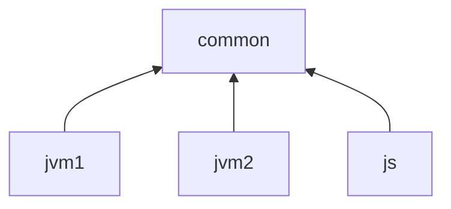

This document outlines the design for the next-gen publication format of Kotlin Multiplatform (KMP) libraries, dubbed "uklibs".

## Problems, goals
1. Simplify the dependencies model used in KMP, make it easier for third-party build tools to implement a KMP.

Currently, KMP libraries are published with the help of Gradle Variants. To be able to reason about KMP dependencies, one need to read a custom format of Gradle Metadata and a non-trivial algorithm that reasons about its contents (known as Gradle Variant-aware Resolution). 

Additionally, Gradle Variants are not the perfect model for KMP source sets and do not provide a necessary level of granularity for KMP. So we have to still publish additional meta-information alongside KMP libraries (known as Kotlin Project Structure Metadata). 

This produces an intricate and non-trivial interplay of Kotlin Gradle Plugin code and Gradle code. Which, in turn, causes a couple of issues:
* Very complicated code that is hard to maintain or reason about
* Any non-Gradle build system has to repeat this on its side (and due to how complicated it is, it's pretty much a showstopper)

2. Have direct control over the Kotlin-specific dependencies and resolution.

As explained in the previous point, KMP has its own dependencies and a unique way of managing them. In the current Gradle implementation, they are not managed entirely by Kotlin: some parts of the dependency resolution are done by Gradle, and some parts are done by Kotlin Gradle Plugin.

This makes it hard to evolve the libraries and ecosystem. Kotlin team can't provide guarantees governing the KMP dependencies, because Gradle partially manages them. On the other hand, these dependencies are still KMP-unique, so a typical intuition about Gradle/Maven dependencies can't be applied, resulting in the "worst of the worlds"-situation.

3. Simplify the publication layout.

The current publication layout of KMP libraries is very granular and elaborate. While it potentially allows a lot of flexibility, it comes at a serious complexity cost, both in terms of implementation and in terms of a mental model for anyone interacting with it.

Over the course of KMP evolution, we realized that some flexibility hadn't found its usage. One such example is the ability to download only a JS or Native part of the library without downloading common or JVM parts.

In some other cases, there initially was a use for the provided flexibility, but it has disappeared over the course of the evolution of Kotlin. For example, at some point, the cross-compilation capabilities of K/N were limited, and it wasn't guaranteed that a single host that could compile an entire library existed. As most repositories are immutable, this required splitting a library into multiple parts that could be published non-atomically from multiple hosts. Nowadays, in almost all cases, whole library can be published from a single host (Mac if the library has Apple-targets)
## Vocabulary

_Def. "Fragment"_: the smallest unit of grouping KMP sources together. Known as a "Kotlin Source Set" in Gradle implementation.

_Def. "Refines-edge"_: a relation between fragments. `A refines B` means that `A` sees all symbols of `B`, including `internal`-ones, and can provide `actual`s for `expect`s from `B`. Known as a `dependsOn`-relation in Gradle implementation. 
Note that it's a stronger relation than usual "dependency" (`myProject.commonMain -> kotlinx-coroutines-core.commonMain`) or "friend dependency" (`myProject.commonTest -> myProject.commonMain`)

_Def. "(Kotlin) Module"_: a set of Fragments (source sets) that are connected with refines (dependsOn) edges. In the Gradle world, given that there's no custom configuration of the KMP project model, each KMP module maps to precisely one Gradle project. 

_Def. "Analyzer"_: a consumer of a serialized representation of Kotlin code. You can think that the "serialized representation" is an output of some Kotlin backend (it's almost true modulo whether you count metadata-compiler as a separate Kotlin backend): `.kotlin_metadata`, `.knm`, IR, `.classfiles`, etc. 
Examples of analyzers: Kotlin compiler itself, IDE, kotlinx-metadata library, etc.

## What is uklib?

"Uklib" is a **self-contained** artifact representing one KMP module. "Self-contained" means that it contains enough information for any analyzer to read the symbols correctly in a KMP context. 

You can intuitively think of it as taking all artifacts currently published for a KMP module and packing them together into one archive + adding some metainformation on top of it.

> [!tip] 
> Trivia: the name "uklib" stands for "uber-klib". The idea is that "uber-klib" is basically couple of klibs packed together, just like ["uber-jar"](https://stackoverflow.com/questions/11947037/what-is-an-uber-jar-file) is a couple of jars packed together

Before going into details, let's quickly give some intuition on how this solution addresses the problems outlined in the previous section:

The whole level of separate fragments is hidden inside an uklib and entirely opaque to any external client. As such, a non-Gradle build tool can just download the uklib and pass it to the Kotlin toolchain without tinkering with fragments, matching attributes, discovering variants, etc. 

This addresses problem №1 (simplification of dependencies model and lowering entrance barrier for non-Gradle build systems to support KMP), and problem №2 (restoring an exclusive control over KMP-specific dependencies, i.e. fragments).

Also, it is trivial that the problem №3 (simplification of the build layout) is also addressed, as you can't really make a layout simpler than one artifact :) 

Below, we'll:
* explore the technical details of that solution;
* highlight some tradeoffs that had to be taken;
* show how some non-trivial cases work.

## Container format

Uklib has a dedicated extension `.uklib`. The file itself is an archive.

Mainly, we're choosing between two options for specific archive format:
* Good old `.zip` 
* Some more advanced algorithms

The reason for looking for more advanced algorithms is solely the compression ratio. Let's explain the considerations here:

**Problem**
The combined size of all platform-specific klibs is quite high. For example, for `kotlinx-coroutines-core:1.8.0-RC`, the number is 47.24 Mb uncompressed. 

A large part of it is platform-specific klibs. In the current publication scheme, platform-specific artifacts include all the contents of common source sets, leading to hugely duplicated data across all the publications, further multiplied by a plethora of Kotlin/Native targets.

There are two options to solve that:

1. Optimize it on the compiler level. It is a planned project called "klib-compilation", when each fragment's contents are compiled to klib with IR. Therefore, the contents of common fragments won't be duplicated across the whole publication, reducing the size of the artifacts we publish. 
   This effort is highly non-trivial from a technical perspective. The timeline for its rollout is probably years from now

2. Abuse the fact that the data in `uklib` contains a lot of duplicates. This is where compression algorithms come to play.

### Compression algorithms comparison

Payload: all published artifacts of `kotlinx-coroutines-core`, unpacked. Input size: 47.24 Mb

[Full comparison data](https://docs.google.com/spreadsheets/d/1sDHk8DnchdzXJotXjEQR021Hqh8mzGEh1kFb25RTeeA/edit?usp=sharing). Here, we will provide a few most interesting and important highlights:

1. zip/gzip: 
	* compression ratio ~= 2.75 
	* compression time ~= 1.0s (takes more on higher compression ratios, but they don't yield notably  higher compression ratio)
	* uncompression time ~= 240ms
2.  `xz`: 
	* compression ratio ~= 60 (!!)
	* compression time ~= 4.6s
	* uncompression time ~= 270ms
3. `zstd`: 
	* compression ratio ~= 53 (!)
	* compression time ~= 1.3s
	* uncompression time ~= 150ms

So, we can see that:
* zip/gzip compress quite quickly, but relatively poorly
* `xz` provides a whopping 60x compression at the cost of the slowest compression time
* `zstd` provides a balanced profile with great compression ratio, the fastest uncompression time, and very good compression time

> [!note] 
>
> **Why there's such a big difference between compression ratios?**
> 
> Compression algorithms usually have some duplicate detection and encode duplicates in form of a "backreferences". The details of that process are out of the scope of this document, but what is important is that deduplication works via a "sliding window", in which the duplicates should appear. If the duplicated data in the input stream is spread out on a distance more than this "sliding window", it won't have the optimized encoded presentation. 
>
>By default, our duplicates are **very** spread out. If all klibs are fed into the encoder one by one, then duplicates will be ~1 size of klib apart, which is several megabytes. 
> 
> gzip uses [deflate](https://www.ietf.org/rfc/rfc1951.txt) compression algorithm, and the window for duplicates is 32K. Therefore, gzip is understandably not able to deduplicate our data, and provides mediocre compression performance
> 
> It appears that `xz` and `zstd` have bigger sizes of "deduplication window", allowing to detect duplicates in the input streams of klibs better, yielding much better compression ratio.

So, ideally, we'd go with `zstd` or `xz`. `zstd` appears to be pretty modern, well-specified format, gaining a lot of popularity recently. 

On the other hand, we should make sure that we'll be able to provide support for a chosen format for all popular hosts and OSes.

> [!warning] 
> **Inconclusive design decision: compression algorithm.**
> 
> We can make it much later (even as one of the last tasks before uklib release).

## uklibs dependencies

### Context
Modules consist of potentially multiple "fragments" ("source sets" in the current Gradle implementation). Fragments are connected by `refines`-connection ("dependsOn" in the current Gradle implementation). 

We'll write `A refines B`, and say that:
- A is a **refiner of** B
- B is **refined by** A
- "Set of **refiners fragments** of B consists of A"
- "Set of **refined fragments** of A consists of B"

Pseudo-code:
```kotlin
class Module(
    val name: String
	val fragments: Set<Fragment>, 
	/* ... other fields will be described below ... */
)

class Fragment(
	val name: String, 
	val refines: Set<Fragment> = emptySet(),
	/* ... other fields will be described below ... /
)
```

For example, if we consider `kotlinx-coroutines-core` as one single Module, then it has multiple fragments inside: `commonMain`, `concurrentMain`, `nativeMain`, `nativeOtherMain`, `jsMain`, `jvmMain`, `iosArm64Main`, ...
We can think that a single-platform Module (e.g., purely Kotlin/JVM one) consists of a single trivial fragment. 

```kotlin
// Refines edges are omitted for clarity
val kotlinxCoroutinesCore = Module(
	"kotlinx-coroutines-core", 
	setOf(
		Fragment("commonMain"),
		Fragment("concurrentMain),
		Fragment("nativeMain"),
		Fragment("nativeOtherMain"),
		Fragment("jsMain"),
		/* ... */
	)
)
	
val guava = Module(
	"guava"
	setOf(Fragment("<stub-for-jvm-libraries>"))
)
```

Kotlin analyzers work with a model where each fragment has a set of dependencies on other fragments. So, if our module depends on `kotlinx-coroutines-core` and we want to compile `commonMain`, we need to know which fragments from `kotlinx-coroutines-core` it sees.

```kotlin
fun compile(compiledFragment: Fragment, dependencies: List<Fragment>)
```

While it might appear obvious that `commonMain` sees `commonMain`, in fact, the behavior is more nuanced. For example, if our particular module compiles only to JVM and Native, then it is actually desirable to see the API from `kotlinx-coroutines-core.concurrentMain` as well.

As the process of figuring out fragment-to-fragment dependencies is quite non-trivial, it is not feasible to require users to declare fragment-to-fragment dependencies themselves.

Instead, we ask users just to declare a dependency on the whole `kotlinx-coroutines-core` and promise that our toolchain will figure out granular fragment-to-fragment dependencies. 

The whole process of dependency resolution consists of two parts: 
* Module Resolution,
* Fragments Resolution.
### Module resolution

"Module Resolution" refers to a process where given a reference to a single Module (e.g., via Maven coordinates or a Module identifier in local build):
* Graph of transitive Modules is discovered;
* If version clashes happen, they are resolved, and final versions for each module are selected;
* For dependencies in remote repositories, they are downloaded to the local machine.


> In this example, a source module `myApp` depends on two Maven-published modules via their GAVs (`coroutines-core` and `kotlin-stdlib`) and on another source module, `myLib`.
> After Module resolution, we discover that coroutines, in fact, have an additional dependency on `atomicfu`.
> 
> Moreover, we discover that `coroutines-core` and `atomicfu` depend on `kotlin-stdlib:1.6.21`, but `myApp` requested `kotlin-stdlib:2.0`. The version clash is resolved by choosing the higher version in this case. 

This work is expected to be done by a particular build system (Gradle, Maven, Bazel, etc.). Kotlin toolchain is intentionally not concerned with those matters.

The output of "Module resolution" phase is that each `Module` receives a flat list of other *modules* (not fragments!). See the [Dependencies sorting](#dependencies-sorting) section on the matters of the order of that list.

#### Flat dependencies list

Readers well-versed in the implementation of KMP in Gradle probably noticed that the section above says that a **whole module** declares a particular dependency. This is different from the Kotlin Gradle Plugin as of Kotlin 2.0, where users declare dependencies from a particular **fragment** to a dependency:
```kotlin
kotlin {
    sourceSets.iosMain.dependencies {
        api("org.jetbrains.kotlinx:kotlinx-coroutines-core:1.7.3")
    }
}
```

**We intentionally restrict this feature in uklibs world.** 

In the uklibs world, each Module has just one flat list of dependencies to other Modules. This is the surface mental model exposed to users and non-sophisticated build systems/analyzers. 

Under the hood, the Kotlin toolchain will apply all of these dependencies to all fragments and run the resolution algorithm, selecting only parts of the dependencies visible in a particular fragment. 

**Consequence №1.** It's not possible to "restrict" visibility of a KMP library to only some fragments:

```kotlin
kotlin {
	jvm()
	ios() 
	
	sourceSets.iosMain.dependencies {
		api("org.jetbrains.kotlinx:kotlinx-coroutines-core:1.7.3")
	}
}
```
In the current Gradle implementation of KMP nor `jvmMain`, neither `commonMain` won't see `kotlinx-coroutines-core`. In uklib world, that won't be possible: `jvmMain` and `commonMain` will see it, as `kotlinx-coroutines-core` has compatible fragments.

**Consequences №2.** (partially sub-case of Consequence №1) It's not possible to depend on different versions of the same library in different fragments, or on different KMP libraries
```kotlin
kotlin {
	sourceSets {
		iosArm64Main.dependencies {
			// native is experimental, so can bump versions faster
			api("org.jetbrains.kotlinx:kotlinx-coroutines-core:1.8.0")

			// like Ktor more for non-JVM targets
			api("io.ktor:ktor-client-core:2.3.11")
		}

		jvmMain.dependencies {
			// jvm is more slow-evolving, so can't bump version fast
			api("org.jetbrains.kotlinx:kotlinx-coroutines-core:1.7.3")

			// but for JVM-target, for some reason prefer OkHttp over Ktor
			api("com.squareup.okhttp:okhttp:2.7.5")
		}
	}
}
```

**Consequence №3**. If a particular fragment-level dependency is not attributes-compatible, it's not an erroneous situation. 

For example, a user has declared a dependency on the Guava library. Indeed, in such cases, `dependencies("iosMain", "com.google.guava")` must return an empty set because Guava doesn't support iOS targets. It's OK because `dependencies("jvmMain", "com.google.guava")` will return the Guava library itself.

> [!note] 
> If none of the fragments could resolve anything from a particular dependency, then such dependency can be reported as "useless" (warning) or even "inapplicable" (error)

### Fragment resolution

"Fragment Resolution" refers to a process where, given a consumer-module and a list of dependency Modules (i.e., the output of "Module resolution"-stage), Kotlin Toolchain infers granular fragment-to-fragment dependencies.

Example of input: note that the list of dependencies is flat (we don't know anymore than `atomicfu` was a transitive dependency of `kotlinx-coroutines-core`)


Example of output (only one dependency is shown for clarity)

#### Kotlin attributes

To enable "Fragment resolution", we'll have to introduce a notion of **Kotlin Attributes** (inspired by Gradle Attributes)

You can think of Kotlin Attributes as "key-value" pairs of strings attached to each fragment.

Keys represent **attribute dimensions**. Each dimension has its own unique identifier and set of possible attribute values. 

The most important dimension is the "Kotlin Platform". All Kotlin fragments must have a "Kotlin Platform"-attribute.

Values of "Kotlin Platform" are sets of `KotlinTarget`s. Each `KotlinTarget` represents one specific "target" for Kotlin code generation, e.g. `jvm`,  `android`, `linuxX64`, `iosArm64`, `iosSimulatorArm64`, `wasmJs`, `wasmWasi`, etc. Note that there's no single dedicated "common"-target. 

For example, `myApp.commonMain` from the picture above has a "Kotlin Platform" with a value like `{ jvm, iosArm64 }` .

Additionally, we require that each Kotlin Attribute dimension also provides an `isCompatible`-relation on its attribute values, forming a [partial order](https://en.wikipedia.org/wiki/Partially_ordered_set). For "Kotlin Platform", its `isCompatible`-relation is effectively a "subset-of" relation of sets of `KotlinTarget`s. 

Pseudo-code for illustrative purposes:
```kotlin
enum class KotlinTarget {
	JVM,
	ANDROID,
	LINUX_X64,
	IOS_ARM64,
	IOS_SIMULATOR_ARM64,
	MACOS_ARM64,
	WASM_JS,
	WASM_WASI,
	...
}

class KotlinPlatformAttribute(val targets: Set<KotlinTarget>) : KotlinAttribute {
    override val uniqueId = "org.jetbrains.kotlin.platform"   

    override val isCompatibleWith(other: KotlinPlatformAttribute): Boolean =
	    this.targets.isSubsetOf(other.targets)
}
```

> [!warning] 
> **Conservative design decision**
> 
> At the moment, we don't see a need for a second dimension. It's OK to think that only one dimension exists (abolishing the need for the "dimension" concept altogether), and the implementation can follow this simplified model.
> 
> The main reason why the working group is not very eager to support multiple dimensions is because then some non-trivial questions arise as soon as you have more than one attribute. For example, what to do if two dimensions "disagreed" on the compatibility? How to treat the absence of a value in the dimension? etc.
> 
> This *does* mean that some already existing cases will have to be deprecated and phased out, e.g. cases like `jvm("okhttp") + jvm("ktor")`. Almost all of them can be refactored into multiple modules and use of `ServiceLocator`-like mechanisms.
> 
> One problematic case is `kotlin-test`. See [kotlin-test](#kotlin-test) section on how it is proposed to handle it

So, expanding previously introduced pseudo-code for `Fragment` with a concept of Kotlin Attributes:
```kotlin
class Fragment(
	val name: String, 
	val refines: Set<Fragment>
	val platformAttribute: KotlinPlatformAttribute
)
```


A couple of notes about other invariants/expectations:

**Fragment `F` doesn't have refiners <=> it has exactly one `KotlinTarget`**
* Note that "having a fragment with empty sources" and "not having a fragment" are not the same. For example, most libraries have only `nativeMain`/`iosMain` sources, but these fragments will still have refiners (`iosArm64Main`, `iosX64Main`, etc.), and it will be reflected in the umanifest of the uklib.
* Note that "bamboos" violate this invariant. If bamboo structures are allowed, you can have `F1 { jvm } -> F2 { jvm }`. 

**Fragment `F1` refines fragment `F2` <=> targets of `F1` are compatible with `F2`**
* In Gradle implementation, only the implication from left to right holds. 

**It's forbidden to have several fragments with the same attributes in uklib**
* See [Multiple fragments with the same attributes](#multiple-fragments-with-the-same-attributes) section for a detailed discussion of this invariant and related cases.

**It's OK to have a fragment with more targets than all of its refiners.** 
* E.g.: `commonMain` has `jvm` across its targets, but there is no `jvmMain` fragment

> [!note] 
> **Fate of `kotlin-project-structure-metadata.json`**
> 
> `kotlin-project-structure-metadata.json` is a format that is used by the current (Kotlin 2.0) KMP implementation of KMP in Gradle. 

#### Algorithm

To describe the algorithm, let's consider a specific example. Say we're developing a module called `consumer`, and it has a dependency on another module `lib`. 

The goal of the "Fragment Resolution"-phase is to provide a mapping from each fragment of `consumer` to an **ordered** collection (we'll explain below why order matters) of fragments from `lib` 


Intuitive description:
1. Consider a dependency on a module `dependency` from `consumer`
2. Get a cartesian product of all fragments of `consumer` and all fragments of `d`
3. For each pair `(consumerFragment, dependencyFragment)` check if attributes of `consumerFragment` are compatible with attributes of `dependencyFragment`.
   * If they are compatible, then add `dependencyFragment` into the resulting list  for `consumerFragment`
   * If they are incompatible, then move to the next pair

Pseudo-code:
```kotlin 
val result = mutableMapOf<Fragment, MutableList<Fragment>>

fun resolveKotlinDependencies(
	consumer: Module
): Map<Fragment, List<Fragment>> {
	for (dependency: Module in consumer.dependencies) {
	    resolveSingleDependency(consumer, dependency)
	}

	ensureOrder() // See below

	return result
}

fun resolveSingleDependency(from: Module, dependency: Module) {
	for (consumerFragment in from.fragments) {
		for (dependencyFragment in dependency.fragments) {
			// Simplified implementation that assumes only KotlinPlatform
			// attribute exists
			val consumerAttribute = consumerFragment.platformAttribute
			val dependencyAttribute = dependencyFragment.platformAttribute
			if (consumerAttribute.compatibleWith(dependencyAttribute)) {
				resolved(consumerFragment, dependencyFragment)
			}
		}
	}
}

fun resolved(from: Fragment, to: Fragment) {
	result.getOrPut(from) { mutableListOf() }.add(to)
}


```
#### Dependencies sorting

> [!warning] 
> This is an open design question

There's one strict requirement that we should maintain: fragments with `actual`s come before `expect`.

This allows the compiler to work more efficiently. If `expect` is encountered, then scanning the rest of the classpath in search of `actual` is unnecessary as it is guaranteed that it won't be found. 

If we sort the fragments according to their `isCompatible`-relation from the most specific to the least specific, such order guarantees the needed invariant. However, it is just a partial order. Specifically, the following fragments can't be compared using just `isCompatible`:

**1. Fragments of one and the same module that are not connected to each other via `refines`-edges.**

In this example, `jvmAndJs` and `jsAndNative` are not orderable using `isCompatible`-relation, but they can appear in the list of the resolved fragments (e.g., if the consumer is a `js`-fragment)

**2. Fragments from different modules, e.g. `A.commonMain` and `B.commonMain`.**

For this order, we might use the order of the passed module dependencies, i.e. the output of the "Module resolution"-phase. So, if `A` comes before `B` in module dependencies list, then all fragments of A should come before all fragments of B.

The concept of "ordered classpath" generally comes from the JVM world and its way of resolving "split classpath" / "classpath hell" (when there are multiple libraries with the same symbols on a classpath). 

While it might appear that it's natural to have the same mechanism for uklibs, in fact, klib compilation model differs noticeably from the JVM model. An additional design is needed to understand, whether JVM "classpath substitution" model is useful, or even possible in Kotlin klibs world. As such, this section is an open design question.

> [!note] 
> Regardless of the decision about "classpath substitution", it generally makes sense to guarantee _some_ stable order of dependencies, for the sake of builds reproducibility
#### Transitive KMP dependencies

We'd like to highlight that transitive dependencies are resolved **with the consumer's attributes, not the attributes of the dependency that brought this transitive dependency**. 

Let's show an example of why it matters:


Suppose someone published a module called `lib` with a dependency on `transitiveLib`. `lib.commonMain` compiles to `{ jvm, js, iosArm64 }`, so it sees only `transitiveLib.commonMain`

Now assume we consume `lib` from a module `app` that doesn't have `js`-target at all and compiles only to `{ jvm, iosArm64 }`:


It's trivial that `app.commonMain` sees `lib.commonMain` (edge #1) And we've already established that `lib.commonMain` sees `transitiveLib.commonMain` (edge #2), hence `app.commonMain` sees `transitiveLib.commonMain` (edge #3)

However, there's a question whether `app.commonMain` sees `transitiveLib.concurrentMain` (edge #4, highlighted in blue)

There are two possible approaches to the resolution algorithm that yield  two different answers to that question:

1. No dependency #4. 
   First, resolve `lib` against `transitiveLib`, yielding #2. Then, resolve `app` against `lib`, yielding #1. Putting together #1 and #2 and using the fact that fragment dependencies are transitive, we get #3.
2. There's a #4 dependency (currently described approach)
   Do not resolve `lib` against `transitiveLib` at all. Instead, resolve `app` against `lib`, yielding #1. Then, resolve `app` against `transitiveLib`, yielding #3 and #4. #2 doesn't exist at all in this approach. 

While Approach №1 might sound more intuitive, there's one big issue with it: it requires Module Resolution phase output to be a **rich graph, not just a flat list of Module dependencies**. Indeed, we need to know that the chain of dependencies is exactly `app -> lib -> transitiveLib`. If it were `app -> transitiveLib -> lib`, the result w.r.t. edge #4 would change (showing that left as an exercise to the reader :trollface: ).

It is expected that **Module Resolution** to be performed by build systems. So, if we go with Approach №1, all the build systems that want to support KMP must preserve the entire dependency graph and pass it to our toolchain. 

The working group deemed that it contradicts the requirements to simplify the integration of KMP to third-party build systems (and implementation in existing ones) and rejected that approach.

> [!note] 
> **Design decision**
> 
> Module Dependencies are flat lists of all modules (including transitive ones) rather than a graph. Fragment resolution runs separately from the consumer to each of these modules. 
> As such, if there's a direct dependency A that brought a transitive dependency B, a consumer might see **more fragments from B than A saw during the publication**.

Note that there's a peculiar corner case born by the intersection of this design decision and the layout of publication to MaveCentral. It is described in [Transitive KMP dependencies through Java-modules](#transitive-kmp-dependencies-through-java-modules) section. 


## Contents

Uklib contains a list of folders and `umanifest`. Each folder represents an output of a compiler for the respective-named source set. If the output is a `klib`, the `default` folder is omitted. 

Let's look at the example:
```
commonMain/  // metadata klib
|- linkdata/
|- resources
|- manifest  // klib manifest

jsMain/      // JS klib
|- ir/
|- linkdata/
|- resources/
|- targets/
|- manifest

nativeMain/  // shared-native metadata klib
// K/N klibs
iosArm64Main/
iosSimulatorArm64Main/

jvmMain/     // unpacked .jar
|- META-INF/
|- org
   |- jetbrains
      |- kotlin
         |- MyClass.class

umanifest
```
Note that the format of the output for a particular fragment is a concern of the respective backend, not of uklib. However, for the sake of example, we show here the formats that are actually used by compilers as of April 2024:

* Top-level of the uklib contains 6 folders, for two common fragments (`commonMain`, `nativeMain`) and four platform-specific fragments (`iosArm64Main`, `iosSimulatorArm64Main`, `jsMain` and `jvmMain`)
* `commonMain` contains metadata klib: it has `manifest` (klib manifest), it has `linkdata` (.knm files, i.e. serialized descriptors), but doesn't has IR
* `jsMain` contains platform-specific klib (JS klib in this case). Compared to `commonMain`, it additionally has `ir` folder with serialized IR
* Consistently with the rule "each folder contains compiler output for respective fragment", `jvmMain` contains compiler output for `jvmMain`-compilation, i.e. typical JAR-like folder structure with classfiles inside.

Also note that as of April 2024, the output for platform-specific fragments like `jvmMain` or `jsMain` is produced by compiling the sources of this fragment alongside all common sources. 
So, if `commonMain` has symbol `MyClass`, it will be repeated across `jsMain`, `iosArm64Main`, `iosSimulatorArm64Main` and `jvmMain`

### umanifest

`umanifest` encodes the meta-information about uklib:
* List of fragments
* Their attributes (see [Kotlin Attributes](#kotlin-attributes))
* Type of the content of the fragment: 
	* `BINARY` - for compiler output
	* `SOURCE` - for sources (see [Sources](#sources)) section
	* Other values can be added in the future for evolution.

`umanifest` should use a machine-parsable & human-readable format for storing its contents. `JSON` is the option suggested in the current iteration of the design.

Rough example of umanifest:

```json
{
"fragments": 
[
	{
		"name": "commonMain",
		"platforms": ["jvm", "js", "linux_x64", "iosArm64"],
		"contentType": "MetadataKlib"
	}, 
	{
		"name": "jvmMain",
		"platforms": ["jvm"],
		"contentType": "JvmJar"	
	}
],
	
"manifestVersion": "1.0.1"
}
```

Note that `umanifest` doesn't store `refines`-edges. We remind that `A refines B` <=> `A.attributes.isCompatibleWith(B.attributes)` (see note at the end of [Kotlin attributes](#kotlin-attributes)-section), so all edges can be restored based on umanifest contents. 
#### Dependencies identifiers in `umanifest` and `uklib`

It is strictly forbidden for the umanifest or any contents to contain any identifiers of dependencies (e.g. Maven coordinates of dependencies). Note that, for example, `klib` manifest circa Kotlin 2.0 contains identifiers of dependencies. As such, `klib` manifests violate this rule and will have to be fixed.

The main reason is that these references to dependencies will matter from the perspective of the library's evolution and compatibility (e.g., what happens if a dependency gets renamed, but its content is still present in another artifact?).

Introducing an in-uklib source of such identifiers will most likely force library authors to have two compatibility models of published libraries in mind (one coming from repo, e.g., from Maven, another coming from uklib itself). We could try to align these models, but it is prohibitively complicated, and the working group doesn't see any benefit in having dependency identifiers inside uklib.

Note that dependencies on K/N platform libs (like `Foundation`) are not forbidden because 
a) they are essential for performance optimizations in K/N,
b) at the moment, they are not modeled in terms of Maven-repo (or any other repo), and therefore, they do not duplicate anything

#### umanifest vs klib's manifest

There's an inherent overlap between `umanifest` and manifests of particular klibs. In fact, the current design iteration has no contradictions with a world where `umanifest` doesn't exist at all, and instead, all meta-information is written to manifests of specific fragments. There is a slight technical issue with JVM-fragments being represented as unpacked .jars and thus not having a `manifest` per se, but it's absolutely solvable.

Contrary to that, this design proposal suggests moving in a direction where `umanifest` is the only format for storing the meta information about the published Kotlin library. While there are no undisputed arguments backing this decision, there are a couple of minor ones: 
* it is easier to express meta information that is not expected to be different between fragments (e.g., version of the compiler used during the compilation);
* `klib`s manifests definitely need a clean-up, so it might not be the good idea to use them as a foundational format for "uklibs" (which meant to be the format of the future)

There's no specific timeline or plans for phasing out `klib`'s manifests or even guaranteeing that they will be phased out. It is possible that klibs manifests will be kept, but with a very different form/purpose. This section will be updated in the future.

### Resources

> [!warning] 
> **Inconclusive design decision: resources handling in uklib.** 
> 
> More detailed resources KMP resources design is required, but overall, the uklib format is flexible enough to accommodate most reasonable options.

Context:
* At the moment, there's no finalized design for KMP resources.
* At the moment, there's a `resources`-folder inside klibs, i.e. inside all folders inside uklib except for JVM-specific fragments. JVM-specific fragments have resources placed inside as per typical rules of JAR-layout. 
As such, we don't feel the need to reserve some special places for resources in uklib. With a high possibility, KMP resources will be fragment-scoped i.e. will be placed in particular fragment' klibs (and therefore won't be a concern of uklib design). 

Even if we need dedicated places for resources in uklib, it can be done via `umanifest` (see [umanifest](#umanifest) section) 

### Sources

TODO:

* Sources is a separate uklib artifact with a special umanifest marker

### cinterops

TODO:
* cinterops is a separate uklib artifact with a special umanifest marker

### Bundled native libraries (.so/.dylib/.h)

TODO: explain that it's a part of klib design, so it's not covered here

## Publishing to MavenCentral

Kotlin Multiplatform Library publishes to one Maven module, i.e. each publication has exactly one GAV (group-artifact-version). 

The whole publication will consist of:
* `.uklib`-artifact
	* potentially with `-sources.uklib` counterpart for sources
* `.jar`-artifact with JVM classfiles for Java clients (see [JVM classfiles inside and outside klib](#jvm-classfiles-inside-and-outside-klib))
	* potentially with `-sources.jar` counterpart for sources for Java clients
* Other additional artifacts (e.g., `.aar` for KMP libraries with Android target) can be published alongside `.uklib`
* potential meta-files for tooling/indexers, like `kotlin-tooling-metadata.json` 
	* Contents of Kotlin Tooling Metadata can be extended to include the whole `umanifest` for optimizations on build tools side/indexers
* Gradle Module metadata `.module`

Example:
```
|- kotlinx-coroutines-core-2.0.uklib
|- kotlinx-coroutines-core-2.0.jar
|- kotlinx-coroutines-core-2.0-sources.uklib
|- kotlinx-coroutines-core-2.0-sources.jar
|- kotlinx-coroutines-core-2.0-kotlin-tooling-metadata.json
|- kotlinx-coroutines-core-2.0.module
|- kotlinx-coroutines-core-2.0.pom
```

**How will Maven resolve such publications?**
* By default, Maven looks for `.jar`-file. So, Kotlin-unaware Maven clients will resolve `.jar`, which is precisely what we need.
* If we want to support KMP in Maven, we must write our own plugin. This plugin can be taught to know about `.uklib`-artifacts and that it needs to download them.
* After the `.uklib` is resolved, all the rest is up to our code and shouldn't differ much between Maven and Gradle

**How will Gradle resolve such publciations?**
* Gradle Module metadata is very flexible and rich, so supporting proper resolution is pretty straightforward.
* For example, we can publish two variants: one looking like a usual JVM publication and pointing to .jar-file, another with our own special multiplatform attributes and pointing to .uklib
Example of .module:
```json5
// ...
"variants": [
	{
		"name": "jvmApiElements-published", // for Java clients
		"attributes": {
			"org.gradle.category": "library",
			"org.gradle.libraryelements": "jar",
			"org.gradle.usage": "java-api",
		},
		"files": [
			{
				"name": "kotlinx-coroutines-core-2.0.jar",
				"url": "kotlinx-coroutines-core-2.0.jar",
				...
			}
		]
	},

    {
		"name": "jvmApiElements-published", // for KMP clients
		"attributes": {
			"org.gradle.category": "library",
			"org.gradle.libraryelements": "jar",
			// attribute to distinguish from JVM
			"org.gradle.usage": "kotlin-uklib", 
		},
		"files": [
			{
				"name": "kotlinx-coroutines-core-2.0.uklib",
				"url": "kotlinx-coroutines-core-2.0.uklib",
				...
			}
		]
	},
```


> [!warning] 
> **Concerns about several artifacts in one Maven module**
> 
> Formally, the layout described above should work, and all the actors support it.
> In fact, we're concerned that this might not be a very frequently used feature, and therefore, different tools might have assumptions contradicting this feature, or just simply a buggy support. 
> We explicitly don't want to be the only big client of this feature. The working group is going to prepare research on how frequently the feature of "multiple artifacts in one maven module" is used in the ecosystem. It might be possible that we'll have to roll back to publication setup with multiple suffixed Maven modules (`-jvm`, etc.)


## Tough cases

#### Transitive KMP dependencies through Java-modules

TODO
* Do we see KMP parts of a library through JVM module or not?
* What happens in case we see a library through JVM and KMP module?
* What happens if build system passes both .uklib and .jar to compilation?
* What about version clashes between .jar and .uklib?

### kotlin-test

TODO:
* Explain the problematic context (two variants for annotations) 
* Explain that it contradicts our idea of "only platform attribute exists"
* Explain how we solve it (allow passing actuals in .jar)
### Compose Multiplatform
TODO: merge with kotlin-test? the solution is the same

### kotlin-stdlib
TODO: explain that this part is suspended until we understand how compilation of stdlib in the world after Kotlin 2.0 works

## JVM world interop

### External .jars

### JVM classfiles inside and outside klib

TODO: collect all .jar-related decisions and considerations in one section

As we saw in section [Contents](#contents), uklib contains compiled .classfiles for JVM variants. On the other hand, [Publishing to MavenCentral](#publishing-to-mavencentral) section explains that the publication of KMP library will contain a separate `.jar`-file for Java clients. 

In this section, we'll explain the need behind each of these decisions, and how it works together.

**Why do we need a separate .jar-file?**
* Java clients don't know anything about Kotlin and can't unpack uklib
* Java clients don't want to download multiplatform parts of a library (this is critical for CI setups)

**Why do we need classfiles inside uklib?**
* Makes uklib self-sufficient artifact
* Makes it easier for non-Gradle build systems integration (can download just one artifact and pass it to the Kotlin compiler)
* Separation of responsibility: `.jar` with classfiles is a "JVM facade" for JVM clients of a multiplatform library. Contents of `jvmMain` in `uklib` is a Kotlin-owned representation of JVM code. Accidentally, as of April 2024, both cases use one and the same binaries, but that doesn't have to be the case. For example, moving to klib-based compilation might change how JVM code is represented inside uklib: specifically, making it so that contents of `jvmMain` will represent only code owned by `jvmMain`, without code from `commonMain` (while having it is mandatory for "JVM facade for Java clients")

TODO: finish the section (how maven resolves all that)

### Timeline

TODO: write down the timeline
* Can’t fit in 2.1 even a release under opt-in flag
	- Must start migration in KGP (deprecate per-fragment dependencies, elaborate structures)
	- Must implement prototype
	- Must support IDE (haven’t thought about IDE at all yet)
	- All that should be ready/tested by ~August (branching for 2.1)
	- That’s 4-5 months of work left
	- Could be possible if we had a full-time person working on it, but we don’t have one.

Despite that, the prototype should be started sooner rather than later. 

#### Migration

TODO: explain that this is suspended until we have the first design iteration established (i.e. reviewed by multiple people outside working group + some prototype is ready)


## Concerns/FAQ

### Host considerations
> Q: Doesn't KMP require multiple hosts to assemble all outputs of a library? Will it require some complicated CI setup with a "merge"-step?

At some point, indeed, cross-compilation capabilities were not rich enough, and for some modules, there was no single host that could compile all of the source sets to klibs.

This is largely irrelevant as of Kotlin 2.0:
* If the module has Darwin-targets, it can be entirely compiled to klibs on Mac-host
* Otherwise, it can be compiled to klibs on any host

In other words, we can safely assume that in almost all cases, the module can be compiled on Mac-host

> [!note] 
> **Advanced case where the statement doesn't hold**
> 
> You use dependencies on custom native libraries via cinterop, and these libraries' API is essentially different on different platforms (or maybe you just use an entirely different set of libraries for each platform). 
> This is a very advanced case, and we don't expect that more than a handful of such projects will exist. 
> For such projects, some tool for merging component klibs into uklib will be provided.

> Q: Ok, but I heard that Mac agents are expensive. Are we ok saying to all of our users "use Mac on CI?"

Couple of notes:
* If you're a well-behaved library author, you do need Mac anyways somewhere to run tests for Mac (as cross-linkage from non-Mac to Darwin targets is just impossible)
* CI time for running tests is expected to be much higher than time spend for compilation into a klib
* As of April 2024, GitHub CI provides free access to Macs for open-source projects

If that won't be enough and we face the problem of "Mac is too expensive", we have a backup plan:
* We'll have to provide a tooling for merging uklib from component klibs anyways
* It might be cumbersome to use. We can mitigate that by providing CI setup templates/guides. To make the amount of work more manageable, we can focus only on CIs that are popular among indie developers (as bigger teams probably will be able to set up their CI on their own), e.g. only on GitHub Actions

### Uklib size

> Q: Is it OK that we're putting all klibs together and forcing people to download all of them, even if only a part is needed? Isn't that a lot of extra megabytes per dependency?

Indeed, it is a concern. There are two ways to mitigate that:
* Use good compression algorithms (see [Container format](#container-format)-section)
* Compile fragments content to a klib. Indeed, most of the weight of the current publication is IR 


### IDE support
TODO: explain that we don't care about IDE in the first design iteration because we control the whole stack


### Multiple fragments with the same attributes

#### Bamboos

The most frequent case of several fragments with same attributes are "bamboos".

We call a "bamboo" a (sub)hierarchy of fragments, such that all fragments in it have the same attributes. Example: `F1 { jvm } -> F2 { jvm } -> F3 { jvm }`.

> [!note] 
> **Trivia**
> 
> Intuition behind the name: usually, fragments with their refines-edges form a "tree" from a Graph Theory perspective (Directed Acyclic Graph in the general case). The situation we describe here is a degenerate case, where the tree has exactly one branch. "Bamboos" can be seen as a "tree" with only one "branch" :)
> Note that "tree with only one branch" is just a quick, intuitive explanation. It covers fewer cases than the formal definition above. 


The main problem is that we want to order fragments on the library on the consumer's side as per [Dependencies sorting](#dependencies-sorting), but we do so based on Kotlin Attributes. The fragments of bamboo have the same Kotlin Attributes by definition. 

If we don't sort them correctly, and bamboo fragments have `expect`/`actual` declarations, then the consumer might observe weird errors. 

Specifically, consider that there's a bamboo: 

Then, the compiler on the consumer side must receive `jvmMain` before `allJvm`, otherwise, it will think that `Foo` doesn't have actual (that was the original reason behind dependencies sorting).

There are two possible ways to support it:
* we can forbid expect/actuals in bamboo fragments,
* we can store refines-edges in umanifest.

Both options introduce additional complexity, and the working group currently doesn't see it as a good tradeoff.

**Real-life cases**. 
In practice, bamboo-structures rarely appear as an intentionally designed part of the project. However, they do appear more or less frequently during the evolution.

As the simplest example, consider the migration from K/JVM-only module to a KMP module. As one of the very steps, one might want to create a module with only one target, and start moving the code from `jvmMain` to `commonMain`. At this point, `commonMain` will be a single-target fragment with only `{ jvm }`-attribute:

It is not the final state: more targets will be added in the future, making proper use of `commonMain` and KMP. 

Sometimes "in future" means "15 minutes later". Sometimes, however, it might take a very long time, with intermediate results being actually public and accessible to other people: for example, if a library considers supporting KMP in the future, does some preparation work with splitting the code into `jvmMain`/`commonMain`, but still not adding other targets yet and having public releases alongside.

Note that "bamboo" is not the ideal model for such cases. `commonMain` will have JVM language and JVM dependencies, and one has to track manually if the code is "common" indeed. 

The ideal solution would allow declaring "phantom targets". Describing this solution is out of scope for this document, but in short: "phantom targets" allow the module to configure dependencies and the analyzer so the code is checked as if the target is a "real" one. 
#### Non-bamboo cases

Bamboo is a strict subset of "multiple fragments with the same attributes". The cases that are not bamboos are basically described as: "Several fragments have the same attributes, but they're not in a refines-relation". Simple example:



Such cases have a critical distinction from bamboo-case: such fragments can't provide expect/actuals to each other (`jvm1` can't provide actuals for `jvm2`, nor vice versa. Therefore, their ordering on the consumer side doesn't matter, and we could allow them.

Note that on the producer-side, during the compilation of `jvm1` and `jvm2`, at least in the current compilation model/Gradle implementation of KMP, `jvm1` and `jvm2` **won't see sources of each other**. 

However, to maintain the same semantics on the consumer side, we'd have to serialize `refines`-graph as part of the publication format. Otherwise, they'll be put in the same classpath and will nominally "see" each other. 

At the moment, we don't know any cases that lead to user-visible WTFs because of that.

**Real-life cases**. 
Usually, non-bamboo structures with multiple fragments with the same attributes appear when the author wants to split existing `KotlinTarget` further. 

In practice, it is almost always the following case:
* it's a library
* there are multiple `jvm`-targets
* each subtarget is a "variant" for a specific framework/dependency: 
	* `jvm("okhttp")` vs `jvm("ktor")` if a module supports different HTTP clients
	* `jvm("junit4")` vs `jvm("junit5")` vs `jvm("testng")` if a module supports different testing frameworks
	* `jvm("gradle7")` vs `jvm("gradle8")` vs `jvm("gradle9")` if a module supports multiple versions of a particular dependency (Gradle in this case)
* There's no real need to use KMP for it, as the different variants have very few expect/actuals (if any at all) that can be replaced by the interfaces and usual dependency injection/service locator-like mechanisms

Note that the kotlin-test is very seldom an exception where the library really needs an `expect`/`actual` mechanism. 

#### Resolution

So, let's sum up:
* There are subgroups of the case "multiple fragments with the same attributes": when all the fragments are connected by `refines`-relation (dubbed "bamboos") and when they're not.
	* "Bamboos" are more problematic: by default, they can contain `expect`s and `actual`s, which then requires a particular ordering of them on the consumer side.
	* Non-bamboo structures don't have inherent issues but still might have awkward pitfalls (behavior/visibility on producer-side is different from the behavior/visibility on consumer-side)
* Both subgroups don't have use-cases that are both important **and** can't be covered by other mechanisms.
* Issues can be resolved if we serialize the whole `refines`-graph into publication format.

As such, the current resolution is to **forbid fragments with the same attributes in uklib**.

> [!note] 
> 
> There's a small open question about what to do during local development. The working group is fine with accepting the baseline of "bamboos are forbidden during local development. If you're in the process of migrating/starting a new KMP module, you should declare at least two targets. Our tooling will help to create actual-stubs for expects". However, more ergonomic solution are not out of consideration as well, especially in the context of [KT-33578](https://youtrack.jetbrains.com/issue/KT-33578/Provide-an-ability-to-extend-the-set-of-platforms-that-the-source-set-is-analyzed-for-helping-project-future-evolution)