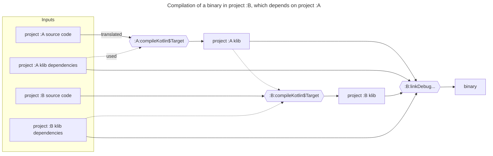
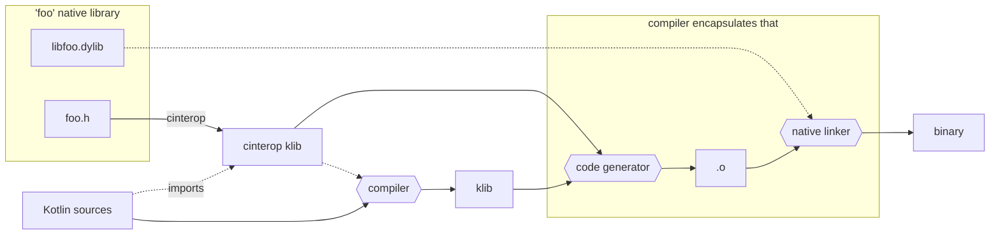
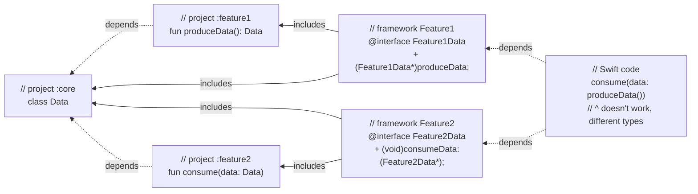
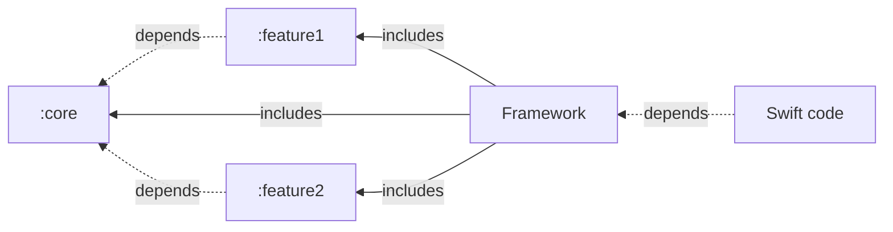

This document briefly outlines how the compilation with
[Kotlin/Native](https://kotlinlang.org/docs/native-overview.html) works in
terms of components and artifacts, including the cases with interoperability
with different languages.

# Kotlin/Native compilation in Gradle

This section describes how compilation with K/N from source to binary works in
Gradle for a single target. The approach is not really specific to Gradle, but
using Gradle in this description seems practical.

By "Gradle" this document mostly means
"[Kotlin Gradle Plugin](../../libraries/tools/kotlin-gradle-plugin)".

When compiling projects with multiple K/N targets, the build has to handle
common parts between these targets, which is not trivial.
This is out of scope for this document, and additionally involves things like
[commonizer](../../native/commonizer) and common metadata compilation.

So, this document focuses on the single target case. Below is the chart:

Any Kotlin sources are first compiled to a klib.
The `compileKotlin$Target` tasks do that.

Klib is a very high-level representation of a Kotlin library.
It contains serialized [Kotlin metadata](../../core/metadata) and serialized
[Kotlin backend IR](../../compiler/ir/ir.tree) (resolved AST).

Klibs are designed to have binary compatibility. They are publishable. In
particular, dependencies (e.g., those from Maven repositories) are also
represented as klibs.

So, "compile" tasks don't perform an actual compilation to machine code or
LLVM IR.
Instead, "link" tasks do that. A "link" task takes a transitively closed set
of klibs as an input, and produces an actual native binary as an output.

In addition to compiling klibs to machine code, a "link" task also compiles and
includes the K/N runtime, containing the implementation of e.g., garbage
collector.

Both "compile" and "link" tasks delegate the whole compilation to the K/N
compiler.
In other words, any such task invokes the K/N compiler once.
They don't split the action into pieces delegating them to the compiler
one-by-one.
The entry point of the compiler can be found [here](../../native/cli-native).

So the rest of this document will sometimes operate the terms "first/second
compilation stage", referring to the compilations from sources to klib and from
klibs to binary accordingly.
Performed by Gradle or the compiler.

# Kinds of binaries

The compiler can produce a few different kinds of binaries.
* **Executables** — native runnable executables, calling `fun main` upon 
  launch.
* **Test executables** — native runnable executables, running all the `@Test`
  methods. They are used for the test tasks in Gradle.
* **Static and dynamic native libraries**. Those are designed to be consumed
  from sources in different languages. For example, the compiler can produce a
  library with C API or Objective-C API. In both cases the compiler takes care
  of generating all the necessary bridging code.

  In the Objective-C case, the compiler emits a self-sufficient Objective-C
  framework (i.e. the native library, the headers and additional metadata are
  packed into a `.framework` bundle).

The relevant compilation flags specifying what the compiler produces are:
`-produce`, `-generate-test-runner`, `-Xstatic-framework`.
The corresponding Gradle documentation is
[here](https://kotlinlang.org/docs/multiplatform-dsl-reference.html#binaries).

# Closed-world compilation model

As hinted in the compilation scheme overview, compilation of binaries follows
the closed-world model: a binary always comprises a transitively enclosed set
of klibs, including stdlib.

Among other things, this means that two different binaries can't share any
code, e.g., in the form of a shared native library.
In other words, K/N binary is always an independent, self-contained closed
"world".

# Compilation time optimization

So, the second compilation stage (confusingly named "link" in Kotlin Gradle
Plugin) performs a global compilation, which might take a long time.
That's why the compiler has a few optimizations to that, reusing the machine
code produced by the previous invocations.

It is worth mentioning that there are "debug" and "release" binaries.
The compilation time optimizations apply only to debug binaries.
That's because compiling release binaries involves massive global
optimizations for the generated code, which are incompatible with compiling
anything separately.

So, in practice, producing the release binaries ("linkRelease" Gradle tasks)
takes significantly longer than the debug binaries, both because of heavier
compiler optimizations and lack of caching.

## "Compiler caches"

As mentioned above, the compiler tries to reuse the machine code produced by
previous invocations when compiling debug binaries. This is called "compiler
caches" or "compilation caches".

Under the hood, it works the following way.

When the compiler compiles a set of klibs to a binary, it attempts to compile
project dependencies to separate chunks of native code, storing them under
`~/.konan`. So, those are fairly persistent, and thus can be reused across
compiler invocations.

The entry point to this machinery can be found 
[here](../../kotlin-native/backend.native/compiler/ir/backend.native/src/org/jetbrains/kotlin/backend/konan/CacheBuilder.kt).

### Cache format

Such chunks of native code are represented as static libraries (`.a` files).
They are augmented with 
[additional meta-information](../../kotlin-native/backend.native/compiler/ir/backend.native/src/org/jetbrains/kotlin/backend/konan/CacheStorage.kt)
(stored as separate files), for example, class field layouts.

Without compiler caches, such information is typically deduced from the Kotlin
backend IR, but adding it to a cache allows the compiler skipping
deserialization of IR in "cached" klibs.

### Versioning the caches

Within the caching implementation, the compiler additionally takes care of
properly accounting parameters affecting the compilation, e.g., compiler flags
or dependencies.

For example, compiling with `-Xgc=cms` and `-Xgc=pmcs` produces different
machine code.

Compiling klib2 against klib1 (its dependency) might produce different machine
code after changing the version of klib1 (even if those are binary compatible 
with regard to Kotlin).

In such cases, the compiler can distinguish incompatible compiler caches.
Basically, it stores such different cached versions of the same library into
different directories.

This is all encapsulated in the compiler itself, as part of its operation
within the second compilation stage.
Implementing this in Gradle instead is possible, but would break encapsulation.

### Only project dependencies

As briefly mentioned, the caching is applied only to dependencies, i.e., klibs
downloaded from remote (Maven) repositories, and not to klibs produced by
compiling project source code.
This is a deliberate design choice:
Dependencies do not change — a klib residing at some path on the local
filesystem will always stay the same for the same path. So,
* up-to-date checks are trivial
* no need for a machinery cleaning outdated compiler versions (caches) of
  such modules. It would be useful even for project dependencies, but not as
  necessary as with project modules (which change that often, so caching
  without purging would lead to significant unlimited disk footprint).

To handle project modules, there is a different (experimental) machinery —
"incremental compilation", covered in the next section.

## Incremental second compilation stage

The compiler is
[able](https://kotlinlang.org/docs/whatsnew1920.html#incremental-compilation-of-klib-artifacts)
to reuse the machine code produced by the previous invocations even for the
project source code.
Only this time the compiler produces a chunk of machine code per source file,
not per klib.

More specifically, the compiler compiles each Kotlin file to an individual
static library (`.a` file), and also stores the graph of dependencies between
files. On the next binary compilation, the compiler can check the set of
changed files, and recompile only these files and files depending on them.

The up-to-date checks for files here are based not on source files as such, but
on "compiled files" files represented as Kotlin backend IR in klibs.
This decision serves at least two purposes:
* The second compilation stage operates klibs, not source files. So using the 
  klib-level representation is a matter of encapsulation.
* It allows handling subtle changes that don't affect the contents of file or
  its dependencies, but affect the resolution and thus change the actual
  compilation.

The incremental compilation is tightly integrated with the compiler caches
under the hood: for example, a compilation can be incremental and use compiler
caches at the same time.
In fact, incremental compilation is implemented with the help of
"per-file caches" under the hood.

The entry point to this machinery can be found
[here](../../kotlin-native/backend.native/compiler/ir/backend.native/src/org/jetbrains/kotlin/backend/konan/CacheBuilder.kt),
same as the compiler caches.

# Interoperability

Kotlin/Native provides a few ways to perform interaction between Kotlin and
other languages.

## Consuming C or Objective-C libraries in Kotlin, aka "cinterop"

### "cinterop klibs"

Kotlin/Native
[allows consuming C](https://kotlinlang.org/docs/native-c-interop.html) and
[Objective-C libraries](https://kotlinlang.org/docs/native-objc-interop.html)
in Kotlin code.
To achieve that, there is a special tool — `cinterop`.
The entry point can be found [here](../../kotlin-native/Interop/StubGenerator).
It takes a C/Objective-C library headers (`.h`) as an input and produces
a special "cinterop klib" as an output.

"Cinterop klib" differs from regular Kotlin klibs in some details.
For example, it contains Kotlin metadata, but not Kotlin backend IR.
Instead, it includes some other information for the compiler, enabling the
latter to actually generate machine code for native library use sites.

The compiler can accept a cinterop klib as a dependency, just like any regular
Kotlin klib.
So, to import a C or Objective-C library to Kotlin, one needs to make a
cinterop klib and pass it to the compiler as a dependency.

In Gradle, this is implemented in the following way:
* A `compilation` can define a `cinterops` description
* Under the hood, Gradle produces a cinterop klib based on such a description,
  and passes it as a dependency to the corresponding compilation.
* Any other compilation depending on this compilation will also get this
  cinterop klib as a dependency. That's why cinterop klibs are published along
  with regular Kotlin klibs.

See also https://kotlinlang.org/docs/multiplatform-dsl-reference.html#cinterops.

### Linking native libraries

Typically, a C or Objective-C library consists of header files and a binary —
either static (`.a`) or dynamic (`.dylib`/`.so`/`.dll`) library.

cinterop klibs cover the header part, which usually contains only the API.
The actual implementation of the library is located in the binary part, which
has to be linked to the binary the compiler produces. The following chart
illustrates the entire compilation flow:

## Consuming Swift or C++ libraries in Kotlin

The previous section describes how importing C and Objective-C to Kotlin works.
Importing Swift or C++ works only through Objective-C or C correspondingly.

For example, when annotating Swift declarations with `@objc`, Swift compiler
can produce an Objective-C header file for such declarations.
This header file can then be (processed with `cinterop` and) imported to
Kotlin.

Similar for C++ — one needs to wrap C++ declarations to C, and import C to
Kotlin.

## Consuming Kotlin libraries in Objective-C or Swift

As mentioned above, the K/N compiler can produce an Objective-C framework,
which can then be imported to Objective-C or Swift code.

The entry point to the implementation can be found
[here](../../kotlin-native/backend.native/compiler/ir/backend.native/src/org/jetbrains/kotlin/backend/konan/objcexport/ObjCExport.kt).

For such a framework, it is possible to instruct the compiler which modules to
include to the framework API as a whole (declarations from the rest will be
added one-by-one, if used in other parts of the resulting API).

### Closed world strikes back

The thing worth mentioning (repeating) here is 
[the closed-world compilation model](#closed-world-compilation-model).
A compiled framework is a closed world. So, it always contains all the
dependencies. When working with multiple such frameworks, this might be
surprising. Consider the following case.

In other words, both frameworks (`Feature1` and `Feature2`) contain project
`:core`, and its class `Data`. So Swift code ends up with two different
incompatible versions of the class: one from `Feature1`, one from `Feature2`.

Since `consumeData` expects `Data` from `Feature2`, but `produceData` returns
`Data` from `Feature1`, `consume(data: produceData())` in Swift won't work.

That's why the recommended approach is to use the "umbrella framework"
technique:

Naturally, that poses a limitation for consuming K/N libraries in
Objective-C/Swift. In fact, it is never a single library, but a whole "world".

See also
[here](https://www.jetbrains.com/help/kotlin-multiplatform-dev/multiplatform-project-configuration.html#several-shared-modules).

## Consuming Kotlin libraries in C/C++

Basically everything from the section 
[above](#Consuming-Kotlin-libraries-in-Objective-C-or-Swift) applies to
[consuming Kotlin in C/C++](https://kotlinlang.org/docs/native-dynamic-libraries.html).

The implementation can be found
[here](../../kotlin-native/backend.native/compiler/ir/backend.native/src/org/jetbrains/kotlin/backend/konan/cexport).

## Consuming Kotlin libraries in Swift directly, without Objective-C

As mentioned above, the K/N compiler can produce an Objective-C framework,
which can be imported to Swift code.

There is an ongoing development initiative for implementing this without
Objective-C in the middle. See [the documentation](../swift-export/README.md)
for more details.
