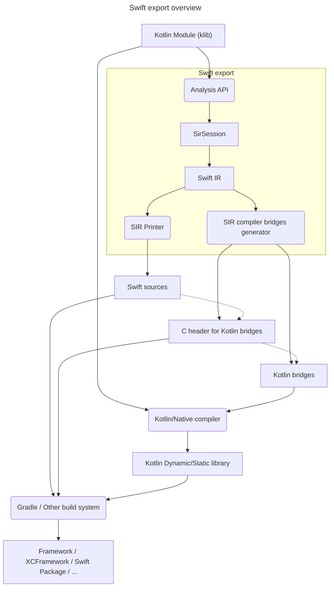

# Swift export architecture

This document provides a high-level overview on how Swift export fits into the bigger "Kotlin" picture. 

> ❗️ Swift export is in very early stages of development.
> Things change very quickly, and documentation might not catch up at times.

## A bit of history: Objective-C export

Objective-C export was developed back in 2017 as a part of the Kotlin/Native compiler. It was pretty fine at the moment, given that
Kotlin/Native was developed in a separate repository and the API surface of different Kotlin parts was pretty cumbersome.  
Effectively, it consists of several global compiler passes:
1. Generate Objective-C declarations from a tree of Kotlin declaration descriptors.
2. Tie these Objective-C declarations to the corresponding backend IR nodes.
3. Generate LLVM IR for Objective-C <-> Kotlin bridges.
4. Pack everything into an Apple framework.

And it works pretty well! However, this approach has a number of drawbacks:
1. It integrates poorly with an IDE. 

    Objective-C export was written as a global "batch" tool while good IDE integration requires the local-first approach.
2. Effectively, Kotlin/Native has 2 LLVM IR generators: one for Kotlin IR, and another for Objective-C bridges. Keeping these things in sync
requires additional efforts.
3. Objective-C export is tied to descriptors that are a K1 legacy, and moving it to K2 requires additional efforts.
4. Integration with artifact kinds other than framework/xcframework might be tricky.

## Swift export

Given Objective-C experience, we wanted to try something else in Swift export. Luckily, when we started Swift export in 2023, we had more tools at our disposal:
1. Mighty Analysis API. While still a work in progress, Analysis API has a goal of creating a stable public API for Kotlin compiler frontend.
It is developed with the IDE use-case in mind, given that it is used for the K2 IDE plugin. 
Moreover, it is suitable for standalone cases (KSP2, Dokka, Kapt 4) as well.
2. The infrastructure around klibs and IR is much more mature. We can add a few unstable compiler intrinsics or stdlib declarations here and 
there if needed instead of relying on the compiler internals.

So after a few approaches, we settled down with a relatively simple architecture of Swift export: Swift export is a separate tool that acts as a 
lazy Analysis API to Swift translator. Additionally, it generates thin Kotlin bridges with a C header which effectively provides C API to Kotlin
binary. These bridges are compiled by the Kotlin/Native compiler like any other sources and require little support in the compiler.

We consider this approach nice for a few reasons:
* Separate components of Swift export might be embedded into other environments (IDE, Kotlin Playground) as well.
* There is a pretty explicit ABI border between compiler/runtime and Swift export, which simplifies the evolution of both counterparts.
    * Moreover, it would be possible to separate release cycles of these counterparts if needed.
* Potentially, we can reuse the same ABI border for other exports (C/Objective-C, for example).