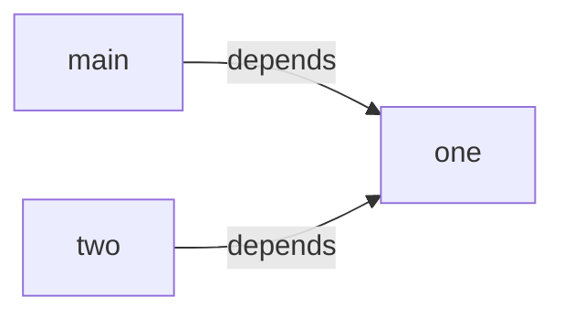

# Swift Export Execution Model — standalone

This document provides an overview of what `swift-export-standalone` runner does under the hood
and how it should be connected to the outside world.

> ❗️ Swift export is in the very early stages of development.
> Things change very quickly, and documentation might sometimes not catch up.

## Terminology

1. `swift-export-standalone` runner, Standalone Executor — an actor, designed for Build Tooling consumption. Provides the ability to translate a set of interlinked klibs into a set of `Swift modules`.
2. Output `Swift module` - represents a single Swift module and its dependencies. It will consist of a `.swift` file with the resulting API and may contain the additional bridges to call the compiled Kotlin code. The structure of the bridges and their purpose are described in the [Architecture section](architecture.md).
3. `synthetic` module - Swift Module, that has no counterpart in the original sources.

## Preconditions

Standalone Executor expects every module that ought to be translated to be precompiled. That allows the following:
1. guarantees the validity of input
2. unifies the input — everything is a klib

Standalone Executor expects that every module involved in the public API will be passed to it.
See details on [Multimodule resolve](#multimodule-resolve).

## Execution

As an input, Swift Standalone Executor receives a set of klibs.
This means that the dependency tree was flattened somewhere in the build tooling.
This fact adds another task for the execution: it has to reconstruct the dependency graph for the resulting Swift modules.

Given that, the Runner solves two problems:
1. It should execute a single module translation for every Kotlin module that was passed as an input.
2. It should collect all the results from the previous step, enrich them with the synthetic modules, and construct a resulting dependency graph for them.

### Translation of every Kotlin module

For each klib from the input, the Runner will construct its own Analysis API Session.
Analysis API Session requires having a source module as a root,
which means that we will create a synthetic source module and add every binary module to it as a dependency.
There is no need to reconstruct the actual dependency graph at this point, all the binary dependencies are passed as a flat list.
For the reasoning behind this step, please consult [Multimodule resolve](#multimodule-resolve).

For each such Analysis API session, a single module translation will be performed.
For the details on this please consult [Architecture section](architecture.md).

### Construct a resulting dependency graph

The resulting dependency graph can be found by analyzing the `imports` for each resulting SwiftModule.
Therefore, in this step, the Runner collects all the imports for each module and converts them into an actual graph.

## Packages

The main approach with package translation can be found [here](language-mapping.md#packages).
However, with the introduction of multiple modules, there is a problem.
Consider the following code:

```kotlin
// MODULE: one
// FILE: one.kt
package namespace

fun foo(): Unit = TODO()
```
```kotlin
// MODULE: two
// FILE: two.kt
package namespace

fun bar(): Unit = TODO()
```

Naive translation for this will produce 2 separate enums on the Swift side for each module:
```Swift 
// MODULE: one
enum namespace {}
extension namespace {
  func foo() { /**/ }
}
// MODULE: two
enum namespace {}
extension namespace {
  func bar() { /**/ }
}
```

Which will lead to strange constructions on the call site when both of those modules are imported:
```Swift 
import one
import two

extension one.namespace { // <- we are forced to use module name, as there is more than one "namespace"
}
```

To solve this problem, we are introducing a synthetic `ExportedKotlinPackages` module.
It stores a hierarchy of Swift enums, which represents a tree of Kotlin packages that were encountered during translation.

With that addition, the previous example becomes this:
```Swift
// MODULE: ExportedKotlinPackages
enum namespace {}
// MODULE: one
@_exported import ExportedKotlinPackages

extension namespace {
  func foo() { /**/ }
}
// MODULE: two
@_exported import ExportedKotlinPackages

extension namespace {
  func bar() { /**/ }
}
```

This provides us with a nice common namespace between different modules, leaving the user with a feeling of a common package:
```Swift 
import one
import two

extension namespace {
    func test() {
        foo()
        bar()
    }
}
```

## Multimodule resolve

Consider the following code: 

```kotlin
// MODULE: dep
// FILE: foo.kt
class Foo
```
```kotlin
// MODULE: main(dep)
// FILE: main.kt
import Foo
val f = Foo()
```

This code makes the type Foo part of the public API surface.
It is impossible to fully translate the module `main` without the information about `Foo`.
Therefore, we need two steps:
1. The module `dep` should be translated by the Swift Export
2. The module `main` should be translated with the knowledge of the existence of module `dep`

Without those two steps, the module `main` translation will encounter an unknown type.
Depending on the Standalone Executor configuration, this will either lead to an error or be translated as `Swift.Never`.
Neither of those options is desirable to the user.

For the first step, we cannot take every module and translate it – this will force every module in the compilation to become public.
This in turn will lead to an enormous public API surface,
which will render any possibility of DCE(dead code elimination) almost impossible.
Which will lead to an enlarged binary size.
Therefore, we need a mechanism to separate modules into two groups – the ones that do form a public API surface and those that are not.
And this separation cannot be made automatically,
because klib format does not make a distinction between `api` and `implementation` dependencies.
Therefore,
there is a Gradle DSL for declaring which modules should be exported, 
and that is the responsibility of the end-user to mark all modules that are part of the public API surface as such. 

The second step is already done by the user, but that information is lost before the call of the Swift Export Runner.
This restriction can be overcome by the fact that we don't need it:
Analysis API does not require the actual dependency tree – it is allowed for the dependency list to be flattened.
Actually, Analysis API does not require even the dependencies between binary modules.
The absence of these restrictions allows us to do the following for the Standalone Executor:

When translating a single module from the requested set,
Swift Export Runner will put every binary module as a dependency for the fake source module.
This will provide the Analysis API with the ability to find every necessary declaration during the translation. 

As a side effect: this will also extract all the transitive dependencies for the particular Swift Module and make them direct.
Also, this step accidentally cleans up any unused dependencies marked as `api` on the Gradle side,
forcing the dependency graph on the Swift side to be as accurate as possible.

This behavior best be illustrated by an example. Consider the following code:
```kotlin
// MODULE: one
class Foo
// MODULE: two
// build.gradle
  dependencies {
    api("one")
  }
// two.kt
fun foo(): Foo = Foo()

// MODULE: main
// build.gradle
  dependencies {
    api("two")
  }
// main.kt
fun main(): Foo = foo()
```
Technically, from the user perspective, there is no direct dependency between main and one modules,
as this configuration can be represented visually like this:


But, after the swift export is done with transforming this API, we will produce the following graph:

