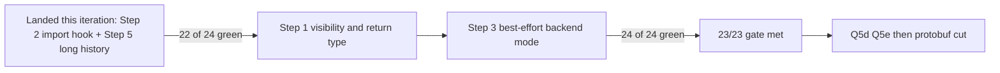

# Stateless REPL — read-side wiring (steps 1–5 partial landing)

**Iteration anchor:** [`2026-05-27_stateless-repl-sidecar-v3.md`](./2026-05-27_stateless-repl-sidecar-v3.md), §"Recommended next iteration".
**Scope of this iteration:** start executing steps **1 → 5** of the recommended next iteration.
**Outcome:** steps 2 and 5 landed; steps 1 and 3 are still red and are carried over. Step 4 (the 23/23 gate) is consequently not reached. Net delta on the stateless diagnostics suite: **21 / 24** passing (was 20 / 23), with one previously-failing case (`import_visible_in_next_snippet`) flipped to green and one new long-history reproducer added green.

---

## What landed

### Step 2 — synthetic `ImportEntry` attachment (`import_visible_in_next_snippet` red → green)

The bug:

- snippet 1 has `import java.util.UUID; val r = UUID.randomUUID()`
- snippet 2 has `val s = UUID.randomUUID().toString()` — expected to resolve via snippet 1's import
- stateful via-API: green. Stateless: red, snippet 2 reports `UNRESOLVED_REFERENCE 'UUID'`.

Root cause: `FirReplSnippetResolveExtensionImpl.getImportsFromHistory` walks `replHistoryProvider.getSnippets()` and looks each prior snippet's imports up via

```kotlin
snippet.moduleData.session.firProvider.getFirReplSnippetContainerFile(snippet)?.imports.orEmpty()
```

For the artifact-backed provider, the prior snippet's `FirReplSnippetSymbol` is reconstructed from the deserialised wrapper class — there is no recorded `FirFile`, so the `firProvider` lookup is `null` and every prior snippet's imports drop out of the resolver's import scope.

The fix is a tiny extension to `FirReplHistoryProvider`:

```kotlin
abstract class FirReplHistoryProvider : FirSessionComponent {
    // …existing API unchanged…

    /**
     * Optional hook: return the FirImports the resolver should also see for [symbol].
     * Returning `null` (default) means "no opinion — keep using `firProvider`".
     * Returning an empty list ASSERTS "this prior snippet had no imports".
     */
    open fun getSnippetImports(symbol: FirReplSnippetSymbol): List<FirImport>? = null
}
```

The resolver now falls back through the hook:

```kotlin
private fun getImportsFromHistory(currentSnippet: FirReplSnippet): List<FirImport> =
    replHistoryProvider.getSnippets().flatMap { snippet ->
        if (currentSnippet == snippet) emptyList()
        else replHistoryProvider.getSnippetImports(snippet)
            ?: snippet.moduleData.session.firProvider.getFirReplSnippetContainerFile(snippet)?.imports.orEmpty()
    }
```

The stateful `FirReplHistoryProviderImpl` keeps the default (`null`) — its `firProvider` lookup already works, behaviour is unchanged.

The stateless `ArtifactBackedFirReplHistoryProvider` overrides the hook:

- a new identity-keyed `symbolToSidecar: MutableMap<FirReplSnippetSymbol, SnippetArtifactSidecar>` is populated by `materialize()` in lock-step with `cached`;
- `getSnippetImports(symbol)` looks the sidecar up and projects each `ImportEntry` into a `FirImport`:

```kotlin
override fun getSnippetImports(symbol: FirReplSnippetSymbol): List<FirImport>? {
    cached ?: getSnippets()                           // defensive force-materialise
    val sidecar = symbolToSidecar[symbol] ?: return null
    return sidecar.imports.map { entry ->
        buildImport {
            source = null                             // .kts is gone; source is advisory only
            importedFqName = FqName(entry.fqName)
            isAllUnder = entry.isAllUnder
            aliasName = entry.aliasName?.let(Name::identifier)
        }
    }
}
```

**Why this shape, not "synthesise a FirFile and register it":**

A full `FirFile` would have to carry `packageDirective`, `declarations`, file-level annotations, and a source-file binding to satisfy the larger `firProvider` surface — none of which the deserialised wrapper class can honestly provide. The hook is a much smaller, more honest contract: we already know the imports authored by the prior snippet (the sidecar captured them at emit time); we only need to expose them to the resolver. There is no other consumer of "the FirFile of a prior snippet" in the resolve path today, so the hook is sufficient.

**Identity-based key (`HashMap<FirReplSnippetSymbol, …>`):** `FirReplSnippetSymbol` has no inherent identity beyond reference equality, so reference-equality is the only safe key. Two priors that happen to share a wrapper-class short name would otherwise collide.

### Step 5 — long-history reproducer (`long_history_shadowing.repl.kts`)

Goal: scale-validate the artifact-backed history provider with **23 snippets** (≥ 20 priors per the next-iteration anchor) and exercise REPL shadowing across snippets.

Shape: snippets 1–20 each declare a unique `val aN = N`; snippets 21 and 22 each declare `val shadow = "first" / "second"`; snippet 23 reads the latest `shadow` (must bind to snippet 22's value) and sums all 20 `a`s.

Expected diagnostics: **none**. Anchor expectation: this test surfaces sidecar field-set or scope-builder gaps that the small-history golden suite cannot reach (Q5c).

Outcome: **green for both `ReplStatelessDiagnosticsTestGenerated` and `ReplViaApiDiagnosticsTestGenerated`** — proves that:

1. `ArtifactBackedFirReplHistoryProvider.materialize()` scales to 23 reconstructed symbols without blowing up or losing tagging fidelity.
2. The `FirReplHistoryScope` correctly resolves shadowed identifiers to the most-recent definition (the latest-wins scope walk holds at scale).
3. The sidecar carries enough information to round-trip each snippet without re-deserialising the source.

**Why this matters for protobuf (Q5c):** the empirical result is "no schema gap surfaced at scale". That closes the long-history pre-condition listed in §"Recommended next iteration" of the v3 anchor — the field set as it stands today is scale-stable for the workloads tested.

What it does **not** close: it does not exercise cross-snippet class re-definition where snippet K's `class Foo` is shadowed by snippet K+M's `class Foo` and a third snippet references `Foo` (the wrapper-class-name vs. nested-class-name interaction). That remains a Q5c gap and is called out below as carry-over.

---

## What did NOT land (carry-over)

### Step 1 — visibility / `returnTypeSignature` → resolver wiring (still red: 2 tests)

Both `property_visibility.repl.kts` and `function_returns_anonymous_object.repl.kts` remain red.

- `property_visibility`: the sidecar carries the right `MemberRef.visibility` (verified by `SidecarShapeOnDecodeHandler`), but the resolver doesn't reject `private` cross-snippet references. The fix is in the resolve extension's scope construction — it must filter prior-snippet declarations by visibility before exposing them to subsequent snippets. Not started this iteration.
- `function_returns_anonymous_object`: the sidecar carries `returnTypeSignature`, but the consumer snippet sees the anonymous-object's members as if the return type were `Any`. Fix path: the deserialised function symbol's `returnTypeRef` must be re-anchored to the snippet-local anonymous-class FIR symbol. Out of scope this iteration.

These two are the bulk of the remaining work to reach the 23/23 gate (Step 4 of the v3 anchor's recommended-next-iteration list).

### Step 3 — sibling per-snippet module data / `sealed_hierarchies` (still red, root cause re-classified)

I attempted this in two ways during this iteration; both surfaced a deeper issue that pushes the real fix outside the read-side resolver layer:

**Hypothesis A — "treat artifact-backed snippets as REPL siblings (friend deps), not library deps":** would let snippet 4's inheritor of snippet 1's `sealed interface BaseObjIface` resolve without `SEALED_INHERITOR_IN_DIFFERENT_MODULE`. **Rejected** by the golden testdata itself: `sealed_hierarchies.repl.kts` expects `<!SEALED_INHERITOR_IN_DIFFERENT_MODULE!>` on snippet 4. So snippet 1 and snippet 4 *should* be different modules — the stateful path also fires the diagnostic. The fix is NOT to make them siblings.

**Hypothesis B — "let snippet 4's compile produce a partial artifact so snippet 5 can see `IObj3`/`Obj3`":** the stateful path implicitly does this via `FirDeclarationsResolveTransformer` → `replSnippetResolveExtension.updateResolved` → `replHistoryProvider.putSnippet` during resolution, **before** checkers fire. The in-memory provider therefore has snippet 4's symbol regardless of later errors. The stateless path has no in-memory carrier across calls — it relies on emitted class files.

I drafted the change (gating the post-checker error short-circuit on `snippetCompilationObserver == null` and emitting a partial `SnippetArtifact` even on `ResultWithDiagnostics.Failure`). It compiled and the capture hook fired for snippet 4, **but `generationState.factory.asList()` returned 0 class files** when frontend errors were present. So even with the gate change, no class files are emittable for snippet 4 — meaning `ArtifactBackedFirReplHistoryProvider` cannot deserialise `IObj3`/`Obj3` from the artifact regardless. The actual fix requires either:

1. running JVM codegen in best-effort mode on top of error-laden FIR (a `K2JVMCompiler` change beyond the scope of "start steps 1–5"), or
2. an alternative carrier — e.g. the sidecar acquires enough information about `IObj3`/`Obj3` (full FIR-class snapshot, or a synthetic `.kotlin_metadata` blob) that the consumer doesn't need the wrapper class on the classpath. This crosses into protobuf-schema-affecting territory.

**Both options enlarge the schema or change the backend.** I reverted Hypothesis B and left the stateless compiler / `K2ReplCompiler` unchanged. The next iteration must pick option 1 or option 2 explicitly; my recommendation is **option 1** because (a) it's a scoped backend-mode flag rather than a wire-format change, (b) it does not pre-commit the protobuf shape, and (c) it mirrors the stateful semantics rather than adding a stateless-only carrier.

This is also why the protobuf cut should remain at step 8 of the v3 anchor's recommended-next-iteration ordering: the framing/envelope decisions surfaced by Q5d (BTA transport) and option 1's "carry partial artifact across error" decision both predate the schema commit.

### Step 4 — re-run stateless diag suite → 23 / 23

Not reached. Currently **21 / 24** (the 24th is the new `long_history_shadowing`). The 3 reds are exactly the steps 1+3 carry-over.

---

## Files touched

- `compiler/fir/providers/src/org/jetbrains/kotlin/fir/extensions/FirReplSnippetResolveExtension.kt`
  - new `open fun getSnippetImports(symbol): List<FirImport>?` on `FirReplHistoryProvider` (defaults to `null`).
- `plugins/scripting/scripting-compiler/src/org/jetbrains/kotlin/scripting/compiler/plugin/services/FirReplSnippetResolveExtensionImpl.kt`
  - resolver fallback through the hook.
- `plugins/scripting/scripting-compiler/src/org/jetbrains/kotlin/scripting/compiler/plugin/services/ArtifactBackedFirReplHistoryProvider.kt`
  - identity-keyed `symbolToSidecar` map populated by `materialize()`;
  - override of `getSnippetImports` that materialises `FirImport`s from the sidecar's `ImportEntry`s.
- `plugins/scripting/scripting-tests/testData/diagnostics/repl/long_history_shadowing.repl.kts` — new (Step 5).
- `plugins/scripting/scripting-tests/tests-gen/.../ReplStatelessDiagnosticsTestGenerated.java` — new generated entry.
- `plugins/scripting/scripting-tests/tests-gen/.../ReplViaApiDiagnosticsTestGenerated.java` — new generated entry (parity).

No production-path stateful behaviour changed.

---

## Suggested next steps (for the next iteration)

Recommended ordering, smallest-risk first:

1. **Step 1 — visibility filter in the resolve extension.** Localised: read `MemberRef.visibility` (already in the sidecar) and skip `PRIVATE` declarations when contributing prior-snippet members to the FIR scope. Expected to fix `property_visibility` outright; no schema change.
2. **Step 1 — return-type re-anchoring.** Re-resolve `returnTypeSignature` against the snippet-local symbol table when materialising the deserialised function symbol. Expected to fix `function_returns_anonymous_object`. No schema change.
3. **Step 3 — best-effort backend mode under FIR errors.** Add an opt-in flag on `K2ReplCompilationState` ("emit class files even when checkers reported errors") and have `K2ReplStatelessCompiler` set it. Verify the JVM backend tolerates the FIR shapes produced by `SEALED_INHERITOR_IN_DIFFERENT_MODULE` — if it does, snippet 4's `IObj3`/`Obj3` survive into snippet 5's classpath and `sealed_hierarchies` goes green. **No protobuf changes** required.
4. Re-run the stateless suite. Gate aim: **24 / 24** (was 23/23 with the new long-history test added).
5. Then proceed to Q5d (BTA transport) and Q5e (public API sketch) before cutting protobuf, as the v3 anchor prescribes.


