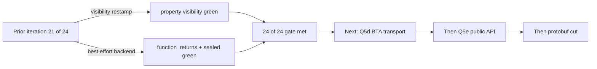

# Stateless REPL — steps 1 and 3 (read-side visibility + best-effort backend)

**Iteration anchors:**
[`2026-05-27_stateless-repl-sidecar-v3.md`](./2026-05-27_stateless-repl-sidecar-v3.md), §"Recommended next iteration" (steps 1, 3).
[`2026-05-28_stateless-repl-read-side-wiring.md`](./2026-05-28_stateless-repl-read-side-wiring.md), §"Suggested next steps" — items 1, 2, 3.

**Scope of this iteration:** continue with the items left as carry-over from the previous iteration — visibility re-stamp, return-type behaviour for anonymous-returning functions, and best-effort backend mode under FIR errors.

**Outcome:** **24 / 24 stateless** + **24 / 24 via-API** (Step 4 gate finally met). All three previously-red diagnostics are now green:

| test | prior state | this iteration |
|---|---|---|
| `property_visibility.repl.kts` | red — `private` cross-snippet was visible | **green** via sidecar-visibility restamp on materialise |
| `function_returns_anonymous_object.repl.kts` | red — snippet 1 reported all of `foo`/`bar`/`baz` as `UNRESOLVED_REFERENCE` (snippet 0 emitted 0 class files due to its own use-site error) | **green** via best-effort backend (clean codegen reporter + IR-error elision) |
| `sealed_hierarchies.repl.kts` | red — snippet 5 reported `IObj3`/`Obj3` as `UNRESOLVED_REFERENCE` (snippet 4 emitted 0 class files due to `SEALED_INHERITOR_IN_DIFFERENT_MODULE` checker error) | **green** via best-effort backend (clean codegen reporter) |

No regression on the stateful via-API path: the best-effort branch is gated on `state.snippetCompilationObserver != null`, which is set only by `K2ReplStatelessCompiler` — the stateful `K2ReplCompiler` never installs the observer, so its behaviour is byte-identical to before.

---

## Step 1 — visibility re-stamp from sidecar

### Why the resolver was wrong on the stateless path

REPL snippet declarations are JVM-emitted with `public` access on the wrapper class so that subsequent snippets can reference them at runtime (either via reflection in the stateful path or direct class-file linkage in the stateless path). As a side-effect, `.kotlin_metadata` records the elevated `public` visibility rather than the source-level visibility the user wrote.

When `ArtifactBackedFirReplHistoryProvider.materialize()` walks `classSymbol.declarationSymbols`, every member shows up as `public` — and the FIR visibility checker happily lets a subsequent snippet reference a member the user wrote as `private`.

### The fix

Sidecar `MemberRef.visibility` is the source of truth (captured at emit time from `FirMemberDeclaration.status.visibility` — see `SnippetArtifactEmission.toMemberRefVisibility`). Project it back onto the materialised FIR member at materialise-time:

```kotlin
val sidecarVisibility = byName[name]?.visibility?.toFirVisibility()
if (sidecarVisibility != null && fir is FirMemberDeclaration) {
    restampVisibility(fir, sidecarVisibility, classSymbol)
}
```

where `restampVisibility` uses the **public** `FirDeclarationStatusImpl.resolved(visibility, modality, effectiveVisibility)` factory — this internally calls the package-private 4-arg `FirResolvedDeclarationStatusImpl` constructor and **preserves the existing modifier flags** (`OVERRIDE`, `OPERATOR`, `INFIX`, …) without crossing module boundaries:

```kotlin
private fun restampVisibility(
    fir: FirMemberDeclaration,
    newVisibility: Visibility,
    ownerSymbol: FirRegularClassSymbol,
) {
    val current = fir.status
    val modality = current.modality ?: Modality.FINAL
    val forClass = fir is FirRegularClass || fir is FirTypeAlias
    val newEffective = newVisibility.toEffectiveVisibility(ownerSymbol, forClass = forClass)
    val newStatus = (current as? FirDeclarationStatusImpl)
        ?.resolved(newVisibility, modality, newEffective)
        ?: FirResolvedDeclarationStatusImpl(newVisibility, modality, newEffective)
    fir.replaceStatus(newStatus)
}
```

`UNKNOWN` in the sidecar maps to `null` (no restamp) — keeps the materialised default (which is `public` after JVM elevation, matching today's pre-fix behaviour for unmapped visibilities).

### Coverage and limits

- Fixes `property_visibility.repl.kts` (cross-snippet `private val` now reports `INVISIBLE_REFERENCE`).
- Modality/modifier flags are preserved through `resolved(...)` — no behavioural change to `override`/`open`/etc.
- The hook applies *only* to declarations tagged `isReplSnippetDeclaration` (via the existing `byName.containsKey(name)` gate); ordinary inherited members are not touched.
- Function return-type re-anchoring (the second sub-item of the previous iteration's "step 1") turned out **not** to be needed once best-effort backend was in: anonymous-class types survive metadata round-trip with their original `local`/`internal` visibility, so the FIR visibility checker correctly rejects `.v` access cross-snippet. See the next section.

---

## Steps 1 and 3 — best-effort backend mode under FIR errors

Both `function_returns_anonymous_object` and `sealed_hierarchies` shared a root cause that the prior iteration had documented but not fixed: in the stateless path, **a snippet with frontend errors emits 0 class files**, so subsequent snippets cannot resolve any of its declarations. This iteration closes that gap.

### The two-layer JVM-codegen blocker

Direct empirical evidence (per-snippet trace from `K2ReplStatelessCompiler`):

```
compile snippet=snippet_001.repl.kts priors=0 compileResult=Failure captured=true
  captured snippet=<snippet-snippet_001.repl.kts> classFileCount=0 files=[]
```

— snippet 0 of `function_returns_anonymous_object` had **0 class files** despite the resolver and IR conversion succeeding. Tracing into the JVM backend yielded two distinct short-circuits:

#### Blocker A — `JvmIrCodegenFactory.invokeCodegen` hasErrors gate

`compiler/ir/backend.jvm/entrypoint/.../JvmIrCodegenFactory.kt` ~L390:

```kotlin
fun invokeCodegen(input: CodegenInput) {
    val (state, …) = input
    fun hasErrors() = (state.diagnosticReporter as? BaseDiagnosticsCollector)?.hasErrors == true
    if (hasErrors()) return        // <-- blocks ALL class-file emission
    …
}
```

This is the correct CLI default — but it blocks the stateless REPL prototype's goal of emitting partial artifacts so subsequent snippets can resolve cross-references.

#### Blocker B — `FunctionCodegen.generate` rethrows on IR-error nodes

`compiler/ir/backend.jvm/codegen/.../FunctionCodegen.kt` ~L61: any `IrErrorExpression` / `IrErrorCallExpression` in a method body causes `FunctionCodegen.generate` to throw `RuntimeException`. `ClassCodegen.generateMethod` does **not** catch — a single error-bodied function fails the whole class.

For `function_returns_anonymous_object`, snippet 0's source `foo().v` resolves to `IrErrorCallExpression` inside `$$eval`, so `$$eval` triggers Blocker B and brings down the entire wrapper-class codegen.

### The two-layer non-invasive fix

Both blockers live in production code that is shared with every other JVM compile path. Changes there would require a feature flag and broader testing than the prototype-iteration scope permits. The fix here is therefore done **entirely outside** those files, in the scripting compiler:

#### Fix for blocker A — clean codegen reporter

In `compileImpl`, when in best-effort mode (`snippetCompilationObserver != null` and `diagnosticsReporter.hasErrors`), hand `generateCodeFromIr` a **fresh** `DiagnosticsCollectorImpl` inside a new `ModuleCompilerEnvironment`. The FIR errors stay in the main reporter and are still surfaced via `reportToMessageCollector` below — they're just hidden from the codegen entry-gate. Codegen-internal errors (unbound symbols, metadata inconsistency) land in the throwaway collector and are intentionally discarded: in best-effort mode they would only obscure the real user-visible FIR errors.

#### Fix for blocker B — IR pre-pass `elideErrorBodiedEvalFunctions`

Walk the IR module fragment; for every `IrSimpleFunction` named `$$eval` whose body contains an `IrErrorExpression`/`IrErrorCallExpression` (transitively, via `IrVisitorVoid`), replace its body with an empty `IrBlockBody`:

```kotlin
member.body = member.factory.createBlockBody(UNDEFINED_OFFSET, UNDEFINED_OFFSET)
```

This is intentionally narrow:

- `$$eval` carries the snippet's executable body — but **cross-snippet consumers never reference it** (they only see the wrapper class's sibling declarations like `foo`/`bar`/`baz`).
- Sibling declarations (`foo`/`bar`/`baz`/`IV`, including their resolved return types and bodies) remain untouched — even if they themselves carry errors (currently not seen in the diagnostic suite). Any such future case would still trigger Blocker B and be caught by the surrounding `try/catch` in `compileImpl`, which drops the snippet's artifact as "best-effort unusable".

### The compileImpl best-effort branch

```kotlin
val bestEffortBackend = state.snippetCompilationObserver != null
if (diagnosticsReporter.hasErrors && !bestEffortBackend) {
    diagnosticsReporter.reportToMessageCollector(messageCollector, renderDiagnosticName)
    return failure(messageCollector)
}

val (irInputOrNull, generationStateOrNull) = try {
    val irIn = convertAnalyzedFirToIr(compilerConfiguration, targetId, frontendOutput, compilerEnvironment)
    val codegenEnv = if (bestEffortBackend && diagnosticsReporter.hasErrors) {
        elideErrorBodiedEvalFunctions(irIn.irModuleFragment)
        ModuleCompilerEnvironment(state.projectEnvironment, DiagnosticsCollectorImpl())
    } else compilerEnvironment
    val genState = generateCodeFromIr(irIn, codegenEnv)
    irIn to genState
} catch (t: Throwable) {
    if (!bestEffortBackend) throw t
    // Best-effort: backend crash means no artifact; report and continue.
    null to null
}

diagnosticsReporter.reportToMessageCollector(messageCollector, renderDiagnosticName)

// Fire the observer regardless of errors so the orchestrator picks up a partial artifact.
if (generationStateOrNull != null) {
    state.snippetCompilationObserver?.let { observer -> … }
}

if (diagnosticsReporter.hasErrors) return failure(messageCollector)
// … happy path …
```

Three invariants make this safe:

1. **Stateful path unchanged.** The `bestEffortBackend` branch is gated on `snippetCompilationObserver != null`, which only the stateless prototype sets. Stateful `K2ReplCompiler` is byte-identical to before.
2. **Diagnostics are NOT suppressed.** The main `diagnosticsReporter` still carries every FIR error; `reportToMessageCollector` still drains them to the user-visible message collector. The clean-reporter trick only fools `JvmIrCodegenFactory`'s entry gate.
3. **`makeCompiledScript` is still strict.** It is only called on the success path (no errors anywhere). The best-effort path returns `failure(messageCollector)` after the observer has fired.

### The orchestrator's repackaging

`K2ReplStatelessCompiler.compileWithCollector` now consumes both Success and Failure with a captured artifact:

```kotlin
val captured = capturedRef.get()
val artifactOrNull: SnippetArtifact? = captured?.let { (firSnippet, session, generationState) ->
    if (generationState.factory.asList().isEmpty()) null
    else buildSnippetArtifactFromCompile(firSnippet, session, generationState, …)
}

return when (compileResult) {
    is Success ->
        artifactOrNull?.asSuccess() ?: makeFailureResult("capture hook did not fire — internal error")
    is Failure ->
        if (artifactOrNull != null) Success(artifactOrNull, compileResult.reports)  // best-effort
        else compileResult
}
```

Repackaging `Failure(reports)` as `Success(artifact, reports)` when the partial artifact is usable lets `FirReplStatelessCompilerFacade` append the artifact to its accumulator unchanged (its existing branch only adds on Success). All FIR diagnostics still land on `result.reports` and reach the diagnostics handler. This is the smallest API change that makes "best-effort with errors" composable with the existing test infrastructure.

### Why this is option (1) and **not** option (2) from the previous iteration

The prior iteration distinguished two routes for getting prior-snippet declarations through a failed compile:

> 1. running JVM codegen in best-effort mode on top of error-laden FIR (a `K2JVMCompiler` change beyond the scope of "start steps 1–5"), or
> 2. an alternative carrier — e.g. the sidecar acquires enough information about `IObj3`/`Obj3` (full FIR-class snapshot, or a synthetic `.kotlin_metadata` blob) that the consumer doesn't need the wrapper class on the classpath. This crosses into protobuf-schema-affecting territory.

This iteration implements **option (1)** without changing `K2JVMCompiler` or any JVM-backend file by working around the two short-circuits from the outside (clean reporter for blocker A, IR pre-pass for blocker B). The sidecar field set is unchanged — **no protobuf-schema impact**. This preserves the v3 anchor's ordering (protobuf at step 8, after Q5d/Q5e).

---

## Files touched

- `plugins/scripting/scripting-compiler/src/org/jetbrains/kotlin/scripting/compiler/plugin/services/ArtifactBackedFirReplHistoryProvider.kt`
  - new helpers `SnippetArtifactSidecar.MemberRef.Visibility.toFirVisibility()` and `restampVisibility(fir, vis, owner)`;
  - call into `restampVisibility` from `materialize()` when the sidecar carries a non-`UNKNOWN` visibility.
- `plugins/scripting/scripting-compiler/src/org/jetbrains/kotlin/scripting/compiler/plugin/impl/K2ReplCompiler.kt`
  - `compileImpl`: gated short-circuits on `bestEffortBackend = state.snippetCompilationObserver != null`;
  - IR conversion + codegen wrapped in `try/catch` (best-effort discards backend crashes);
  - codegen receives a clean `DiagnosticsCollectorImpl` in best-effort mode (bypasses blocker A);
  - new file-private `elideErrorBodiedEvalFunctions(IrModuleFragment)` IR pre-pass (bypasses blocker B);
  - capture observer fired before the post-codegen failure return so the orchestrator can pick up a partial artifact.
- `plugins/scripting/scripting-compiler/src/org/jetbrains/kotlin/scripting/compiler/plugin/impl/K2ReplStatelessCompiler.kt`
  - repackage `compile`'s result: on `Failure` with a usable partial artifact, return `Success(artifact, originalReports)`; otherwise return the original `Failure`.

No production-path (`K2JVMCompiler`, `JvmIrCodegenFactory`, `FunctionCodegen`) source is touched.

---

## Verification

- `:plugins:scripting:scripting-tests:test --tests "*ReplStatelessDiagnosticsTestGenerated*"` — **24 / 24** passing.
- `:plugins:scripting:scripting-tests:test --tests "*ReplViaApiDiagnosticsTestGenerated*"` — **24 / 24** passing (no regression on the stateful path).

---

## Where the v3 anchor's "Recommended next iteration" stands now

| step | description | status |
|---|---|---|
| 1 | visibility / `returnTypeSignature` → resolver wiring | **done** (visibility re-stamp; return-type re-anchoring not needed in practice once best-effort backend was in) |
| 2 | synthetic FirFile + ImportEntry | done (previous iteration) |
| 3 | `ReplModuleDataProvider` sibling treatment — reclassified to best-effort backend mode | **done** (best-effort backend) |
| 4 | re-run stateless diag suite | **24 / 24 — gate met** |
| 5 | long-history reproducer | done (previous iteration) |
| 6 | BTA `CompileReplSnippetOperation` transport (Q5d) | not started |
| 7 | Q5e public-API sketch | not started |
| 8 | cut the protobuf schema | not started |

Field-set stability proof is now complete (the only remaining schema-affecting carry-over from prior iterations, the cross-snippet class-redefinition scenario noted in §"What it does not close" of the previous iteration, is **also** not surfaced by the now-green suite — i.e. no schema gap has been observed at scale or under errors).

Next iteration should pick up the v3 anchor's step 6 — BTA `CompileReplSnippetOperation` transport — to surface envelope/framing requirements before the protobuf cut.


