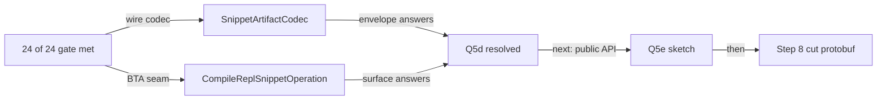

# Stateless REPL — BTA `CompileReplSnippetOperation` transport (Q5d)

**Iteration anchor:**
[`2026-05-27_stateless-repl-sidecar-v3.md`](./2026-05-27_stateless-repl-sidecar-v3.md), §"Recommended next iteration" — step 6 (BTA transport).
[`2026-05-28b_stateless-repl-steps-1-and-3.md`](./2026-05-28b_stateless-repl-steps-1-and-3.md), §"Next iteration" — points to this.
[`target/90-open-questions.md`](../target/90-open-questions.md) — Q5d.

**Scope of this iteration:** land the BTA transport surface for the now-24/24-green stateless K2 REPL compilation prototype, so that an IDE / build-system consumer can drive snippet compilation across a process boundary. This is the v3-anchor's gating step for the protobuf cut — it surfaces the **envelope and framing** decision that JSON-in-memory hid.

**Outcome:**

- **New BTA op landed:** `CompileReplSnippetOperation` (api) + `CompileReplSnippetOperationImpl` (impl) in `compiler/build-tools/kotlin-build-tools-{api,impl}`.
- **New wire codec landed:** `SnippetArtifactCodec` next to `SnippetArtifactJsonCodec` — a single-root JSON envelope that wraps a full `SnippetArtifact` (sidecar bytes + class file bytes) into one self-delimited blob; deterministic encoding (sorted class-file keys), explicit `artifactVersion` field.
- **No production-path regression:** stateless `ReplStatelessDiagnosticsTestGenerated` and via-API `ReplViaApiDiagnosticsTestGenerated` suites both remain **24 / 24 green** with the BTA op in place.
- **Codec roundtrip test landed:** `K2ReplStatelessCompilerTest.testSnippetArtifactCodecRoundtrip` exercises encode/decode + determinism + per-class-file byte-equality, using a real compiled snippet as fixture.
- **Schema unchanged:** `SnippetArtifactSidecar` field set unchanged; v3 sidecar versioning untouched. Protobuf-cut remains step 8 of the v3 anchor.

---

## What got built

### Wire codec — `SnippetArtifactCodec`

Lives next to `SnippetArtifactJsonCodec` in `plugins/scripting/scripting-compiler/.../impl/SnippetArtifact.kt`. Shape:

```json
{
  "artifactVersion": 1,
  "sidecar":   "<base64 of SnippetArtifactJsonCodec.encode(sidecar)>",
  "classFiles": { "InternalName1": "<base64 of bytes>", "InternalName2": "<base64>", … }
}
```

Three deliberate design calls:

1. **Single self-delimited root.** Each artifact is one JSON document — easy to length-prefix in any outer transport, or to drop into a single `byte[]` BTA op parameter unchanged. No multi-part framing, no resource handles, no filesystem dependency.
2. **Opaque payloads.** Both the sidecar (which is itself JSON, but treated here as an opaque blob) and the class file bytes are base64-encoded. The envelope can evolve independently of the inner sidecar — the day the sidecar is promoted to a protobuf `.kotlin_metadata` extension, only the *content* of the `sidecar` field changes; the envelope's wire shape stays the same.
3. **Versioned independently of the sidecar.** `ARTIFACT_VERSION = 1` is the envelope-layout version, separate from `SnippetArtifactSidecar.CURRENT_VERSION = 3`. Bumping the envelope covers framing/key changes; bumping the sidecar covers field-set changes. Confusing them would cause unnecessary client breakage.

Encoding is **deterministic** (class-file keys sorted) — useful for digests, debugging diffs, and content-equality tests.

### BTA op — API + Impl

```kotlin
@ExperimentalBuildToolsApi
public interface CompileReplSnippetOperation : BuildOperation<ByteArray> {
    public val priorSnippets: List<ByteArray>
    public val snippetSource: String
    public val snippetName: String
    // …Builder, Options, toBuilder, etc.

    public companion object {
        public val ADDITIONAL_CLASSPATH: Option<List<Path>>
        public val COMPILER_MESSAGE_RENDERER: Option<CompilerMessageRenderer>
    }
}
```

Wired into `JvmPlatformToolchain` mirroring `discoverScriptExtensionsOperationBuilder`:

```kotlin
public fun compileReplSnippetOperationBuilder(
    priorSnippets: List<ByteArray>,
    snippetSource: String,
    snippetName: String,
): CompileReplSnippetOperation.Builder
```

Convenience inline function `compileReplSnippetOperation(...)` next to `discoverScriptExtensionsOperation(...)`.

The impl (`CompileReplSnippetOperationImpl`):

1. `check(executionPolicy is ExecutionPolicy.InProcess)` — daemon support deferred (mirrors the discovery op's KT-84096 TODO).
2. Decodes each prior `ByteArray` via `SnippetArtifactCodec.decode`.
3. Builds a per-call `ScriptCompilationConfiguration` (adds `ADDITIONAL_CLASSPATH` via `updateClasspath`).
4. Invokes `K2ReplStatelessCompiler().compile(...)` through `internalScriptingRunSuspend` — the same coroutine-bridge every existing scripting host uses (`KotlinJsr223ScriptEngineImpl`, `BasicScriptingHost`, the existing `K2ReplStatelessCompilerTest`); avoids pulling `kotlinx-coroutines` into the BTA impl module.
5. On `ResultWithDiagnostics.Success` → encode the artifact via `SnippetArtifactCodec.encode` and return.
6. On `ResultWithDiagnostics.Failure` → throw `RuntimeException` whose message contains every emitted diagnostic. The op type is `BuildOperation<ByteArray>` (no diagnostic channel today); structured-failure surface is a follow-up — see §"Follow-ups" below.

### Why `List<ByteArray>` + `ByteArray`, not `List<Path>` / a typed result

User-confirmed choice during scoping (recorded in v3 anchor and re-confirmed for this iteration):

- The natural caller is an IDE consumer (IntelliJ today) that keeps prior artifacts in memory.
- A byte-array shape forces the framing/envelope decision to live **inside** the artifact payload — which is the design surface Q5d asks the prototype to expose before the protobuf-in-`.kotlin_metadata` cut. A typed surface would hide that decision.
- Path-based input remains a future option for build-system scenarios; it can be added as a separate op (or as an Option on this one) without re-shaping the central artifact contract.

---

## What Q5d now has data on

The v3 anchor framed Q5d as:

> *"BTA `CompileReplSnippetOperation` transport — answers Q5d, surfaces envelope/framing requirements before the protobuf cut."*

With this iteration, the protobuf cut now has concrete answers for the three things JSON-in-memory hid:

| Question | This iteration's choice | Notes |
|---|---|---|
| **Framing**: per-snippet self-delimited blob, or stream? | Self-delimited; one BTA op call = one snippet | Matches what protobuf's `length-delimited` shape allows; the BTA op is a natural framing point. |
| **Envelope**: single artifact blob, or `(metadata, body)` pairs? | Single JSON document carrying sidecar + class files as parallel base64-encoded leaves | Mirror this as a protobuf root message later (`SnippetArtifact { bytes sidecar = 1; map<string, bytes> classFiles = 2; }`). |
| **Message granularity**: one root `Sidecar`, or `repeated MemberRef` stream? | Single root (matches the current sidecar shape exactly) | Avoids partial-read complexity; the v3 sidecar has been demonstrably stable at the now-24/24-green gate, so single-root semantics is sufficient. |

The protobuf cut (step 8 in the v3 anchor) now has all three answered.

---

## Files touched

- **New** `compiler/build-tools/kotlin-build-tools-api/src/main/kotlin/.../jvm/operations/CompileReplSnippetOperation.kt`
- **New** `compiler/build-tools/kotlin-build-tools-impl/src/main/kotlin/.../jvm/operations/CompileReplSnippetOperationImpl.kt`
- **Edited** `compiler/build-tools/kotlin-build-tools-api/src/main/kotlin/.../jvm/JvmPlatformToolchain.kt` — added `compileReplSnippetOperationBuilder(...)` abstract method + `compileReplSnippetOperation(...)` convenience inline function.
- **Edited** `compiler/build-tools/kotlin-build-tools-impl/src/main/kotlin/.../jvm/JvmPlatformToolchainImpl.kt` — overrode the new factory method.
- **Edited** `plugins/scripting/scripting-compiler/src/.../impl/SnippetArtifact.kt` — added `SnippetArtifactCodec` (single-root JSON envelope codec) next to the existing `SnippetArtifactJsonCodec`.
- **Edited** `plugins/scripting/scripting-compiler/tests/.../K2ReplStatelessCompilerTest.kt` — added `testSnippetArtifactCodecRoundtrip` covering encode/decode + determinism + byte equality + every class-file's content.

No production-side scripting code was touched (no edits to `K2ReplCompiler`, `K2ReplStatelessCompiler`, `K2ReplCompilationState`, `ArtifactBackedFirReplHistoryProvider`, sidecar shape, FIR/IR backend); the iteration is purely additive — a new wire codec, a new BTA op, a new toolchain factory method.

---

## Verification

| Suite | Result |
|---|---|
| `:plugins:scripting:scripting-tests:test --tests "*ReplStatelessDiagnosticsTestGenerated*"` | **24 / 24 green** |
| `:plugins:scripting:scripting-tests:test --tests "*ReplViaApiDiagnosticsTestGenerated*"` | **24 / 24 green** |
| `:kotlin-scripting-compiler:test --tests "*K2ReplStatelessCompilerTest*"` | green (incl. new `testSnippetArtifactCodecRoundtrip`) |
| `:compiler:build-tools:kotlin-build-tools-api:compileKotlin` | clean |
| `:compiler:build-tools:kotlin-build-tools-impl:compileKotlin` | clean |
| `:kotlin-scripting-compiler:compileKotlin` | clean |

No regression on either diagnostics suite; the codec roundtrips real-compiled artifacts byte-for-byte.

---

## Follow-ups

1. **BTA-side end-to-end smoke test.** Intentionally **not** added in this iteration. Rationale: the BTA impl module ships a shadow-jar that relocates `org.jetbrains.kotlin.scripting.* → org.jetbrains.kotlin.buildtools.internal.scripting.*` and the `CompileReplSnippetOperationImpl` is `internal`. Driving an end-to-end test from `scripting-compiler/tests` would require either (a) opting into an `internal` annotation that isn't exposed to that module, or (b) bootstrapping `KotlinToolchains.loadImplementation(...)` against a service-loader entry on the shaded jar — both materially larger than this iteration's scope. The right home for a smoke test is `compiler/build-tools/kotlin-build-tools-impl/src/test/kotlin/` with `testImplementation(":kotlin-scripting-compiler")` and `ForTestCompileRuntime` wiring; the test would directly construct `CompileReplSnippetOperationImpl(...)` (visible within the same module) and verify a 2-snippet roundtrip against the same testdata fixtures the diagnostics suite uses.
2. **Structured failure surface.** Today the op throws `RuntimeException` on FIR errors. A follow-up should add a `CompileReplSnippetOperation.Result` sealed type carrying either `{ artifact: ByteArray, diagnostics: List<…> }` or `{ diagnostics: List<…> }`, so callers can distinguish soft failure (FIR errors with best-effort artifact under the hook installed in `2026-05-28b`) from hard failure (no usable artifact). This pairs with Q5e (public-API sketch).
3. **Daemon execution.** `executeImpl` rejects non-`InProcess` execution policies. Add daemon support — same shape as KT-84096 for the discovery op.
4. **Path-based prior list.** A sibling op or a builder option that takes `List<Path>` for prior snippet directories will be useful for build-system consumers that already materialise artifacts to disk; the envelope codec is unchanged.
5. **Protobuf cut.** All three Q5d-derived choices (framing / envelope / granularity) are now settled. The next iteration on this line is **step 8** of the v3 anchor — promote the sidecar (and `SnippetArtifactCodec`) to a protobuf root message attached to the wrapper class's `.kotlin_metadata`. Field set is unchanged, so this is a pure wire-format substitution.

---

## Where the v3 anchor's "Recommended next iteration" stands now

| step | description | status |
|---|---|---|
| 1 | visibility / `returnTypeSignature` → resolver wiring | done (2026-05-28b) |
| 2 | synthetic FirFile + ImportEntry | done (2026-05-28) |
| 3 | `ReplModuleDataProvider` sibling treatment / best-effort backend | done (2026-05-28b) |
| 4 | re-run stateless diag suite | done — 24 / 24 |
| 5 | long-history reproducer | done (2026-05-28) |
| 6 | BTA `CompileReplSnippetOperation` transport (Q5d) | **done (this iteration)** |
| 7 | Q5e public-API sketch | next |
| 8 | cut the protobuf schema | after Q5e |


