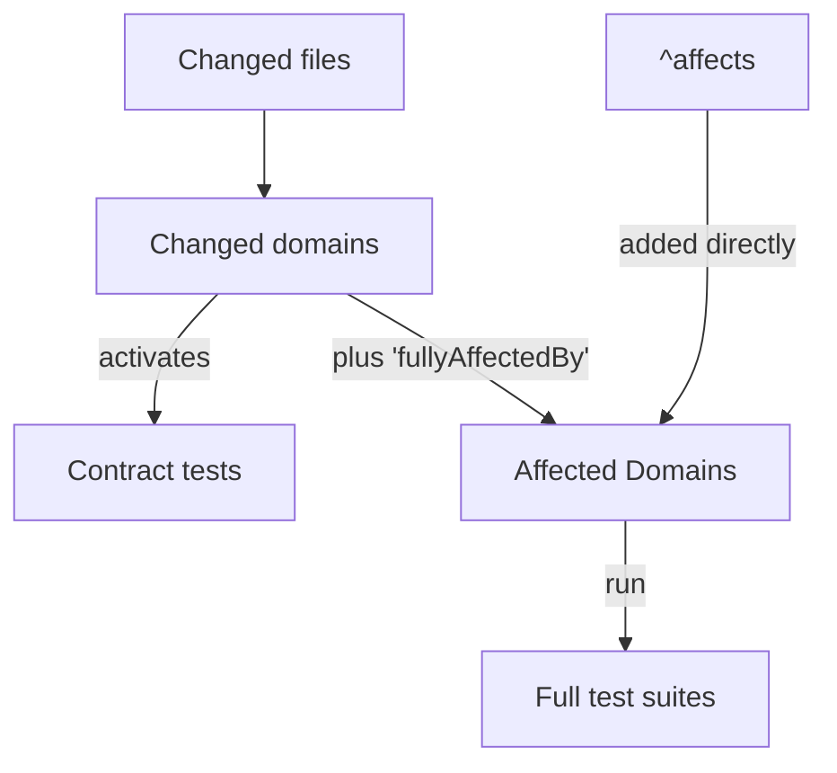

# Test Federation

The mono-repository is split into multiple 'Domains' (like 'Compiler', 'AnalysisApi', ...). The CI can verify commits into such Domains
independently.
'Plain old tests' of 'unaffected Domains' are not required for commits to prove correctness. All tests, however, will be executed on master
builds.

## Table of contents

- [What is a Domain? (Quick intuition)](#what-is-a-domain-quick-intuition)
- [Changed and affected Domains](#changed-and-affected-domains)
- [Defining Domains](#defining-domains)
- [`^affects` commit command](#affects-commit-command)
    - [Domains fully affecting other Domains](#domains-fully-affecting-other-domains)
- [Local testing](#local-testing)
    - [Verifying domains](#verifying-domains)
    - [Updating the dump](#updating-the-dump)
    - [Checking domain dependencies](#checking-domain-dependencies)
- [Smoke Tests: Verifying commits on the federal level](#smoke-tests-verifying-commits-on-the-federal-level)
- [Running a small subset of tests, as smoke tests, automatically](#running-a-small-subset-of-tests-as-smoke-tests-automatically)
- [Contracts between Domains](#contracts-between-domains--single-tests--test-suites-affected-by-other-domains)
    - [Contracts require approval from the target team](#contracts-require-approval-from-the-target-team)
- [Nightly Tests](#nightly-tests)

## What is a Domain? (Quick intuition)

A Domain is a **CI ownership and impact unit**, not an architecture concept.

- It answers: "If files in this area change, which tests should CI run?"
- It does **not** answer: "How should production code be layered or designed?"

Think of a Domain as a **change-radius boundary**:

- Inside the boundary: changes mark this Domain as changed and, therefore, affected.
- Outside the boundary: this Domain is not changed, although it can still become affected through `fullyAffectedBy`. Contracts can make
  individual tests run without making their entire Domain affected.

In other words, Domains model **test impact**, not **code structure purity**. A single subsystem can span multiple Domains, and one Domain
can include files from multiple places if that gives better CI behavior.

## Changed and affected Domains

Test Federation computes two related sets for every change:

1. **Changed Domains** are inferred from changed files.
2. **Affected Domains** are the Domains whose full test suites must run. Changed Domains are expanded according to `fullyAffectedBy`
   relationships, then any Domains named in an `^affects` commit command are added to the result.

Thus, **changed Domains are always affected, but affected Domains are not necessarily changed**. The distinction matters for Contracts:

- All affected Domains run their full test suites.
- Only changed Domains activate their `@AffectedByXYZ` Contract tests in smoke-mode test tasks.

For example, if `Native` is `fullyAffectedBy: Compiler` and `Compiler` is changed, both Domains are affected and run their full test suites.
Only `Compiler` is changed, however, so `@AffectedByCompiler` Contracts run while `@AffectedByNative` Contracts do not.

## Defining Domains

Domains are defined in the [domains.yaml](./domains.yaml) file. e.g., the `Native` domain could be defined as:

```yaml
Native:
  include:
    - "native"
    - "kotlin-native"
  fullyAffectedBy:
    - Compiler
```

Entries under `include` and `exclude` can be directory paths or glob patterns. A directory path matches the directory and all its
descendants, so the `Native` domain above includes everything under the `native` and `kotlin-native` directories. When `include` and
`exclude` entries overlap, the most specific matching entry takes precedence. A domain is always marked as changed if any file belonging to
the domain is changed.

## '^affects' commit command

If a commit is known to impact a Domain beyond those inferred from its changed files, the commit command `^affects:` can declare additional
affected Domains. Their full test suites run, but they are not added to the changed Domains and therefore do not activate their Contracts.
They also do not cause other Domains to become affected through `fullyAffectedBy`; command-listed Domains are added after that expansion.

```
^affects: Gradle, AnalysisApi
^affects: Compiler

// Mark all domains as affected
^affects: *
```

### Domains fully affecting other Domains

Some Domains might form a 'Domain/Subdomain' relationship, which can be expressed using `fullyAffectedBy`. A Domain that is `fullyAffectedBy`
another Domain will be marked as affected when that other Domain is changed. This does not mark the dependent Domain as changed. Domains
listed using `^affects` do not participate in this expansion. In the example above:

A change which marks the 'larger Compiler domain' as changed will also mark the 'Native' domain as affected, while a change isolated within
the 'Native' domain will not affect the 'Compiler' domain.

Note: 'fullyAffectedBy' is **not** transitive. All dependencies have to be listed explicitly. This allows for some modules acting as 'API'
boundaries.

### Local testing

#### Verifying domains

The declared domains will be 'expanded' into the actual files belonging to each domain. The dump file will be verified on CI. The file can
be found at [domains.dump.txt](domains.dump.txt).

Verify it locally from the repository root with:
```shell
./gradlew :repo:codebase-tests:test --tests "org.jetbrains.kotlin.code.DomainsDumpTest" --rerun -Pkotlin.native.enabled=true
```

#### Updating the dump

Changes to `domains.yaml` might require an update of the dump file. Update it from the repository root with:

```shell
./gradlew :repo:codebase-tests:updateDomainsDump -Pkotlin.native.enabled=true
```

Alternatively, run `scripts/update-domains.sh` or use the `Update domains.dump.txt` run configuration in IntelliJ.
Use `Update all project dumps` to refresh all project dumps at once.

#### Checking domain dependencies

You can verify dependencies between domains by making a relevant change, committing it locally and then invoking this command:

```shell
./gradlew -Ptest.federation.enabled=true inferAffectedDomains
```

To check how a specific task behaves when `Js` is changed and both `Js` and `Wasm` are affected, set both properties:

```shell
./gradlew :some:module:test \
  -Ptest.federation.enabled=true \
  -Ptest.federation.mode=Smoke \
  -Ptest.federation.changed.domains="Js" \
  -Ptest.federation.affected.domains="Js;Wasm"
```

`test.federation.affected.domains` controls which Domains run in full mode, while `test.federation.changed.domains` controls which Contracts
run in smoke mode. When only `test.federation.affected.domains` is specified, the changed Domains default to the same value. Set
`test.federation.changed.domains` explicitly when the two sets need to differ. Both properties accept:

- a single domain (for example, `CompilerPlugins`)
- several domains separated by semicolons (for example, `Wasm;Js`)
- all domains (`*`)
- no domains (`<none>`)

For other properties and their values, see
[runtimeEnvironment.kt](test-runtime/src/main/kotlin/org.jetbrains.kotlin.testFederation/runtimeEnvironment.kt).

### Smoke Tests: Verifying commits on the federal level

All tests of affected 'Domains' will be executed on CI. Running tests of a domain that is not affected can be done by marking a test as a
'SmokeTest'. Using JUnit 5 (or higher) allows using the `@SmokeTest` annotation.

- on the test method directly

```kotlin
@SmokeTest
@Test
fun `my important test`() {
    // ...
}
```

- on the test class

```kotlin
@SmokeTest
class MyImportantTest {
    @Test
    fun `my important test`() {
        // ...
    }
}
```

- on any abstract test class

```kotlin
@SmokeTest
abstract class AbstractImportantTests {
    // ...
}
```

- as a meta-annotation on another annotation

```kotlin
@SmokeTest
annotation class MyImportantTest

@MyImportantTest
fun `my important test`() {
    // ...
}
```

Smoke tests are always executed on CI, no matter the affected domains. Checking in a smoke test requires the test to fulfill the following
criteria:

- The test is very stable
- The test is fast

Because unstable/flaky smoke tests affect the entire team, fixing them is a high priority.

### Running a small subset of tests, as smoke tests, automatically

Some test tasks do not have a clear candidate that stands out as a 'Smoke Test'. However, if all tests are quick and stable, running a
percentage of those tests in 'smoke test mode' might be a good strategy for gaining confidence when testing unrelated changes. Any test
task, therefore, allows specifying a 'smokeTestConfig'.

Example: Run 5% of all tests in 'Smoke Test Mode'. When a commit is verified on CI, but the domain to which this test belongs is
'unaffected', then roughly 5% of the defined tests will still execute.

Note: The selected tests are stable as the selection is based upon the FQN and unique ID of the test.

```kotlin
tasks.withType<Test>().configureEach {
    smokeTestConfig = SmokeTestConfig.Enabled(
        autoSmokeTestPercentage = 5
    )
}
```

Sometimes an entire test task should *always* run, even in 'smoke test mode'.

```kotlin
tasks.withType<Test>().configureEach {
    smokeTestConfig = SmokeTestConfig.RunAllTests
}
```

This will ensure that the test task is always executed and all tests are verified.

### Contracts between Domains | Single Tests / Test Suites affected by other domains

Some Domains might rely on the behavior or API of another Domain. Such requirements can be expressed as a 'Contract' between two Domains.
Any test can be promoted to a 'Contract Test' using the relevant `@AffectedByXYZ` annotation. e.g., a test that defines a contract to the
'Js' compiler might be marked as `@AffectedByJs`.

A set of well-maintained contracts is always preferable to marking a domain as 'fullyAffectedBy' another domain, as 'ContractTests' will
enable actually building efficient pipelines for verifying commits, whereas 'fullyAffectedBy' will require a full build of the affected
domains.

```kotlin
@AffectedByJs
class MyImportantJsTests {
    // ...
}
```

Any commit that marks the `Js` Domain as changed will verify all Contracts associated with `Js`. A Domain added through `^affects` or affected
only through `fullyAffectedBy` still runs its full test suites, but does not activate its Contracts in smoke-mode test tasks.

The full flow from changed files to the tests selected by Test Federation can be seen below.

It works like this:
* we collect **changed files** and find their home domains -> this gives us **changed domains**
* we go through changed domains:
    * every changed domain is marked as **affected**
    * all domains `fullyAffectedBy` the changed domain are marked as **affected**
    * all contracts `@AffectedBy` the changed domain are marked as **affected**
* additionally, we take every domain from the `^affects:` commit command and mark them as **affected**

Everything that is affected must be verified:
* for affected domain, it means executing all its tests (FULL mode)
* for affected contract test, it means to execute this test



##### Contracts require approval from the target team

Declaring a contract is transactional between at least two teams (owning their domains). Defining and changing a contract requires the
explicit approval of both teams.

### Nightly Tests

Some tests, test-classes or even entire suites of tests might not qualify for our 'master aggregate'. Typically, nightly tests are 'long' or
have not proven their stability (yet), while not being 'necessary' as 'mater quality gate'. Marking a test as 'nighlty' is done by using the
`@NightlyTest` annotation

```kotlin
class MyTests {
    @NightlyTest
    @Test
    fun `my looong nightly test`() {
        superLongOperation()
    }

    @Test
    fun `my regular test`() {

    }
}
```

The above example will only execute 'my regular test' during safe-merge, while the `my looong nightly test` is only executed nightly.
